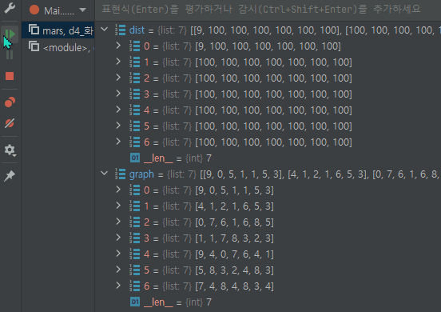

# 3주차 문제풀이 알고리즘


## 1일 차


### n진수 게임

```python
## 프로그래머스
## 어렵게 생각하지 말고 그냥 리스트로 해결하면 됨
def solution(n, t, m, p):
    wordlist = []
    result = []
    for i in range(m * t + p - 1):
        wordlist += str(convert(i,n))

    for i in range(t):
        result.append(wordlist[m*i+p-1])
        print(result)

    print(''.join(result))
    return ''.join(result)


#재귀함수 이용 - 10진수를 n진수로
def convert(idx, base) -> str:
    arr = "0123456789ABCDEF"
    q, r = divmod(idx, base)
    if q == 0:
        return arr[r]
    else:
        return convert(q, base) + arr[r]
```


## 2일 차

### 이진 탐색 (leetcode no.704)

```python
from typing import List


## leetcode no.704
class Solution:
    def search(self, nums: List[int], target: int) -> int:
        def rec(ps,pe):
            ## 이진 탐색을 위한 중간index
            half = (ps+pe)//2
            ## 정답을 찾았을 때 반환
            if nums[half] == target:
                return half
            ## index가 시작index과 겹쳤는데도, 위의 조건문이 실행되지 않았다면
            ## 리스트에 타겟번호가 없는 것이다
            elif half==ps:
                return -1
            ## 이진 탐색을 재귀함수로 구현한다
            elif nums[half] > target:
                return rec(ps,half)
            elif nums[half] < target:
                return rec(half,pe)

        return rec(0,len(nums))

sol = Solution()
print(sol.search([-1,0,3,5,9,12],9))
print(sol.search([-1,0,3,5,9,12],2))

## 교재 풀이
def binary_search(nums, target):
    def bs(start, end):
        ## start에 1을 더 하거나, end에 1을 빼서 호출하므로
        ## 마지막까지 찾은 후 start 인덱스가 end보다 더 커지면 값이 없는 것!
        if start > end:
            return -1

        mid = (start + end) // 2

        if nums[mid] < target:
            ## 굳이 찾아본 값의 index를 추가해서 찾지 말자
            return bs(mid + 1, end)
        elif nums[mid] > target:
            ## 굳이 찾아본 값의 index를 추가해서 찾지 말자
            return bs(start, mid - 1)
        else:
            return mid

    ## 처음 재귀함수에 값을 넣을때 실제 index값을 넣으려면 배열의 길이에서 하나를 빼야한다
    return bs(0, len(nums) - 1)

```


### 두 수의 합

```python
from typing import List


## leetcode no.704
class Solution:
    def search(self, nums: List[int], target: int) -> int:
        def rec(ps,pe):
            ## 이진 탐색을 위한 중간index
            half = (ps+pe)//2
            ## 정답을 찾았을 때 반환
            if nums[half] == target:
                return half
            ## index가 시작index과 겹쳤는데도, 위의 조건문이 실행되지 않았다면
            ## 리스트에 타겟번호가 없는 것이다
            elif half==ps:
                return -1
            ## 이진 탐색을 재귀함수로 구현한다
            elif nums[half] > target:
                return rec(ps,half)
            elif nums[half] < target:
                return rec(half,pe)

        return rec(0,len(nums))

sol = Solution()
print(sol.search([-1,0,3,5,9,12],9))
print(sol.search([-1,0,3,5,9,12],2))

## 교재 풀이
def binary_search(nums, target):
    def bs(start, end):
        ## start에 1을 더 하거나, end에 1을 빼서 호출하므로
        ## 마지막까지 찾은 후 start 인덱스가 end보다 더 커지면 값이 없는 것!
        if start > end:
            return -1

        mid = (start + end) // 2

        if nums[mid] < target:
            ## 굳이 찾아본 값의 index를 추가해서 찾지 말자
            return bs(mid + 1, end)
        elif nums[mid] > target:
            ## 굳이 찾아본 값의 index를 추가해서 찾지 말자
            return bs(start, mid - 1)
        else:
            return mid

    ## 처음 재귀함수에 값을 넣을때 실제 index값을 넣으려면 배열의 길이에서 하나를 빼야한다
    return bs(0, len(nums) - 1)
```


### 두 배열의 교집합

```python
import collections
from typing import List


## leetcode no.349
class Solution:
    def intersection(self, nums1: List[int], nums2: List[int]) -> List[int]:
        dict = collections.defaultdict(int)
        set1 = set(nums2)

        result = []
        for i in nums1:
            dict[i] = 1
        for ele in set1:
            if dict[ele] == 1:
                result.append(ele)
        return result


sol = Solution()
print(sol.intersection([4,9,5], [9,4,9,8,4]))
```


### 회전 정렬된 배열 검색


## 3일 차

### 고정점 찾기

```python
import sys
from typing import List

list_len = int(sys.stdin.readline())
nums = list(map(int, sys.stdin.readline().split()))

## 퀵소트를 사용하는데 비교값을 index로 하면 해결
def find_fix(ls: List[int], left, right) -> int:
    half = (left + right) // 2
    while left < right:
        if ls[half] > half:
            right = half-1
            half = (left + half-1) // 2
        elif ls[half] < half:
            left = half+1
            half = (left + right) // 2

        if ls[half] == half:
            return half
    return -1


print(find_fix(nums, 0, len(nums) - 1))

#############################################################
## 재귀 함수를 사용한 이진탐색
def binary_serach_recur(ls: List[int], left, right) -> int:
    if left>right:
        return -1
    mid = (left+right)//2
    ## 고정점을 찾은 경우 인덱스 반환
    if ls[mid]==mid:
        return mid
    ## 중간점이 가리키는 위치의 값보다 중간점이 작은 경우 왼쪽 확인
    elif ls[mid]>mid:
        return binary_serach_recur(ls,left,mid-1)
    ## 중간점이 가리키는 위치의 값보다 중간점이 큰 경우 오른쪽 확인
    else:
        return binary_serach_recur(ls,mid+1,right)
    
binary_serach_recur(nums,0,len(nums)-1)
```


### 정렬된 배열에서 특정 수의 개수 구하기

> bisect.bisect_left()과 bisect.bisect_right()을 사용해서 빼주면 바로 답이 나온다

```python
import sys
import bisect
from typing import List

list_len, target = list(map(int, sys.stdin.readline().split()))
nums = list(map(int, sys.stdin.readline().split()))

def findTarget(nums: List[int], target: int) -> int:
    if not nums:
        return -1

    ## 퀵 소트로 값의 index를 찾는 재귀함수 O(logN)
    def recur(ns: int, ne: int) -> int:
        half = (ns + ne) // 2
        if ns>ne:
            return find(half)
        if nums[half] <= target:
            return recur(half + 1, ne)
        elif nums[half] > target:
            return recur(ns, half - 1)

    def find(index) -> int:
        left = index
        right = index
        while nums[left] == target:
            left-=1
            if left <= -1:
                break
        while nums[right] == target:
            right+=1
            if right >= len(nums):
                break
        # print(left,right)
        count = right-left-1
        return count

    return recur(0, len(nums) - 1)

print(findTarget(nums, target))

"""
7 2
1 1 2 2 2 2 3
"""
### bisect을 사용하여 쉽게 풀 수 있다
def count_number(lst, target):
    left_idx = bisect.bisect_left(lst, target)
    if not (0 <= left_idx < len(lst) and lst[left_idx] == target):
        return -1

    right_idx = bisect.bisect_right(lst, target)
    return right_idx - left_idx

```


### 나무 자르기

```python
import sys

## 백준 no.2805

n, need = list(map(int, sys.stdin.readline().split()))
trees = list(map(int, sys.stdin.readline().split()))

trees.sort()

min_length = 0
max_length = trees[-1]
result = 0

while min_length <= max_length:
    mid = (min_length + max_length) // 2
    ## 자를 높이보다 높은 나무들만 자른 값을 더한다
    sum_logs = sum((i - mid) for i in trees if i >= mid)
    if sum_logs >= need:
        min_length = mid + 1
        result = mid
    elif sum_logs <= need:
        max_length = mid - 1

print(result)

"""
4 7
20 15 10 17
"""
"""
5 20
4 42 40 26 46
"""
```


### 공유기 설치

```python
import sys
import bisect
from typing import List

n, num = list(map(int, sys.stdin.readline().split()))

gongList = []
for _ in range(n):
    gongList.append(int(sys.stdin.readline()))

gongList.sort()
## 가능한 최소 거리
start = 1
## 가능한 최대 거리
end = gongList[-1]-gongList[0]
result = 0

while(start <= end):
    ## 가장 인접한 두 공유기 사이의 최대 거리를 설정하고 좁혀가며 공유기를 찾는다
    mid = (start+end)//2
    value = gongList[0]
    ## 첫번 째 공유기
    count = 1
    # 현재의 mid값을 이용해 공유기 설치
    for i in range(1,n):
        ## 반복문을 실행하며 i인덱스의 값이
        ## 현재 공유기와 설정한 거리를 더한 값보다 크다면
        ## 현재공유기를 교체하고 count값을 하나 늘린다
        if gongList[i] >= value+mid:
            value = gongList[i]
            count +=1
        ## 설정한 공유기 이상의 공유기를 설치할 수 있는 경우 거리를 증가시킨다
    if count >= num:
        start = mid + 1
        ## 최대값을 저장한다
        result = mid
    else:
        end = mid-1
print(result)

"""
5 3
1
2
8
4
9
"""
```


### 랜선 자르기

```python
import sys

## 백준 no.1654

n, num = list(map(int, sys.stdin.readline().split()))

lines = []
for _ in range(n):
    lines.append(int(sys.stdin.readline()))

lines.sort()
small = 1
long = lines[-1]
result = 0

## small을 0으로 설정하면 에러가 뜬다
## 아마 케이스 중에 가장 긴 전선이 1인 케이스가 있어서
## int를 0으로 나누려고 해서 에러가 뜨는 듯 하다
while small<=long:
    mid = (small+long)//2
    pieces = sum(i // mid for i in lines)
    if pieces >= num:
        small = mid+1
        result = mid
    elif pieces < num:
        long = mid-1

print(result)

"""
4 11
802
743
457
539
"""
```

### 랜선자르기 ver2 재귀함수 이용

```python
import sys

## 백준 no.1654
###################################재귀함수###################################

n, num = list(map(int, sys.stdin.readline().split()))

lines = []
for _ in range(n):
    lines.append(int(sys.stdin.readline()))
sys.setrecursionlimit(10 ** 6)

## 이진 탐색을 사용하기 위해 lines배열을 정렬한다
lines.sort()
## 가장 짧은 랜선의 길이는 1로
low = 1
## 가장 긴 랜선의 길이는 배열의 마지막 값으로 설정하고
high = lines[-1]
def search(ran_list, target, high, low) -> int:
    mid = (high + low) // 2
    ## 재귀함수의 종료조건
    if low > high:
        return mid

    tempsum = sum(i // mid for i in ran_list)

    if tempsum >= target:
        low = mid + 1
        mid = search(ran_list, target, high, low)
        return mid
    else:
        high = mid - 1
        mid = search(ran_list, target, high, low)
        return mid

print(search(lines, num, high, low))
```


### 예산

> 이전의 문제들처럼 while문을 쓰면 편하지만, 재귀함수로 구현하는 것을 도전 해 봄

```python
import sys

## 백준 no.2512

N = int(sys.stdin.readline())
lst = list(map(int, sys.stdin.readline().split()))
M = int(sys.stdin.readline())

lst.sort()
min = 1
max = lst[-1]

def solution():
    result = 0
    def recur(mi, ma) -> None:
        nonlocal result
        mid = (mi + ma) // 2
        tempsum = sum(i for i in lst if i < mid) + sum(mid for i in lst if i >= mid)
        if mi>ma:
            return
        if tempsum > M:
            return recur(mi,mid-1)
        elif tempsum <= M:
            result = mid
            return recur(mid+1,ma)

    recur(min,max)
    print(result)

solution()
```


## 4일 차

### 화성 탐사




```python
import heapq
import sys


def mars(graph):
    dr = [1, 0, -1, 0]
    dc = [0, 1, 0, -1]

    ## dist라는 최소 비용을 저장 할 행렬을 만들고
    ## 미리 default 값을 넣어놓는다 (10000)
    N = len(graph)
    dist = [[10000] * N for _ in range(N)]

    q = []
    ## dist 행렬의 시작 점에 그래프의 시작 점의 값을 저장한다
    dist[0][0] = graph[0][0]
    ## 변수명이 q인 힙에도 그래프의 시작 점을 저장한다
    heapq.heappush(q, (graph[0][0], 0, 0))
    while q:
        ## heappush된 값중에 가장 작은 값을 pop한다
        ## 이미 방문한 노드의 값들 중 값이 가장 작은 노드를 먼저 방문한다
        ## 첫 실행시 3,0,0이 나온다
        acc, r, c = heapq.heappop(q)

        """
        현재의 값이 최단거리라면 (dist의 값과 힙의 값이 같다면) 계산하지 않는다
        항상 힙에서 가장 작은 값부터 계산하기에 가능한 백 트래킹 방법이다
        가운데 있는 노드의 경우 네 곳에서 오는 값을 비교하여야 하는데
        힙을 이용하면 쉽게 비교할 수 있다
        """
        if dist[r][c] < acc:
            continue

        ## 위, 아래, 왼쪽, 오른쪽의 네 방향을 한 방향씩 탐색한다
        for i in range(4):
            nr = r + dr[i]
            nc = c + dc[i]
            ## 유효한 범위내로 이동했을 때
            if 0 <= nr < N and 0 <= nc < N:
                ## cost 값은 현재 위치 [r][c]의 값 + 다음노드의 값이다
                cost = dist[r][c] + graph[nr][nc]
                ## 그렇게 나온 값이 더 작다면
                ## 처음 탐색하는 노드는 dist값이 높게 설정되어 있어서
                ## 무조건 저장하게 된다
                if cost < dist[nr][nc]:
                    ## 다음노드가 가리킨 위치에 값을 저장한다
                    dist[nr][nc] = cost
                    ## heapq에도 따로 저장한다
                    heapq.heappush(q, (cost, nr, nc))

    return dist[N - 1][N - 1]


test_case = int(sys.stdin.readline())
for _ in range(test_case):
    N = int(sys.stdin.readline())
    graph = []
    for _ in range(N):
        graph.append(list(map(int, sys.stdin.readline().split())))

    print(mars(graph))

"""
3
3
5 5 4
3 9 1
3 2 7
5
3 7 2 0 1
2 8 0 9 1
1 2 1 8 1
9 8 9 2 0
3 6 5 1 5
7
9 0 5 1 1 5 3
4 1 2 1 6 5 3
0 7 6 1 6 8 5
1 1 7 8 3 2 3
9 4 0 7 6 4 1
5 8 3 2 4 8 3
7 4 8 4 8 3 4
"""
```

