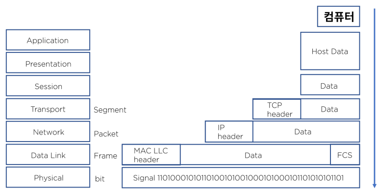

# CS

## OSI 7계층

> OSI (Open System Interconnection)
>
> 네트워킹 또는 무선통신 시스템의 기능을 설명하는 핵심 개념이다
>
> [네트워크의 기본 'OSI 7계층'··· 한번에 이해하고 외우는 방법 - CIO Korea](https://www.ciokorea.com/news/36536#:~:text=7계층 – 응용 계층 (Application)%3A 디핑 소스 비유를,아웃룩 (Outlook)%2C 오피스 (Office) 등의 응용 프로그램이 대표적이다.)
>
> [(4) 네트워크 소개 - 4 : 네이버 블로그 (naver.com)](https://blog.naver.com/sayoon210/222597840537)

