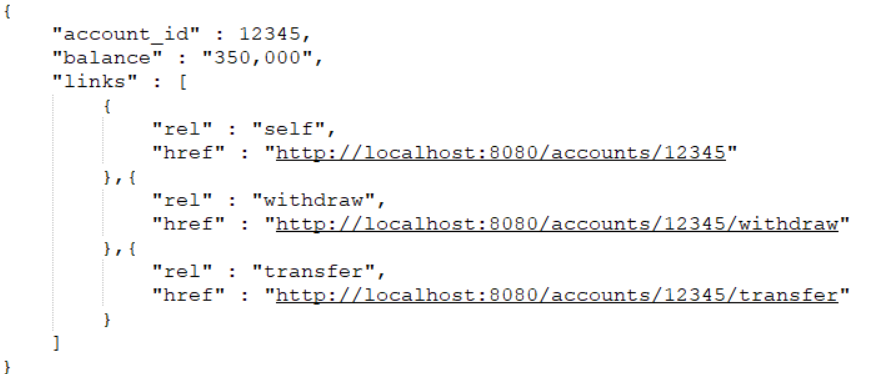
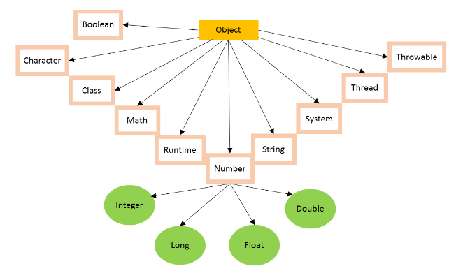
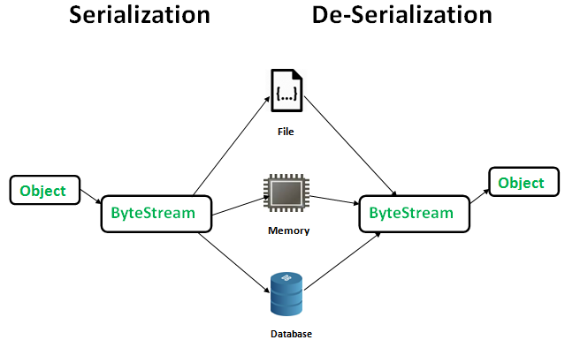

# Spring 면접 50문


## 1) JPA는 무엇인가?

JPA(Java Persistence API)로 현재 자바 진영의 ORM기술 표준으로, 인터페이스의 모음이다.

자바 어플리케이션에서 관계형 데이터베이스를 사용하는 방식을 정의한 인터페이스이다.


## 2) spring Framework와 Spring Boot의 차이

Spring Boot에서는 Embed Tomcat을 사용하기 때문에 따로 Tomcat을 설치하거나 매번 버전을 관리해 줘야 하는 수고로움을 덜어준다.

Starter을 통한 dependency 자동화, XML설정 필요없음


## 3) Spring Web MVC의 Dispatcher Servlet의 동작원리는?

1. 클라이언트에서 Request
2. DispatcherServlet에서 해당 Request에 맞는 Controller로 request를 보내줌(HandlerMapping에서 매핑한 컨트롤러 검색)
3. Controller에서 클라이언트의 요청을 처리하고 결과를 출력할 ModelAndView객체 를 생성하여 DispathcerServlet으로 리턴
4. View 이름을 토대로 View Resolver에서 처리 view를 검색
5. 처리 결과를 View에 송신
6. 처리 결과가 포함된 View를 DispathcerServlet에 송신
7. DispatcherServlet에서 클라이언트로 최종결과 Response


## 4) Spring Bean Life Cycle에 대해 설명해주세요 ✅

Spring 서버 시작 → Spring Container 생성 → Spring bean 등록 → 의존관계 주입 → Bean 초기화 콜백 → Bean 소멸전 콜백 → spring 서버 종료


## 5) filter와 interceptor의 차이

filter는 Dispatcher Servlet에 요청이 전달되기 전/후에 url 패턴에 맞는 모든 요청에 대해 부가작업을 처리할 수 있는 기능을 제공한다.

Interceptor는 Spring이 제공하는 기술로써, Dispatcher Servlet이 컨트롤러를 호출하기 전고 ㅏ후에 요청과 응답을 참조하거나 가공할 수 있는 기능을 제공한다.


## 6) Dependency Injection (방법 3가지)

Constructor Injection(생성자 주입), Field Injection(필드 주입), Setter Injection(세터 주입)


## 7) AOP로 실제 개발한 경험이 있다면 설명해주세요


## 8) maven/gradle의 차이를 설명해주세요.

스크립트 길이와 가독성 면에서 gradle이 우세하다.

빌드와 테스트 실행 결과 gradle이 더 빠르다.(gradle은 캐시를 사용하기 때문)

의존성이 늘어날 수록 성능과 스크립트 품질의 차이가 심해질 것이다.


## 9) 아파치, 톰캣은 각각 멀티 프로세스인가 멀티 쓰레드인가?

아파치는 기본적으로 멀티 프로세스로 구현되어 있다. 하지만 설정에 따라 멀티 쓰레드를 같이 운용할 수 있다.

톰캣은 요청을 처리하기 위한 쓰레드 풀을 관리하고 있다. 그리고 요청이 오면 해당 쓰레드 풀에서 쓰레드를 꺼내 요청을 처리하도록 한다.


## 10) Spring Security 인증은 어떻게 이루어지나요?

AuthenticationManager에 등록된 AuthenticationProvider에 의해 처리된다.

인증 전의 Authentication 객체를 받아서 인증이 완료된 객체를 반환하는 역할을 한다.

??????????????????????????


## 11) 객체지향에 대해서 설명해주세요.

컴퓨터 프로그램을 명령어의 목록으로 보는 시각에서 벗어나 여러개의 독립된단위, 객체 들의 모음으로 파악하고자 하는 것. 각각의 객체는 메시지를 주고 받고, 테이터를 처리할 수 있음.


## 12) DI가 뭔지 DI와 객체지향관점을 연결지어서 말하시오.

답변

추가


## 13) IOC 컨테이너의 역할은 무엇이 있을까요?


## 14) JWT에 대해서 간단히 설명해주세요.

- ### 답변

  - JWT(JSON Web Token)는 유저를 인증하고 식별하기 위한 토큰(Token)기반 인증이다.

- ### 특징

  - JWT를 사용하면 Stateless인 환경에서 사용자 데이터를 주고 받을 수 있게 된다. JWT를 클라이언트에 저장하고 요청시 단순히 HTTP헤더에 토큰을 첨부하는 것만으로도 단순하게 데이터를 요청하고 응답을 받아올 수 있다.

- ### 추가 (세션/쿠키 vs JWT)

  - 간편하다. 세션/쿠키는 별도의 저장소 관리가 필요하지만 JWT는 발급한 후 검증만 하면 되기 때문에 추가 저장소가 필요 없다. 이는 Stateless한 서버를 만드는 입장에서는 큰 강점이며 서버를 확장하거나 유지/보수 하는데 유리하다.


## 15) OAuth에 대해서 간단히 설명해주세요.

- ### 답변

  - OAuth는 사용자들이 비밀번호를 제공하지 않고 다른 웹사이트 상의 자신들의 정보에 대해 웹사이트나 애플리케이션의 접근 권한을 부여할 수 있는 공통적인 수단으로서 사용되는, 접근 위임을 위한 개방형 표준이다.


## 16) JWT와 OAuth의 차이는 무엇이 있을까요?

- ### 답변

  - JWT는 토큰의 종류이고, OAuth는 토큰을 발급하고 인증하는 오픈 스탠다드 프로토콜이다.


## 17) CORS란 무엇이며 이것에 대해서 설명해보세요. 그리고 CORS 에러를 해결한 경험이 있다면 알려주세요.

- ### 답변

  - CORS(Cross-Origin Resource Sharing)는 추가 [HTTP](https://developer.mozilla.org/ko/docs/Glossary/HTTP) 헤더를 사용하여, 한 [출처](https://developer.mozilla.org/ko/docs/Glossary/Origin) 에서 실행 중인 웹 애플리케이션이 다른 출처의 선택한 자원에 접근할 수 있는 권한을 부여하도록 브라우저에 알려주는 체제입니다. 웹 애플리케이션은 리소스가 자신의 출처(도메인, 프로토콜, 포트)와 다를 때 교차 출처 HTTP 요청을 실행합니다.

  - RefreshToken을 Cookie에 담아주기 위한 시도에서 configuration.setAllowCredentials(true)


## 18) 인스턴스화 된다라는게 무슨의미인가요?

## 19) 제네릭에 대해서 설명해주세요.

## 20) 애노테이션에 대해서 설명해주세요.

## 21) POJO란 무엇인가요? Spring Framework에서 POJO는 무엇이 될 수 있을까요?

- ### 답변

  - Plain Old Java Object 의 약자로, 특별한 제한에 종속되지 않고, 클래스 패스(class path)를 필요로 하지 않는 일반적인 Java Object를 의미합니다.

- ### 특징

  - POJO를 유지하면서 특정 기술을 사용하기 **(스프링이 POJO를 유지하면서 Hibernate를 사용할 수 있는 이유) - PSA [ Portable Service Abstraction ] (** 표준 인터페이스를 사용해 추상화 )

- ### 추가

  - EJB가 Java EE 등의 중량 프레임워크들을 사용하게 되면서 해당 프레임워크에 종속된 "무거운" 객체를 만들게 된 것에 반발해서 사용되게 된 용어
  - Java 오브젝트 모델, 컨벤션 또는 프레임워크를 따르지 않는 Java 오브젝트를 나타냅니다.

POJO의 조건

1. 미리 지정된 클래스를 extends하면 안됨
2. 미리 정의된 인터페이스를 implement하면 안됨
3. 미리 정의된 Annotation을 포함하면 안됨


## 22) Refresh Token을 사용했을 때 보안에 어떤 점이 좋은지?

- ### 답변

  - Access Token의 유효기간을 짧게 설정할 수 있습니다. (Access Token이 탈취한 사람이 공격을 길게 할 수 없음)

- ### 특징

  - 유효기간이 짧은 Access Token의 payload에 사용자의 여러 정보를 담는다.
  - Refresh Token의 payload는 사용을 자제한다.

- ### 추가

  - Refresh Token이 탈취된다면?
    - 서버에서 관리되기에, Refresh Token이 탈취되었다는 걸 인지하면 폐기시킬 수 있다.
    - **One time Use Only**로 구성한 Refresh Token을 두 번째 요청했을때 탈취로 판단한다.


## 23) Autowiring 과정에 대해서 설명해주세요.

- ### 답변

  - Autowiring : 필요한 의존 객체의 "타입"에 해당하는 Bean을 Ioc컨테이너에서 찾아 주입해주는 것.

  - 동작과정: BeanPostProccessor라는 인터페이스의 구현체인 AutowiredAnnotationBeanPostProcessor에 의해 의존성을 주입

- ### 추가

  - Bean의 라이프사이클
    - 스프링 컨테이너 생성 ->
    - 스프링 빈 생성 ->
    - 의존관계 주입 -> 초기화 콜백 ->
    - 사용 ->
    - 소멸 전 콜백 -> 스프링 종료


## 24) 인터페이스와 추상클래스의 차이점에 대해 설명해주세요.

- ### 답변

  - 추상클래스 : 일반 클래스지만 추상 메서드가 하나라도 포함된 경우

  - 인터페이스 : 모두 추상메서드


## 25) RESTful이란 무엇이며, 이것에 대해서 아는대로 설명해보세요.

- ### 답변

  - REST의 원리를 따르는 시스템입니다.

  - REST API의 설계 규칙을 올바르게 지킨 시스템을 RESTful하다고 합니다.

- ### 추가

  - REST 규칙 ( URL을 만드는 규칙 )
    - 슬래시( / ) 로 계층 관계를 표현하고, 마지막에 슬래시를 포함하지 않는다
    - 언더바( _ ) 대신 대쉬( - ) 를 사용한다
    - 소문자를 사용한다
    - 행위는 URL에 포함하지 않는다
    - 리소스명은 동사 대신 명사를 사용한다
    - 파일 확장자는 포함하지 않는다


## 26) HTTP 메서드와 이것이 하는 역할에 대해서 설명해보세요.

- ### 답변

  - HTTP 메서드는 `클라이언트가 웹 서버에게 사용자 요청의 목적이나 종류를 알리는 수단` 입니다.

- ### 추가

  - HTTP 메서드에는 GET, POST, PUT, PATCH, DELETE 과 같은 주요 메서드와

  - HEAD, OPTIONS, CONNECT, TRACE 의 기타 메서드가 있습니다.
    - GET : 리소스 조회
    - POST : 요청 데이터 처리
    - PUT : 리소스를 대체 (해당 리소스가 없으면 생성)
    - PATCH : 리소스를 일부만 변경
    - DELETE : 리소스 삭제
    - HEAD : GET과 동일하지만 메시지 부분을 제외하고, 상태 줄과 헤더만 반환
    - OPTIONS : 대상 리소스에 대한 통신 가능 옵션을 설명 (주로 CORS에서 사용)
    - CONNECT : 대상 자원으로 식별되는 서버에 대한 터널을 설정
    - TRACE : 대상 리소스에 대한 경로를 따라 메시지 루프백 테스트를 수행


## 27) 대용량 트래픽에서 장애가 발생하면 어떻게 대응할 것인가요?

- ### 답변

  - Load Balancing을 사용하여 트래픽을 여러 서버로 분산시켜 줄 것 같습니다.

- ### 추가

  - 보통 로드밸런싱은 부하분산 Network Switch 혹은 소프트웨어가 담당하는데 Cloud 환경에서는 Load Balancer라고 부른다. OSI 7 Layers에서 L4 / L7 계층에서 사용하는데 L7이 L4보다 더 정교한 로드밸런싱이 가능하다. L7 에서의 로드밸런싱을 콘텐츠 기반 스위칭이라고도 한다.

  - Clustering으로도 대용량 트래픽 문제를 해결 할 수 있다 (Clustering이란 여러 대의 컴퓨터를 똑같은 구성의 서버군을 병렬로 연결한 시스템으로 마치 하나의 컴퓨터처럼 사용하는 것을 말한다.)

  - 로드밸런싱과 클러스터링

    둘 다 분산환경을 구축하는 것에 있어 차이가 없어보일 수 있으나 `클러스터링`은 한 서비스를 제공하는 여러 개의 서버를 하나로 묶어 성능을 높여 많은 패킷을 감당하는 형식이고 `로드밸런싱`은 여러 대의 서버에 이 패킷을 분산시켜주는 것을 목표로 한다는 것에 차이가 있다. `로드밸런싱`의 경우 세션 공유가 되지 않기 때문에 클라이언트의 접속 정보를 저장한 컴퓨터 이외에 다른 컴퓨터에 접속 시 세션이 끊긴다.


## 28) 싱글톤 패턴에 대해서 설명해주세요.

- ### 답변

  - 객체의 인스턴스가 1개만 생성되는 패턴입니다.

- ### 추가

  - 이미 생성된 인스턴스를 활용하기에 메모리 낭비를 방지할 수 있고, 속도가 빠르다

  - 싱글톤 인스턴스가 전역으로 사용되는 인스턴스이기 때문에 클래스 간에 **데이터 공유가 쉽다**

  - 단, 여러 클래스의 인스턴스에서 싱글톤 인스턴스의 데이터에 동시에 접근하게 되면 동시성 문제가 발생할 수 있다.

  - 싱글톤의 단점 (trade off)

    먼저 싱글톤 패턴을 구현하는 코드 자체가 많이 필요하다. 앞서 소개한 구현 방법외에도 정적 팩토리 메서드에서 객체 생성을 확인하고 생성자를 호출하는 경우에 멀티스레딩 환경에서 발생할 수 있는 동시성 문제 해결을 위해 syncronized 키워드를 사용해야 한다.

    두 번째는 테스트하기 어렵다는 것이다. 싱글톤 인스턴스는 자원을 공유하고 있기 때문에 테스트가 결정적으로 격리된 환경에서 수행되려면 매번 인스턴스의 상태를 초기화시켜주어야 한다. 그렇지 않으면 어플리케이션 전역에서 상태를 공유하기 때문에 테스트가 온전하게 수행되지 못한다.

    세 번째로는 의존 관계상 클라이언트가 구체 클래스에 의존하게 된다. new 키워드를 직접 사용하여 클래스 안에서 객체를 생성하고 있으므로, 이는 SOLID 원칙 중 DIP를 위반하게 되고 OCP 원칙 또한 위반할 가능성이 높다.

    이외에도 자식클래스를 만들수 없다는 점과, 내부 상태를 변경하기 어렵다는 점 등 여러가지 문제들이 존재한다. 결과적으로 이러한 문제들을 안고있는 싱글톤 패턴은 유연성이 많이 떨어지는 패턴이라고 할 수 있다.


## 29) TDD를 알고 있나요? TDD에 대해서 어떻게 생각하나요?

- ### 답변

  - 테스트 주도 개발(Test-Driven Development)로 개발 방법론중에 하나입니다.

- ### 추가

  - 단위 테스트 ( Unit Test )를 작성해야 하는 이유

    ```
    1. 코드를 수정하거나 기능을 추가할 때 수시로 빠르게 검증 할 수 있다.
    2. 리팩토링 시에 안정성을 확보할 수 있다.
    3. 개발 및 테스팅에 대한 시간과 비용을 절감할 수 있다.
    ```

  - 테스트 코드를 작성하면 우리가 작성한 코드들에 대해 `수시로 빠르게 검증`을 받을 수 있으며, 유지보수 및 리팩토링을 할 때에도 `안정성을 확보`할 수 있다는 장점이 있다. 하지만 그것보다 큰 장점으로 `개발 및 테스팅에 대한 시간과 비용을 절감`할 수 있다는 점에 주목해야 한다.

우리는 개발이 끝난 뒤에 문제가 없는지 확인하기 위해 애플리케이션을 실행하고, 직접 수동 (통합) 테스트를 진행해야 한다. 단위 테스트를 작성하지 않은 코드들은 테스트를 작성하지 않은 코드들 보다 버그가 있을 확률이 높은데, 문제는 직접 테스트 하는 비용이 너무 크다는 것이다. 그 이유는 통합 테스트를 위해서는 캐시, 데이터베이스 등 외부 컴포넌트들과 연결 등 부가적인 시간이 필요하기 때문이다.테스트 코드를 작성하지 않았다면 여러 개의 버그가 잠재되어 있을 확률이 있고, 모든 버그들을 수정하고 테스트를 반복하는 비용은 기하급수적으로 늘어나게 된다. 그러므로 우리는 개발 및 테스팅에 대한 비용을 줄이기 위해 단위 테스트를 작성해야 한다.


## 30) N + 1 문제가 발생하는 이유와 이를 해결하는 방법을 설명해주세요.

- ### 답변

  - 일대다, 다대일 구조를 가진 엔티티를 조회하는 상황에 발생합니다.

  - 발생하는 이유
    - JPA Repository로 find 시 실행하는 첫 쿼리에서 하위 엔티티까지 한 번에 가져오지 않고, 하위 엔티티를 사용할 때 추가로 조회하기 때문에.
    - JPQL은 기본적으로 글로벌 Fetch 전략을 무시하고 JPQL만 가지고 SQL을 생성하기 때문에.

  - 해결법

    1. Fetch Join 사용
       - 두 테이블을 Join해 가져온다

    - Fetch Join의 단점
      - 쿼리 한번에 모든 데이터를 가져오기 때문에 JPA가 제공하는 Paging API 사용 불가능(Pageable 사용 불가)
      - 1:N 관계가 두 개 이상인 경우 사용 불가
      - 패치 조인 대상에게 별칭 (as) 부여 불가능
      - 번거롭게 쿼리문을 작성해야 한다
      - 카테시안 곱이 발생하여 중복이 생기게 된다

    2. Entity Graph 사용

       - @EntityGraph의 attributePaths에 같이 조회할 연관 엔티티명을 적으면 된다

       - Fetch Join이 inner join이 디폴트인 반면 Entity Graph는 outer join이 디폴트이다

    3. BatchSize 이용

       - BatchSize 설정을 하면 설정한 수 만큼은 IN을 사용해 매핑된 데이터를 조회해온다.

       - 조회하는 테이블 종류 만큼의 쿼리가 생긴다

- ### 참고

  - 카테시안 곱 : 두 테이블 사이에 유효 join 조건을 적지 않았을 때 해당 테이블에 대한 모든 데이터를 전부 결합하여 테이블에 존재하는 행 갯수를 곱한만큼의 결과 값이 반환되는 것
    - 해결법
      1. JPQL에 DISTINCT 를 추가하여 중복 제거
      2. OneToMany 필드 타입을 Set으로 선언하여 중복 제거


## 31) String과 StringBuffer에 차이점이 무엇인가요?

- ### 답변

  - String은 불변 객체, StringBuffer는 가변 객체입니다.

- ### 부가 설명

  - String은 반복문을 통해 수정 작업을 할 시에서는 성능문제가 있습니다.


## 32) MVC에 대해서 설명해주세요.

- ### 답변

  - Model, Veiw, Controller 의 약자로 model에서 DB와 통신하고 view에서 요청을 처리하고 controller로 요청을 받습니다.


## 33) JPA에서 Entity를 설계할때 주의점을 말해주세요.

- ### 답변

  - Setter를 사용하지 말것, 연관 관계는 LAZY로 설정할 것, 컬렉션은 필드에서 초기화할 것

- ### 부가설명

  - 컬렉션은 필드에서 초기화해야 NullPointerException으로부터 안전합니다.


## 34) 데이터베이스에서 인덱스를 사용하는 이유 및 장단점에 대해 설명해주세요.

- ### 답변

  - 자주 사용되는 테이블 데이터에 번호를 매겨서 정렬 후 해당부분을 먼저 탐색하기 때문에 검색이 빨라진다는 장점이 있습니다.
  - DML작업(추가,수정,삭제)시 재정렬을 해야하므로 인덱스를 과도하게 사용하면 성능이 오히려 안좋아질수 있는 단점이 있습니다.


## 35) 트랜잭션에 대해서 설명해주세요.

- ### 답변

  - 데이터가 DB에 모두 반영되던가, 전혀 반영되지 않는 것이 트랜잭션의 가장 큰 특징 입니다.
  - 로직을 처리에 성공했다면 Commit 에러가 생긴다면 Rollback을 통해 데이터를 처리합니다.

- ### 부가 설명

트랜잭션은 4가지 특징이 있습니다.

원자성, 일관성, 고립성, 지속성 [ ACID - Atomicity, Consistency, Isolation, Durability ]

원자성은 데이터가 DB에 모두 반영되거나 전혀 반영되지 않아야 한다는 것

일관성은 처리 결과가 항상 일관성이 있어야 한다는 것

독립성은 둘 이상의 트랜잭션이 동시에 실행되고 있을 경우 서로간의 연산에 끼어들 수 없다는 것

지속성은 트랜잭션이 성공적으로 완료되었을 경우, 그 결과는 영구적으로 반영되어야 한다는 것


## 36) 배열과 링크드 리스트의 차이를 설명해주세요.

- ### 답변

  - 배열은 메모리상 데이터가 순차적으로 저장되어 읽기에는 O(1)로 유리하나 쓰기에는 O(n)으로 시간이 다소 걸립니다.
  - 링크드 리스트는 데이터에 다음 데이터의 주소를 넣기 때문에 읽기에 불리하고 쓰기에 유리합니다.


## 37) JOIN에 대해서 설명해주세요.

- ### 답변

  - 두개 이상의 테이블을 결합해 나타내는 SQL문 입니다.
  - 조인의 종류는 이너조인, 아우터조인, 크로스조인, 셀프조인이 있습니다.

- ### 부가설명

이너조인은 공통된 요소를 결합하는 조인방식입니다.

아우터조인은 공통영역을 포함해 한쪽 테이블의 다른데이터를 포함시키는 조인방식입니다.

크로스조인은 공통영역의 가능한 모든 경우의 수를 보여주는 조인방식입니다.

셀프조인은 크로스조인과 동일하지만 다른 테이블이 아닌 자기 자신을 조인하는 방식입니다.


## 38) RDBMS vs NOSQL에 대해서 설명해주세요.

- ### 답변

  - 둘의 가장 큰 차이점은 스키마의 사용 여부라고 생각합니다.

- ### 부가 설명

RDBMS는 정해진 스키마에 따라 데이터를 저장해야 하므로 명확한 데이터 구조를 보장하고 있습니다.

NOSQL은 스키마없이 유연하고 자유롭게 데이터를 저장할 수 있습니다.

## 39) 오버라이딩과 오버로딩이 무엇이며 어떤 차이가 있을까요?

- ### 답변

  - 오버로딩은 동일한 이름을 가진 메소드를 다른 형식, 개수의 매개변수로 여러개 정의하는 것을 의미합니다.
  - 오버라이딩은 부모 클래스에게 상속받은 함수를 자식클래스에서 재정의하는 것을 의미합니다.


## 40) 즉시 로딩과 지연 로딩의 차이

- ### 답변

  - EAGER방식은 엔티티를 불러올때 연관관계에 있는 데이터를 한번에 불러오는 방식입니다.
  - LAZY방식은 연관관계에 있는 해당 데이터를 사용할 때 데이터를 불러오는 방식입니다


## 41) WAS와 WS의 차이

> 💡 **WS - Web Server**
>
> 정적인 파일을 제공하기 위한 서버  - HTTP 프로토콜에 의해 제공
>
> ex ) **apache**, nginx, gws, etc…

> 💡 **WAS - Web Application Server**
>
> 동적인 데이터를 제공하기 위한 서버
>
> 웹 서버의 기능을 내장하고 있어 웹 서버가 없어도 서비스 가능
>
> ex)  **tomcat**, jeus, web logic, etc


ref) https://makemethink.tistory.com/169


## 42) Call By Value와 Call By Reference 차이

> 💡 **Call by value(값에 의한 호출)**
>
> 인자로 받은 값을 복사하여 처리

> 💡 **Call by Reference(값에 의한 호출)**
>
> 인자로 받은 값의 주소를 참조하여 직접 값에 영향

Call by value(값에 의한 호출)는 인자로 받은 값을 복사하여 처리를 한다. Call by reference(참조에 의한 호출)는 인자로 받은 값의 주소를 참조하여 직접 값에 영향을 준다. 간단히 말해 값을 복사를 하여 처리를 하느냐, 아니면 직접 참조를 하느냐 차이인 것이다.

**Java는 Call by Value를 사용**한다. 👉 참조형(ReferenceType)의 경우도 Call by value. **주소값의 value**를 넘긴다. 해당 객체의 주소값을 직접 넘기는 게 아닌 객체를 보는 또 다른 주소값을 만들어서 넘기다


## 43) http VS 웹소켓 차이?


## 44) HATEOAS 란 무엇인가?

> 💡 Hypermedia As The Engine of Application State
>
> 서버가 클라이언트에게 하이퍼 미디어를 통해 **정보를 동적으로 제공**해주는 것을 뜻함

Hypermedia (링크)를 통해서 애플리케이션의 **상태 전이**가 가능해야 한다.

또한 Hypermedia (링크)에 **자기 자신에 대한 정보**가 담겨야 한다.

단순히 REST API뿐만 아니라 이 자원을 이용함으로써 어떻게 상태가 영향 받는지, 그 자원은 무엇인지 표기한다.




## 45) 가비지컬렉터는 무엇인가?

> 💡 쓰지 않는, 불필요한 메모리를 제거한다.

객체는 일회성이고, 금방 사라진다(Unreachable)는 개념 아래에 힙 영역을 두 개로 나누게 되었다.

이 두 개의 힙 영역은 객체의 생존 기간에 따라 Young, Old로 나눈다


**Young**

새롭게 생성된 객체가 할당되는 영역

대부분의 객체가 Unreachable하다.

**Minor GC**가 이루어진다.


**Old**

Young 영역보다 크지만 GC가 덜 이루어진다.

**Major GC**가 이루어진다.


Minor GC & Major GC 동작과정


ref) https://mangkyu.tistory.com/118


## 46) 메모리에서 힙영역과 스택영역은 무엇인가?


> 💡 **Stack 영역**
>
> **컴파일**시 할당
>
> Heap 영역에 생성된 **Object 타입의 데이터의 참조값**이 할당된다.
>
> **원시타입의 데이터가 값**과 함께 할당된다.
>
> 지역변수들은 scope 에 따른 visibility 를 가진다.
>
> 각 Thread 는 자신만의 stack 을 가진다.

> 💡 **Heap 영역**
>
> **런타임**시 할당
>
> 주로 긴 생명주기를 가지는 데이터들이 저장된다.
>
> 모든 Object 타입(new 키워드로 생성된 객체와 배열)이 Heap 영역에 생성 → GC의 대상
>
> Method Area(#47번 참고)에 로드된 클래스만 생성
>
> Thread 개수에 상관없이 단 하나의 heap 영역만 존재한다.
>
> Heap 영역에 있는 오브젝트들을 가리키는 레퍼런스 변수가 stack 에 올라가게 된다.


## 47) 자바 메모리에서 메소드영역은 무엇을 하는지?

> 💡 메서드 영역은 클래스 파일의 바이트 코드 로드(**클래스 로딩)**을 수행한다. 

메서드 영역이란 메소드의 바이트 코드 그리고 static 변수가 적재되는 공간이다 - a.k.a **Class Area**

- 클래스정보(멤버변수의 이름)
- 변수정보(데이터타입, 접근제어자정보)
- 메소드정보(메소드 이름, 리턴타입, 파라미터, 접근제어자 정보)
- static변수
- final class변수
- Constant pool(상수풀 : 문자상수, 타입, 필드, 객체참조가 저장됨)

JVM이 동작해서 클래스가 로딩될 때 생성

JVM이 무언가 실행하기 위해 바이트 코드가 메모리 공간에 저장되어 있어야 한다.

JVM은 메인 메서드를 호출할 것이고, 메인 메서드에서 사용하는 클래스와 static 변수가 메서드 영역에 올라오게 된다. → 프로그램의 흐름을 구성하는 바이트코드(컴파일러에 의해 컴파일된 코드)


## 48) 자바의 최상위 부모클래스가 무엇인지?

> 💡 **Object**



## 49) 직렬화란?

> 💡 직렬화란 **객체를 바이트 스트림**으로 바꾸는 것

즉 객체에 저장된 데이터를 스트림에 쓰기 위해 연속적인 데이터로 변환하는 것이다.




## 50) final / finally / finalize() 차이는 무엇인가요?

> 💡 **final** : 클래스, 메서드 또는 변수에 제한을 적용하는 데 사용되는 키워드 및 접근 제어자

> 💡 **finally** : 마지막으로 예외 발생 여부에 관계 없이 중요한 코드를 실행하는 예외 처리 블록 - try 블록에 사용된 리소스를 정리

> 💡 **finalize()** : 가비지 컬렉터가 동작하기 직전에 정지 처리를 수행하는 Java 메서드


# +알파

### Rest Api란?

### Redis 휘발성 해결?

Redis를 메인 캐싱 스토리지로 사용하지 않는다 - 스프링컨테이너 내의 캐시를 사용한다
N+1 문제
aws S3 에 접근하는 권한 - im으로 풀 접근

### 스프링의 동작 방식

 - 디스패처 서블릿  controller와 restcontroller

### 빈과 객체

### ioc컨테이너의 역할

### aop ioc컨테이너

### static

 - 스태틱 메모리, 스택 메모리, 힙 메모리

### overriding overloading의 차이

### 중복을 제거하는 방법

- hashmap, hashset(집합) - db에서 가져올때 중복을 제거

### 프로세스와 스레드