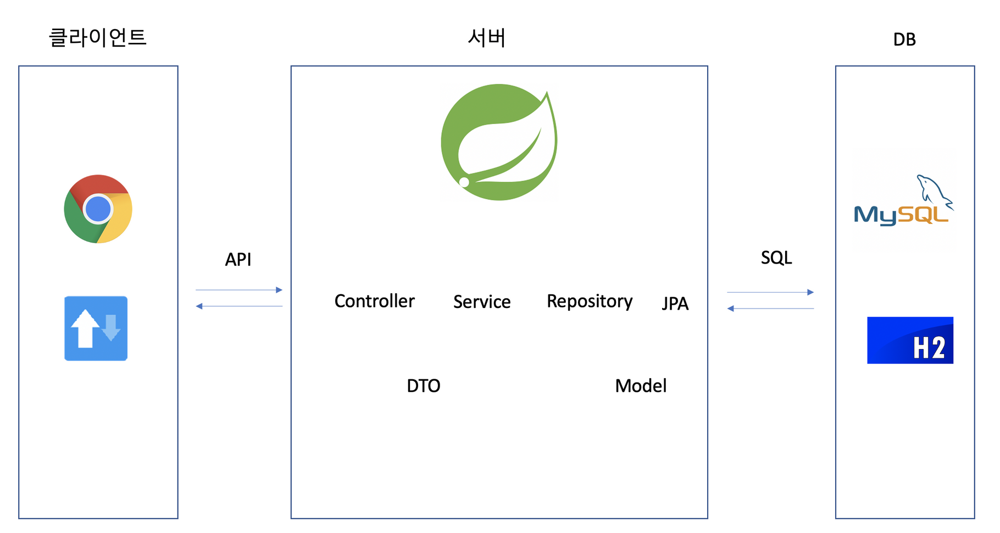
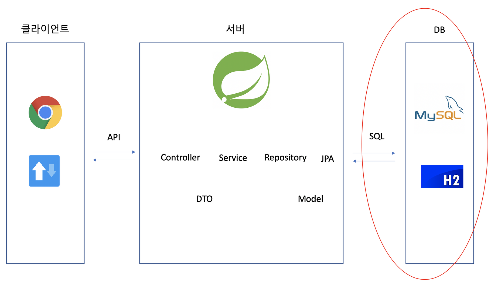
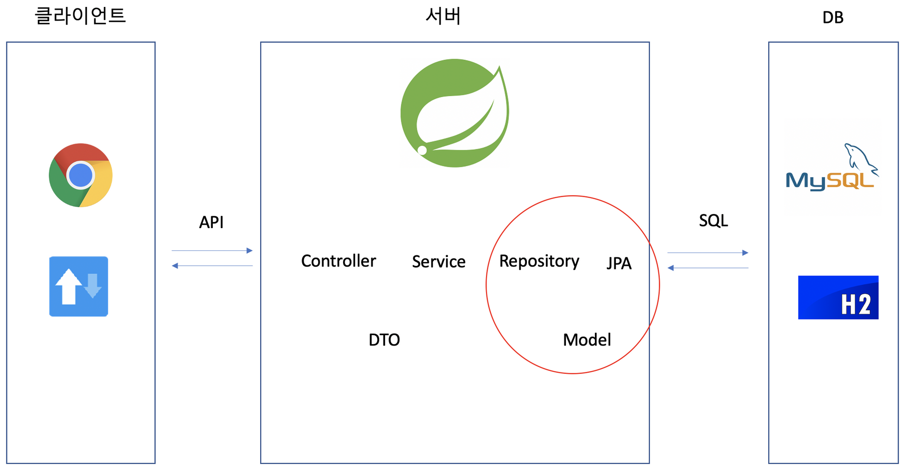
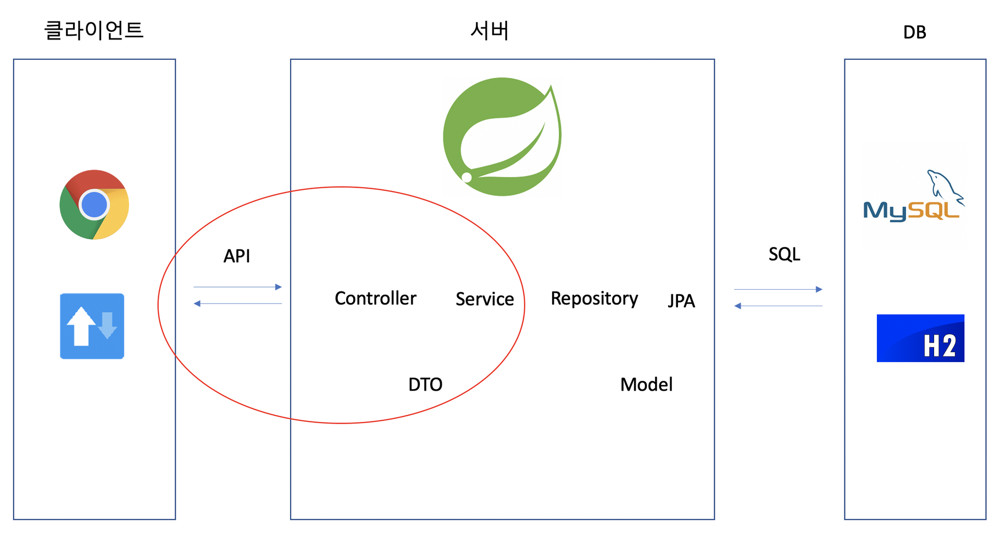

> [[스파르타코딩클럽\] 자바 문법 뽀개기 (notion.so)](https://www.notion.so/80db7f3685304ab3ac749e0e9cd29b30)
>
> [[스파르타코딩클럽\] 웹개발의 봄, Spring - 1주차 (notion.so)](https://www.notion.so/Spring-1-3ce1633a7ad244749a8192f4cf55c93a)
>
> [[스파르타코딩클럽\] 웹개발의 봄, Spring - 2주차 (notion.so)](https://www.notion.so/Spring-2-58046d5633454406b67905630ab7bc72)
>
>  
>
> 


설치해야하는 Dev Tools

> Lombok
>
> Spring Web
>
> Spring Data JPA
>
> H2 Database
>
> MySQL Driver


# 웹의 동작 개념

> 우리가 보는 웹페이지의 원리
>
> 1. 브라우저가 API에 요청을 보내면 **서버**에서 미리 준비해두었던 것을 보내주게 된다
> 2. 브라우저가 API에서 보내준 데이터를 **"받아서", "그려준다"**
>
> 
>
> **브라우저가 하는 일**
>
> 1) 요청을 보내고
> 2) 데이터나 HTML, CSS, JS 파일을 받는다
> 3) 받은 파일들로 화면을 구성하거나, 받은 데이터를 처리한다
>
> 브라우저는 데이터를 JSON형식으로 받고
> 서버에선 데이터를 RestController로 보낸다


## RestController

> JSON 데이터로 응답하려면 RestController를 사용해야 한다
>
> 단순히 클래스 앞에 `@RestController` 어노테이션을 붙여주면 된다

- Rest ?
  - 서버의 응답이 JSON 형식임을 나타냅니다.
  - HTML, CSS 등을 주고받을 때는 Rest 를 붙이지 않습니다.

- Conroller ?

  <aside> 👉 자동 응답기! 누군가 말을 걸면 응답하는 녀석이에요.

  - 클라이언트의 요청(Request)을 전달받는 코드를 Controller 라고 부릅니다.

    → JSON 만을 돌려주는 것은 RestController 라고 부릅니다.


```java
// RestController 예시
@RestController
public class CourseController {

    @GetMapping("/courses")
    public Course getCourses() {
        Course course = new Course();
        course.setTitle("웹개발의 봄 스프링");
        course.setDays(5);
        course.setTutor("노션");
        return course;
    }
}
```

> @GetMapping
>
> 브라우저에서 주소를 치는 행위를 GET 방식으로 정보를 요청한다고 합니다. 스프링 주소(http://localhost:8080) 뒤의 주소가 /courses 일 경우, getCourse 메소드를 실행함을 나타냅니다.


## 그레이들 (Gradle)

> 스프링 프로젝트를 빌드 할 수 있게 도와주기도 하고
>
> 다른 사람이 만들어둔 도구를 내려받는데 도움을 준다


언어별 다운로드받고 적용하는 과정을 편하게 해주는 도구들

- Javascript - NPM
- Python - pip
- Java - mavenCentral, jcenter


# MVC모델 요약




## DB

> RDBMS, H2, SQL



### RDBMS

> RDBMS(Relational DataBase Management System)은 컴퓨터에 정보를 저장하고 관리하는 기술입니다.
> **성능/관리 면에서 매우 고도화된 엑셀** 이라고 생각해도 좋다

(줄여서 RDB) **관계형 데이터베이스**를 뜻한다


#### RDBMS의 종류

> 각 제품 간 차이가 크지 않아서 사실 어떤 걸 사용하든 좋습니다. 유료인 Oracle을 제외하고 보통 MySQL, PostgreSQL 중에서 많이 고르는 편인데, 우리는 실제 배포 시 MySQL을 사용합니다.

- MySQL
- PostgreSQL
- Oracle Database


### H2

> In-memory DB의 대표 주자인 H2
> 인메모리 DB란 서버가 작동하는 동안에만 내용을 저장하고, 서버가 작동을 멈추면 데이터가 모두 삭제되는 데이터베이스를 말합니다.

RDBMS의 한 종류로, 서버가 켜져있는 동안에만 작동하는 RDB

### SQL

데이터를 읽고, 저장하고, 변경하고, 삭제하는 구체적인 문법이다


## Model

> DB를 사용하기 위한 영역
>
> 스프링은 자바로 작동하고, 데이터베이스는 SQL로 작동한다
> 한국어와 영어 사이에 번역기가 필요하듯, 스프링과 DB에도 번역기가 필요하다
> **JPA는 자바를 위한 번역기**라고 생각하면 된다




### JPA

> JPA(Java Persistence API)는 스프링을 위해 만들어졌다
> **Java로 코드를 작성하면 SQL로 번역**해줄 뿐만 아니라, **기본적인 기능이 거의 완벽하게 들어있다**


### Repository

> 클래스의 한 역할 중 하나이고, 데이터에 접근할 때 사용하는 하나의 도구라고 생각하면 된다

 JPA를 작동시키는 매개체


## Controller

> 클라이언트 - 서버 간의 약속인 API와 데이터를 주고받는 영역




### API, Controller, Service

> API 요청에도 다양한 방식이 있습니다. 생성, 조회, 수정, 삭제 각각에 맞는 방법을 알아봅니다.
>
> **스프링은 데이터를 주고받는 방법을 강제합니다**. 어떻게 하면 올바르게 주고받을 수 있는지 배웁니다.


### DTO

> 현업에서는 데이터를 주고받을 때, DTO를 반드시 이용합니다. 왜 그러한지 이유와 방법을 배웁니다.


### Lombok

> 코드를 절약할 수 있는 Lombok 사용법을 익힙니다.


