> [[스파르타코딩클럽\] 자바 문법 뽀개기 (notion.so)](https://www.notion.so/80db7f3685304ab3ac749e0e9cd29b30)
>
> [[스파르타코딩클럽\] 웹개발의 봄, Spring (notion.so)](https://www.notion.so/Spring-36bf83125a3e43acb863849f4902fa6c)
>
> [[스파르타코딩클럽\] Spring 심화반 (notion.site)](https://teamsparta.notion.site/Spring-5dceb99696bd471ab0618dfafc12f8f5)


설치해야하는 Dev Tools

> Lombok
>
> Spring Web
>
> Spring Data JPA
>
> H2 Database
>
> MySQL Driver


# 객체지향 설계 5원칙 SOLID

[객체지향 설계 5원칙 SOLID (SRP, OCP, LSP, ISP, DIP) (tistory.com)](https://sjh836.tistory.com/159)

> SRP, OCP, LSP, ISP, DIP
>
> 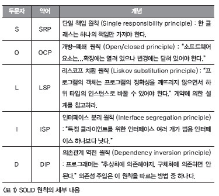

객체지향 설계는 긴 세월과 수많은 시행착오를 거치며 5가지 원칙이 정리되었다. 이것은 객체지향 설계의 5원칙이라고 하며, 앞글자를 따서 SOLID라고 한다.

1. SPR(Single Responsibility Principle) : 단일 책임 원칙
2. OCP(Open Closed Principle) : 개방 폐쇄 원칙
3. LSP(Liskov Substitution Principle) : 리스코프 치환 원칙
4. ISP(Interface Segregation Principle) : 인터페이스 분리 원칙
5. DIP(Dependency Inversion Principle) : 의존 역전 원칙

이 원칙들은 응집도는 높이고 결합도는 낮추자는 고전 원칙을 객체 지향의 관점에서 재정립한 것으로 볼 수 있다.

## SPR - 단일 책임 원칙

> 어떤 클래스를 변경해야 하는 이유는 오직 하나 뿐이어야 한다

**SRP가 지켜지지 않은 사례**

- 변수 레벨
  - 하나의 속성이 여러 의미를 갖는 경우
  - 어떤 곳에서는 쓰고, 어떤 곳에선 안쓰는 속성이 있는 경우
- 메소드 레벨
  - 분기처리를 위한 if문이 많을 경우


## OCP - 개방 폐쇄 원칙

> 소프트웨어 엔티티(클래스, 모듈, 함수 등)는 확장에 대해서는 열려 있어야 하지만, 변경에 대해서는 닫혀 있어야 한다. 즉, 자신의확장에는 열려있고, 주변의 변화에 대해서는 닫혀 있어야 한다는 것.
>
> 이것은 interface를 통해 구현하여 해결한다
>
> 현실의 예를들면 상점직원이 아무리 바뀐다고해서 손님이 상품을 구매하는 데는 지장이 없다. 이는 직원은 판매 인터페이스를 구현해야하기 때문이다. 손님은 판매인터페이스와 소통하기 때문에 직원이 누구든 지장이 없다.


## LSP - 리스코프 치환 원칙

> 서브타입은 언제나 자신의 기반타입으로 교체할 수 있어야 한다. 즉, 하위 클래스의 인스턴스는 상위형 객체 참조 변수에 대입해 상위 클래스의 인스턴스 역할을 수행하는 데 문제가 없어야 한다. 이것은 OOP 4대 특성의 상속, 인터페이스 원칙이 잘 지켜진 다면 LSP는 자동으로 잘 적용된 것이다.
> (주로 조직도, 계층도 관점에서의 상속이 LSP를 위배하는 문제가 생긴다)


## ISP -  인터페이스 분리 원칙

> 클라이언트는 자신이 사용하지 않는 메소드에 의존 관계를 맺으면 안된다. ISP는 SRP와 비슷하지만 인터페이스를 통한 다른 해결책을 제안하고 있다. 예를 들어 `class 사람 implements 군인` 이면 `군인 홍길동 = new 사람()` 을 통해 군인 인터페이스의 메소드만을 사용하도록 제한하는 것이다. SRP라면 class를 나누어서 해결한다 (일반적으론 ISP보다 SRP가 권장된다)


## DIP - 의존 역전 원칙

> 고차원 모듈은 저차원 모듈에 의존하면 안된다. 추상화된 것은 구체적인 것에 의존하면 안된다. 구체적인 것이 추상화된 것에 의존해야 한다. 자주 변경되는 클래스에 의존하지 말자.
>
> 즉, 자신보다 변하기 쉬운 것에 의존하지 말라는 것이다. 해결방법은 OCP와 비슷한데, 구체적인 class가 아닌, 인터페이스에 의존함으로써 DIP를 해결한다


## 상속

> 추상클래스와 인터페이스의 차이점
>
> 1. extends
>    - 부모에서 선언 / 정의를 모두하며 자식은 메소드 / 변수를 그대로 사용할 수 있음
> 2. implements (interface 구현)
>    - 부모 객체는 선언만 하며 정의(내용)은 자식에서 오버라이딩 (재정의) 해서 사용해야함
> 3. abstract
>    - extends와 interface 혼합. extends하되 몇 개는 추상 메소드로 구현되어 있음


[자바의 추상 클래스와 인터페이스 (brunch.co.kr)](https://brunch.co.kr/@kd4/6)

[자바 extends, implements 차이 (velog.io)](https://velog.io/@hkoo9329/자바-extends-implements-차이)


> ## 추상클래스
>
> **abstract** 키워드를 가지고 있는 **추상메서드**를 가지고 있는 클래스
> => 추상메서드는 반드시 재정의해야하는 메서드이다
>
> AA [ Application Architecture ]가 주로 설계한다
>
> 사용 목적
>
> 1. 공통된 필드와 메서드를 통일
> 2. 실체클래스 구현시 시간절약
> 3. 규격에 맞는 실체클래스 구현
>
> 
>
> ## 인터페이스
>
> 해당 **인터페이스를 구현한 객체들**에 대해서 **동일한 동작을 약속하기 위해** 존재
> **계약 및 분류의 의미가 강하다**
>
> **모든 메소드가 추상 메소드**이다


### extends 상속

> **슈퍼클래스의 기능을 이용**하거나 **확장**하기 위해서 사용

- 부모 클래스에서 구현한 메소드를 사용할 수 있다

- 다중 상속이 안된다 (같은 메소드 명이 있다면 에러가 날 것)

- 추상클래스의 상속

  > **일반클래스를 extends 하는 상속과 인터페이스를 implements하는 상속의 혼용** 
  >
  > abstract 메소드가 존재하는 추상클래스라면, Override로 재정의하여 **구현해야 한다**


### implements 상속

> **인터페이스를 상속**받는 것

- 인터페이스에서 정의한 메소드를 Override로 재정의하여 **구현해야 한다**
- 다중 상속이 가능하다


# 스프링

> 디자인 패턴
>
> https://velog.io/@sangmin7648/Spring%EC%9D%98-%EB%94%94%EC%9E%90%EC%9D%B8-%ED%8C%A8%ED%84%B4%EB%93%A4


## DI

> Dependency Injection ( 객체 주입 )
>
> [스프링 - 생성자 주입을 사용해야 하는 이유, 필드인젝션이 좋지 않은 이유 (yaboong.github.io)](https://yaboong.github.io/spring/2019/08/29/why-field-injection-is-bad/)

### 의존성 주입 (Dependency Injection)

: 필요한 의존성 객체를 어떻게 주입 받을 것인가

- 종류
  - (1) **Constructor Injection**
  - (2) **Field Injection**
  - (3) **Setter Injection**
- (1) **Constructor Injection**의 경우,
  주입 받을 의존성 객체의 원형 **필드에** 보통 **final** 키워드를 붙인다.
- (2), (3) 의 **Field Injection** 와 **Setter Injection** 의 경우에는,
  필드에 **final** 키워드를 **붙이지 않는다.**
- Spring 에서 공식적으로 **권장하는** 의존성 주입 방법은 (1) **Constructor Injection** 이다.
- 그럼에도 Field Injection 이나 Setter Injection 같은 방법들이 존재하는 이유는
  간혹 **순환 참조**(**Circular Depencies** or **Circular Reference**) 라는 문제가 발생할 수 있는데
  이 순환 참조 문제를 Field Injection 이나 Setter Injection로 해결 가능하다.


## IoC

> Inversion Of Controll ( 제어 역전 )
>
> **DI / IOC** 한방에 정리 - [IoC 컨테이너 / BeanFactory / ApplicationContext (velog.io)](https://velog.io/@linger0310/IoC-컨테이너-BeanFactory-ApplicationContext)


### IoC(Inversion of Control)란?

: 제어권 역전.

**일반적인 제어권 상황**과 **IoC 상황**을 코드로 예를 들어 설명하겠다.

#### (1) 일반적인 제어권

> 객체 의존성에 대한 일반적인 제어권 Example

- 자신이 사용할 의존성 객체를 **직접** 초기화하여 만들어 사용한다.
  이는 **의존성 객체에 대한 제어권이 자신에게 있다**고 볼 수 있다.

```java
	class OwnerController{
		private OwnerRepository owner = new OwnerRepository();
	}
```


#### (2) IoC(Inversion of Control)

> IoC(Inversion of Control) Example

- 자신이 사용할 의존성 객체를 생성자를 통해 **외부로부터** 주입 받는다.
  **즉, 의존성 객체에 대한 제어권이 자신에게 없는 상황**이고 이를 **제어권이 역전**되었다고 한다.
  이렇게 외부로부터 의존성 객체를 주입 받는 것을 **DI(Dependency Injection)** 라고 한다.

```java
class OwnerController {
	private OwnerRepository owner;

	public OwnerController(OwnerRepository owner) {
		this.owner = owner;
	}
}
```


## Bean

> Spring 의 **IoC 컨테이너가 관리하는 자바 객체**를 Bean 이라고 한다.

- 위의 IoC(Inversion of Control)에서

  - **(1) 일반적인 제어권** 의 example 코드 방식으로 생성된 객체는
       **Bean이 아니다.**

  - **(2) IoC(Inversion of Control)** 의 example 코드 방식으로 생성된 객체가
       **Bean이다.**

    

- Spring 에서 **의존성 주입(DI, Dependency Injection)**을 받기 위해서는
  이러한 자바 객체를 IoC 컨테이너에 Spring Bean으로 등록해야 가능하다.

### Bean 등록 방법

#### (1) Component Scanning

- Class에 **@Component**와 관련된 어노테이션을 적용시켜 Bean으로 등록하는 방식

  - 종류

    - **@Component**

    - **@Repository**

    - **@Service**

    - **@Controller**

    - **@Configuration**

    - **etc.**

      

> Component Scanning Example

```java
@Controller
public class SampleBeanController {

}
```

#### (2) 직접 등록

- 일종의 Configuration.java 파일을 생성하여
  @Configuration 과 @Bean을 사용하여 직접 등록해주는 방식

  

> 직접 등록 Example | SampleBeanConfig.java

```java
@Configuration
public class SampleBeanConfig {

	@Bean
	public SampleBeanController sampleBeanController(){
		return new SampleBeanController();
	}
}
```

### 등록된 Bean을 어떻게 꺼내어 사용할까?

#### (1) @Autowired 혹은 @Inject

> Example

```java
	@Autowired
	private OwnerRepository owners;

	@Autowired
	private ApplicationContext applicationContext;

	@Autowired
	private VisitRepository visits;

	@Autowired
	private PetRepository petRepository;
```

#### (2) ApplicationContext에서 getBean()으로 직접 꺼내어 사용하기

> Example

```java
@RunWith(SpringRunner.class)
@SpringBootTest
public class SampleBeanControllerTest {

	@Autowired
	ApplicationContext applicationContext;

	// ApplicationContext에 SampleBeanController가 Bean으로 등록되어 있는지
	// 확인하는 테스트 코드
	@Test
	public void testDI() {
		SampleBeanController bean = applicationContext.getBean(SampleBeanController.class);
		assertThat(bean).isNotNull();
	}
}
```


## IoC 컨테이너

- Spring Bean 생성과 Bean들 사이의 관계 설정, 사용, 제거 등의 작업을 담당하는 독립된 공간
- Spring 에서 IoC를 담당하는 컨테이너는 **BeanFactory**, **ApplicationContext** 두 가지가 있다.
- 기본적으로 **싱글톤 스코프**로 Bean 을 관리.
  - 왜 싱글톤 일까?
    - 매번 클라이언트에서 요청이 들어올 때마다 각 로직을 담당하는 객체들을 새로 생성하는 것은 자원 측면에서 매우 비효율적.
    - 따라서, 클래스당 하나의 객체만 만들어두고 사용자의 요청을 담당하는 여러 스레드에서 하나의 객체를 공유해 동시에 사용.


## 1. BeanFactory

- Spring IoC 컨테이너 최상위 인터페이스

## 2. ApplicationContext

- BeanFactory와 그외 여러가지 인터페이스들을 추가로 상속받은 인터페이스.
- IoC 컨테이너로서의 역할을 하는 **BeanFactory**에 엔터프라이즈 애플리케이션을 개발하는 데 필요한 여러가지 기능을 추가한 것이 **ApplicationContext**다.


## AOP

> Aspect Oriented Programming ( 관점 지향 프로그래밍 )


# 웹의 동작 개념

> 우리가 보는 웹페이지의 원리
>
> 1. 브라우저가 API에 요청을 보내면 **서버**에서 미리 준비해두었던 것을 보내주게 된다
> 2. 브라우저가 API에서 보내준 데이터를 **"받아서", "그려준다"**
>
> 
>
> **브라우저가 하는 일**
>
> 1) 요청을 보내고
> 2) 데이터나 HTML, CSS, JS 파일을 받는다
> 3) 받은 파일들로 화면을 구성하거나, 받은 데이터를 처리한다
>
> 브라우저는 데이터를 JSON형식으로 받고
> 서버에선 데이터를 RestController로 보낸다


# HTTP의 구조

> [HTTP🍔 — Duck9s' (tistory.com)](https://duckgugong.tistory.com/156#--%--%EB%AC%B-%EC%--%--%ED%--%-C%---%--Stateless%--%ED%--%--%EB%A-%-C%ED%--%A-%EC%BD%-C)


## RestController

> JSON 데이터로 응답하려면 RestController를 사용해야 한다
>
> 단순히 클래스 앞에 `@RestController` 어노테이션을 붙여주면 된다

- Rest ?
  - 서버의 응답이 JSON 형식임을 나타냅니다.
  - HTML, CSS, JS 등을 주고받을 때는 Rest 를 붙이지 않습니다.

- Conroller ?

  <aside> 👉 자동 응답기! 누군가 말을 걸면 응답하는 녀석이에요.

  - 클라이언트의 요청(Request)을 전달받는 코드를 Controller 라고 부릅니다.

    → JSON 만을 돌려주는 것은 RestController 라고 부릅니다.


```java
// RestController 예시
@RestController
public class CourseController {

    @GetMapping("/courses")
    public Course getCourses() {
        Course course = new Course();
        course.setTitle("웹개발의 봄 스프링");
        course.setDays(5);
        course.setTutor("노션");
        return course;
    }
}
```

> `@GetMapping`
>
> 브라우저에서 주소를 치는 행위를 GET 방식으로 정보를 요청한다고 합니다. 스프링 주소(http://localhost:8080) 뒤의 주소가 /courses 일 경우, getCourse 메소드를 실행함을 나타냅니다.


## 그레이들 (Gradle)

> 스프링 프로젝트를 빌드 할 수 있게 도와주기도 하고
>
> 다른 사람이 만들어둔 도구를 내려받는데 도움을 준다


언어별 다운로드받고 적용하는 과정을 편하게 해주는 도구들

- Javascript - NPM
- Python - pip
- Java - mavenCentral, jcenter

# MVC모델 요약


## DB

> RDBMS, H2, SQL


### RDBMS

> RDBMS(Relational DataBase Management System)은 컴퓨터에 정보를 저장하고 관리하는 기술입니다.
> **성능/관리 면에서 매우 고도화된 엑셀** 이라고 생각해도 좋다

(줄여서 RDB) **관계형 데이터베이스**를 뜻한다


#### RDBMS의 종류

> 각 제품 간 차이가 크지 않아서 사실 어떤 걸 사용하든 좋습니다. 유료인 Oracle을 제외하고 보통 MySQL, PostgreSQL 중에서 많이 고르는 편인데, 우리는 실제 배포 시 MySQL을 사용합니다.

- MySQL
- PostgreSQL
- Oracle Database


**H2**

> In-memory DB의 대표 주자인 H2
> 인메모리 DB란 서버가 작동하는 동안에만 내용을 저장하고, 서버가 작동을 멈추면 데이터가 모두 삭제되는 데이터베이스를 말합니다.

RDBMS의 한 종류로, 서버가 켜져있는 동안에만 작동하는 RDB


### SQL

> SQL(Structured Query Language)
>
> RDBMS의 고도화된 엑셀 파일 하나가 "데이터베이스"라면,
> 엑셀 시트 하나는 "테이블"이라고 부르고,
> 엑셀 행 하나는 "데이터"라고 부릅니다.

데이터베이스에서 데이터를 읽고, 저장하고, 변경하고, 삭제하는 구체적인 문법이다


### ERD

> ERD [ Entity Relationship Diagram ]
> 관계형 데이터베이스를 다이어그램(도표)화 한 것
>
> 무료 ERD사이트
> https://dbdiagram.io/home
>
> 연관관계와 dbdiagram.io 사용법
> https://conanmoon.medium.com/%EB%8D%B0%EC%9D%B4%ED%84%B0%EA%B3%BC%ED%95%99-%EC%9C%A0%EB%A7%9D%EC%A3%BC%EC%9D%98-%EB%A7%A4%EC%9D%BC-%EA%B8%80%EC%93%B0%EA%B8%B0-%EC%97%B4%ED%95%9C-%EB%B2%88%EC%A7%B8-%EC%9D%BC%EC%9A%94%EC%9D%BC-31a084f98e2c


## Model

> DB를 사용하기 위한 영역
> `@Entity` 를 선언하여 클래스를 바로 테이블로 만들어 사용하고, 각종 기능들을 구현한다
>
> 스프링은 자바로 작동하고, 데이터베이스는 SQL로 작동한다
> 한국어와 영어 사이에 번역기가 필요하듯, 스프링과 DB에도 번역기가 필요하다
> **JPA는 자바를 위한 번역기**라고 생각하면 된다


### Repository

> 클래스의 한 역할 중 하나이고, 데이터에 접근할 때 사용하는 하나의 도구라고 생각하면 된다

 JPA를 작동시키는 매개체


- 자바로 DB를 사용하도록 도와주는 녀석이 JPA 라고 말씀드렸습니다.
- 그럼 DB를 이용하는데 핵심이었던 "테이블"과 "SQL"과 동일한 개념의 자바 용어가 있겠죠?
- **"테이블"은 Domain, "SQL"은 Repository** 입니다.


## Controller

> 클라이언트 - 서버 간의 약속인 API와 데이터를 주고받는 영역


### API, Controller, Service

> API 요청에도 다양한 방식이 있습니다. 생성, 조회, 수정, 삭제 각각에 맞는 방법을 알아봅니다.
>
> **스프링은 데이터를 주고받는 방법을 강제합니다**. 어떻게 하면 올바르게 주고받을 수 있는지 배웁니다.


### DTO

> **DTO [ Data Transfer Object ]**
> VO [ Value Object ] 로 정의하여 사용했던 클래스와 같다
>
> 현업에서는 데이터를 주고받을 때, DTO를 반드시 이용합니다. 왜 그러한지 이유와 방법을 배웁니다.


### Lombok

> 코드를 절약할 수 있는 Lombok 사용법을 익힙니다.


# Spring boot 용어설명

> [[Spring Boot\] 05/26 Sprin.. : 네이버블로그 (naver.com)](https://blog.naver.com/lkj7458/222747672065)

## JPA

> JPA(Java Persistence API) - Java를 이용하여 데이터 관리/유지 기법을 정리해 놓은 표준 Spec
> **Java로 코드를 작성하면 SQL로 번역**해줄 뿐만 아니라, **기본적인 기능이 거의 완벽하게 들어있다**
> Java - ORM 기술에 대한 인터페이스의 모음
>
> - 데이터 베이스 관련 작업을 대신 처리해주는 추상화된 계층의 구현 스펙
> - 이전 사용되는 EJB라는 기술 스펙에서 Entity Bean이라는 데이터를 처리해주는 스펙을 정해준 것이 JPA의 효시
> - JPA를 이해하기 위해서는 우선 ORM이라는 기법을 이해
> - 데이터 베이스와 연관된 처리를 JPA 계층에서 처리하므로 좀 더 추상화된 형태의 코드를 제작하는 것으로 개발이 가능


## ORM

> ORM(Object-Relational Mapping) - 자바 객체와 RDBMS의 데이터를 자동으로 매핑해주는 것
>
> - 자바의 객체 지향 기술과 관계형 DataBase를 서로 연결 해주는 추상화된 기술
> - ORM을 통해 객체 간의 관계를 바탕으로 SQL을 자동으로 생성하여 불일치 해결
> - Object 필드와 데이터 베이스 데이터를 서로 매핑
> - 객체를 사용하여 갖접적으로 데이터베이스 데이터를 다루는 개념
> - 데이터 영속성을 위한 API(Persistant API)의 한 종류


## **영속성**

- 데이터가 사라지지않고 오래 지속되는 현상
- DB에 저장하는 방식
  - JDBC 사용하기(java에서 사용)
  - Spring JDBC(JDBCTemplate 등을 사용)
  - Persistence FrameWork 

- JDBC 프로그래밍의 복잡함을 없애고, 간단한 작업만으로 데이터베이스와 연동되는 시스템을 빠르게 개발할 수 있다 
- SQL Mapper와 Objet-Relational Mapping 두 종류로 구분할 수 있는데, JPA, Hibernate, Mybatis 등이 여기에 해당


JPA 사용 안했을 때

```java
String query = "SELECT * FROM EMPLOYEE WHERE ID = ?";
Employee employee = jdbcTemplate.queryForObject(
  query, new Object[] { id }, new EmployeeRowMapper());
```


JPA 설정

```java
implementation 'org.springframework.boot:spring-boot-starter-data-jpa'
```


JPA 사용 했을 때

> query없이 사용가능, 자동으로 SQL로 변환해준다

```java
repository.save(new Customer("Jack", "Bauer"));
repository.save(new Customer("Chloe", "O'Brian"));
```


### JPA code예시

> [[JPA\] ORM(Object-Relational Mapper) (tistory.com)](https://annajin.tistory.com/168)

```java
@NoArgsConstructor // 기본생성자를 대신 생성해줍니다.
@Entity // 테이블임을 나타냅니다.
public class Course {

    @Id // ID 값, Primary Key로 사용하겠다는 뜻입니다.
    @GeneratedValue(strategy = GenerationType.AUTO) // 자동 증가 명령입니다.
    private Long id;

    @Column(nullable = false) // 컬럼 값이고 반드시 값이 존재해야 함을 나타냅니다.
    private String title;

    @Column(nullable = false)
    private String tutor;

    public String getTitle() {
        return this.title;
    }

    public String getTutor() {
        return this.tutor;
    }

    public Course(String title, String tutor) {
        this.title = title;
        this.tutor = tutor;
    }
}
```

JPA를 사용하지 않는다면 아래처럼 입력해야한다

```sql
CREATE TABLE IF NOT EXISTS Course (
    id bigint(5) NOT NULL AUTO_INCREMENT,
    title varchar(255) NOT NULL,
    tutor varchar(255) NOT NULL,
    PRIMARY KEY (id)
);
```


## 인터페이스

> JPA는 Repository를 통해서만 사용할 수 있습니다.
>
> 인터페이스는 클래스에서 멤버가 빠진, 메소드 모음집이라고 보시면 됩니다.

```java
public interface CourseRepository extends JpaRepository<Course, Long> {
}	// (Primary Key가 Long 타입인) Course 클래스에 대한 Repository를 만든다
```


```java
@Bean
    public CommandLineRunner demo(BoardRepository repository) {
        return (args) -> {

            Board board1 = new Board();
            repository.save(board1);
            // BoardRepository에서 JpaRepository<Board, Long>를 상속했기 때문에
            // repository관련 메소드를 사용할 수 있다
            List<Board> boardList = repository.findAll();

            for (int i=0; i<boardList.size();i++){
                Board b = boardList.get(i);
                System.out.println(b.getTitle());
            }
        };
    }
```


## 상속의 개념

> `public interface CourseRepository extends JpaRepository<Course, Long>{}`
> 에서 사용한 **extends는 클래스의 상속을 선언**할 때 사용한다
> 상속받은 클래스는 상속한 클래스의 **멤버변수, 메소드를 가지고 있다**


```java
// 상속 예시
class Person {
	private String name;
	private String getName() {
		return this.name;
	}
}

class Tutor extends Person {
	private String address;
	// Person 클래스를 상속했기 때문에,
	// name 멤버변수와 getName() 메소드를 가지고 있습니다.
}
```


### 생성일자, 수정일자

> 대부분의 DB는 기본으로 "생성일자"와 "수정일자"를 필드로 가지고 있다
>
> 생성일자와 수정일자를 다루는 클래스를 생성하고, 그것을 상속받아 사용하게 만든다


# CRUD

> 정보관리의 기본 기능
>
> → 생성 (Create)
> → 조회 (Read)
> → 변경 (Update)
> → 삭제 (Delete)


## 데이터 저장 (Create) & 조회 (Read)

1. Application단에서 `JpaRepository`를 상속받은 BoardRepository 인터페이스 클래스의
   JPA 메서드를 사용하여 저장 및 조회 기능을 구현

> JpaRepository를 상속받은 repository는 쿼리를 보내주는 클래스라고 생각하면 된다

```java
// 데이터 저장하기
repository.save(new Course("프론트엔드의 꽃, 리액트", "임민영"));

// 데이터 전부 조회하기
List<Course> courseList = repository.findAll();
for (int i=0; i<courseList.size(); i++) {
    Course course = courseList.get(i);
    System.out.println(course.getId());
    System.out.println(course.getTitle());
    System.out.println(course.getTutor());
}

// 데이터 하나 조회하기
// 데이터가 없을 수 있으므로 .orElseThrow로 예외를 처리해 줘야한다
Course course = repository.findById(1L).orElseThrow(
        () -> new IllegalArgumentException("해당 아이디가 존재하지 않습니다.")
);
```


> Repository에 기능추가
> https://docs.spring.io/spring-data/jpa/docs/current/reference/html/#jpa.query-methods

```java
public interface BoardRepository extends JpaRepository<Board, Long> {
    List<Board> findAllByOrderByModifiedAtDesc();
}
```


### Service의 개념

> 스프링의 구조는 3가지 영역으로 나눌 수 있습니다.
>
> 1. Controller : 가장 바깥 부분, 요청/응답을 처리함.
>
>    → 2주차 후반부에 배울 녀석
>
> 2. Service : 중간 부분, 실제 중요한 작동이 많이 일어나는 부분
>
>    → 지금 배울 녀석
>
> 3. Repo : 가장 안쪽 부분, DB와 맞닿아 있음.
>
>    → 여태 배운 녀석 (Repository, Entity)

Update 는 Service 부분에 작성해야 한다


## 데이터 변경 (Update)

> [[Spring\] @Transactional 정리 (tistory.com)](https://devkingdom.tistory.com/287)

1. Board 클래스에 update메서드를 추가한다
2. Service클래스에서 Board클래스의 update를 이용하여 update JPA를 생성한다
3. Application단에서 Service클래스의 update메서드를 호출하여 데이터 수정 기능을 구현한다
3. @Transactional 어노테이션으로 인해 update가 완료된다

```java
@Service // 스프링에게 이 클래스가 서비스임을 명시
public class BoardService {

    // final: 서비스에게 꼭 필요한 것이다 (생성자에서 사용할 수 있음)
    private final BoardRepository boardRepository;

    // 생성자를 통해, Service 클래스를 만들 대 꼭 Repository를 넣어주도록 스프링에게 알려줌
    public BoardService(BoardRepository boardRepository){
        this.boardRepository = boardRepository;
    }

    @Transactional // SQL 쿼리가 일어나야 함을 스프링에게 알려줌
    public Long update(Long id, Board board){
        Board board1 = boardRepository.findById(id).orElseThrow(
                () -> new IllegalArgumentException("해당 아이디가 존재하지 않습니다")
        );
        board1.update(board);
        return board1.getId();
    }
}
```

```java
 // 업데이트
            Board board2 = new Board("제목2", "콘텐츠2", "작성자2");
            boardService.update(1L, board2);
```


## 데이터 삭제 (Delete)

1. Application단에서 `JpaRepository`를 상속받은 BoardRepository 인터페이스 클래스의
   JPA 메서드를 사용하여 삭제 기능을 구현


# 데이터 받기

> [[Spring\] @RequestBody, @ModelAttribute, @RequestParam의 차이 - MangKyu's Diary (tistory.com)](https://mangkyu.tistory.com/72)
>
> https://tecoble.techcourse.co.kr/post/2021-05-11-requestbody-modelattribute/

**[ RequestBody, ModelAttribute, RequestParam 간단 정리 ]**

- RequetParam("`key`")

1개의 HTTP 파라미터를 얻기 위해 사용됨
필수 여부가 true이기 때문에 반드시 필요한 경우가 아니라면 required=false 설정이 필요함

- RequestBody

  - @RequestBody를 사용하면 요청 본문의 JSON, XML, Text 등의 데이터가 적합한 HttpMessageConverter를 통해 파싱되어 Java 객체로 **변환** 된다.

  - @RequestBody를 사용할 객체는 필드를 바인딩할 생성자나 setter 메서드가 필요없다.
    - 다만 **직렬화를 위해 기본 생성자는 필수**다.
    - 또한 데이터 바인딩을 위한 필드명을 알아내기 위해 **getter나 setter 중 1가지는 정의되어 있어야 한다**.


- ModelAttribute
  - multipart/form-data 형태로 받은 HTTP Body 데이터와 HTTP 파라미터들을 Setter를 통해 1대1로 객체에 바인딩시킴
  - 변환이 아닌 값을 주입시키므로, 변수들의 생성자나 Setter함수가 없으면 변수들이 저장되지 않음
  - @ModelAttribute 애너테이션의 역할은 클라이언트가 보내는 HTTP 파라미터들을 특정 Java Object에 **바인딩(맵핑)** 하는 것입니다. `/modelattribute?name=req&age=1` 같은 Query String 형태 혹은 요청 본문에 삽입되는 Form 형태의 데이터를 처리합니다.
  - @RequestBody 예제와 비슷하게 컨트롤러 및 DTO를 작성했습니다. ModelAttributeDto는 RequestBodyDto와 동일한 필드와 생성자 및 Getter 메서드를 가지고 있습니다. 차이점이라고 한다면 Setter가 정의되어 있지 않고, 컨트롤러는 @RequestBody 대신 @ModelAttribute를 사용한 것입니다.


### @RequestBody

[[Spring\] - @RequestBody 어노테이션의 동작방식 (tistory.com)](https://kim-jong-hyun.tistory.com/60)

> POST, PUT방식으로 Rest 소통할때 주로 쓰이게 된다
> 응답의 Body의 값을 JSON으로 변환하여 받아온다


### @RequestParam VS @PathVariable

https://pomo0703.tistory.com/92

> URL에 데이터를 보내는 두 가지 방법
>
> - @RequestParam (쿼리 파라미터 [ Query Parameter ])
> - @PathVariable 

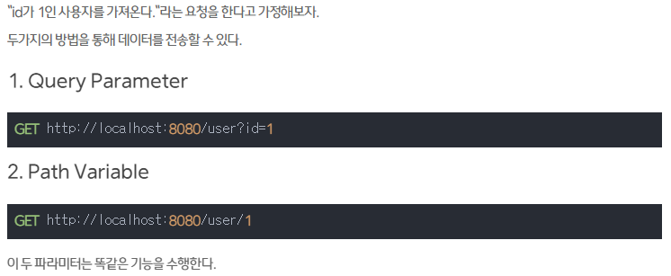


> **어떤 resource를 식별하고 싶으면 Path Variable**를, **정렬이나 필터링을 한다면 Query Parameter**를 사용하는 것이 좋다.
>
> Path Variable은 REST API에서 값을 호출할 때 주로 사용되고,
> Query Parameter는 게시판의 페이지 및 검색 정보를 전달하는 방식에서 많이 사용된다.
>
> ```url
> // 프로그래머인 사용자 목록을 가져온다.
> GET http://localhost:8080/user?occupation=programmer
> 
> // id가 1인 사용자를 가져온다.
> GET http://localhost:8080/user/1
> ```


# Lombok, DTO

> 롬복 사용상 주의점
>
> https://kwonnam.pe.kr/wiki/java/lombok/pitfall
>
> https://cheese10yun.github.io/lombok/


### Lombok

> 어노테이션을 통해 코드를 줄일 수 있다
>
> ex) getter, setter생성 / 기본생성자 자동생성 / 매개변수 자동선언

```java
// 생성자를 통해, Service 클래스를 만들 때 꼭 Repository를 넣어주도록 스프링에게 알려줌
public BoardService(BoardRepository boardRepository){
    this.boardRepository = boardRepository;
}
```

```java
@RequiredArgsConstructor // 자동으로 위의 과정 실행
```


**Lombok의 Builder 패턴 이용**

> https://royleej9.tistory.com/entry/Lombok-Builder


### DTO

> VO (Value Object)

```html
테이블을 막 건드려도 될까?
= read, update할 때 Course 클래스를 막 써도 될까?
= 내가 아닌 다른 사람이 변경이라도 한다면?? 😱

완충재로 활용하는 것이
DTO(Data Transfer Object)입니다.
```


# API

> 👉 클라이언트 - 서버 간의 약속입니다.
> 클라이언트가 정한대로 서버에게 요청(Request)을 보내면, 서버가 요구사항을 처리하여 응답(Response)을 반환합니다.


### Rest

> 👉 REST란, 주소에 명사, 요청 방식에 동사를 사용함으로써 의도를 명확히 드러냄을 의미합니다.

- 여기에 쓰이는 동사는 우리가 JPA 시간에 배운 CRUD를 지칭합니다.
- 즉 A에 대해 생성(POST)/조회(GET)/수정(PUT)/삭제(DELETE) 요청을 하는 것이죠.

- 예시
  - GET /courses → 강의 전체 목록 조회 요청
  - GET /courses/1 → ID가 1번인 녀석 조회 요청
  - POST /courses → 강의 생성 요청
  - PUT /courses/3 → ID가 3번인 녀석 수정 요청
  - DELETE /courses/2 → ID 2번인 녀석 삭제 요청


**Rest API 설계 규칙**

> [Rest API / Rest-ful — Duck9s' (tistory.com)](https://duckgugong.tistory.com/301)


#### GET

```java
@GetMapping("/api/boards")
    public List<Board> getBoards(){
        return boardRepository.findAll();
    }
```

#### POST

> `@RequestBody` POST의 특성 상 url에 데이터가 담기는 것이 아니라 body에 담긴다

```java
@PostMapping("/api/boards")
public Board createBoard(@RequestBody BoardDTO boardDTO) {
    // BoardDTO 는, 생성 요청을 의미합니다.
    // 강의 정보를 만들기 위해서는 강의 제목과 튜터 이름이 필요하잖아요?
    // 그 정보를 가져오는 녀석입니다.

    // 저장하는 것은 DTO가 아니라 Board이니, DTO의 정보를 Board에 담아야 합니다.
    // 잠시 뒤 새로운 생성자를 만듭니다.
    Board board = new Board(boardDTO);

    // JPA를 이용하여 DB에 저장하고, 그 결과를 반환합니다.
    return boardRepository.save(board);
}
```


#### PUT

> `@PathVariable`로 url의 변수와 이름이 같은 변수를 할당한다

```java
@PutMapping("/api/boards/{id}")
public Long updateBoard(@PathVariable Long id, @RequestBody BoardDTO boardDTO){
    return boardService.update(id, boardDTO);
}
```


#### DELETE

```java
@DeleteMapping("/api/boards/{id}")
public void deleteBoard(@PathVariable Long id){
    boardRepository.deleteById(id);
}
```


# JPA 공부

[[배워보자 Spring Data JPA\] JPA 에서 Pageable 을 이용한 페이징과 정렬 (tistory.com)](https://wonit.tistory.com/483)


## JPA - Update의 과정

https://jessyt.tistory.com/35


## JPA - 연관관계 설정

> [[Spring\] JPA: 관계 표현. ManyToOne, OneToMany : 네이버 블로그 (naver.com)](https://m.blog.naver.com/sssang97/221777035267)
>
> [연관관계 매핑 기초 · JPA (gitbooks.io)](https://backend.gitbooks.io/jpa/content/chapter5.html)
>
> [[JPA\] 3. 엔티티 연관 관계 매핑 정리/예제 (tistory.com)](https://cjw-awdsd.tistory.com/47)
>
> [JPA 연관 관계 한방에 정리 (단방향/양방향, 연관 관계의 주인, 일대일, 다대일, 일대다, 다대다) (tistory.com)](https://jeong-pro.tistory.com/231)
>
> [[JPA\] 양방향 연관관계 (tistory.com)](https://ict-nroo.tistory.com/122)
>
> [JPA - 연관 관계 매핑 (@OneToMany , @ManyToOne , @OneToOne , @ManyToMany ) (velog.io)](https://velog.io/@devsh/JPA-연관-관계-매핑-OneToMany-ManyToOne-OneToOne-ManyToMany)


> https://www.youtube.com/watch?v=brE0tYOV9jQ
>
> https://www.youtube.com/watch?v=hsSc5epPXDs 

**방향**(Direction) : [단방향, 양방향]이 있다.
예를 들어 회원과 팀이 관계가 있을 때 회원 -> 팀 또는 팀 -> 회원 **둘 중 한 쪽만 참조하는 것을 단방향 관계**라 하고, 회원 -> 팀, 팀 -> 회원 **양쪽 모두 서로 참조하는 것을 양방향 관계**라 한다. ***방향은 객체관계에만 존재하고 테이블 관계는 항상 양방향***이다.

**다중성**(Multiplicity) : [다대일(N:1), 일대다(1:N), 일대일(1:1), 다대다(N:N)] 다중성이다. 예를 들어 회원과 팀이 관계가 있을 때 여러 회원은 한 팀에 속하므로 회원과 팀은 다대일 관계다. 반대로 한 팀에 여러 회원이 소속될 수 있으므로 팀과 회원은 일대다 관계다.

**연관관계의 주인**(Owner) : 객체를 양방향 연관관계로 만들면 연관관계의 주인을 정해야 한다.


- ## 양방향 매핑시 가장 많이 하는 실수

  > 1. **연관관계의 주인**에 값을 입력하지 않음.
  > 2. mappedBy 에 필드 값을 수정하는 것.
  > 3. 이 필드는 **읽기 전용이 되는 것을 꼭 명심**해야 함.
  > 4. 양방향 매핑시에 **무한 루프 조심**, toString, lombok, JSON 생성 라이브러리
  > 5. 스프링 부트는 컨트롤러 레이어에서 유저로 데이터를 반환할 때 @ResponseBody 로 반환하는 경우 Json 파싱을 하게 되는데 이 때 Jackson 라이브러리를 사용합니다. 만약 엔티티를 컨트롤러에서 사용하게 되면 무한 참조가 발생하게 됩니다. 처리하는 방법은 @JsonIgnore 나 엔티티를 사용하지 않는 방식이나 일반적으로 엔티티를 사용하지 않고 DTO 로 변환해서 사용하는 것이 매우 매우 매우 권장됩니다.


### @ManyToOne

> N:1 관계를 표현하는 어노테이션이다. @ManyToOne이 붙은 엔티티가 N이고 반대 엔티티가 1이다.


### @OneToMany

> 1:N 관계를 표현하는 어노테이션이다. @OneToMany가 붙은 엔티티가 1이고 반대 엔티티가 M이다.

@OneToMany 속성

- `mappedBy = "반대쪽 매핑의 필드 이름값"`
  - 양방향 매핑일 때 사용한다

> mappedBy의 필요성
>
> 양방향 매핑에서 객체는 서로 다른 단방향 2개로 이루어져있기 때문에, 2개의 연관관계 ID가 필요하게 된다.
> 즉, **외래키 2개를 관리해야 하는 상황에 관계형 데이터베이스는 외래키 1개를 가지고 관리하기 때문에**,
> JPA는 **두개의 연관관계중 하나를 고르게 하기 위해 mappedBy를 설정한다**.
> 여기서 관리되는 연관관계를 연관관계의 주인이라 한다.
> 다시 말해 **mappedBy가 없는 엔티티(외래키가 생성되는 엔티티, @ManyToOne 어노테이션이 붙은 엔티티)가 연관관계의 주인**이다.
>
> 연관관계주인 방향에서 데이터를 입력하면 **연관관계 주인이 아닌 엔티티에 데이터를 넣지 않아도 데이터베이스에는 정상적으로 들어간다.**
> (mappedBy로 매핑되어 알아서 데이터가 들어가기때문에, 연관관계 주인인 엔티티에만 데이터를 넣어주면 된다)


### @JoinColumn(name="")

>  외래키를 정의하는 어노테이션이다.


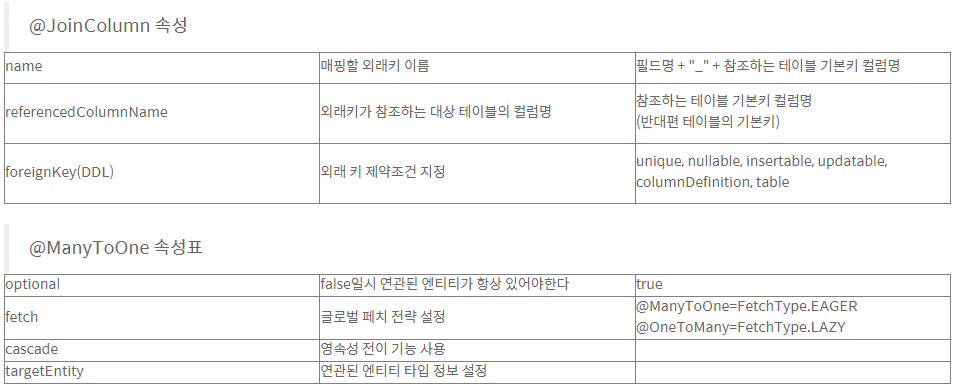


## Cascade 옵션

> [[JPA\]엔티티 상태 & Cascade (velog.io)](https://velog.io/@max9106/JPA엔티티-상태-Cascade)


### Entity의 상태

1. `Transient`: 객체를 생성하고, 값을 주어도 JPA나 hibernate가 그 객체에 관해 아무것도 모르는 상태. 즉, 데이터베이스와 매핑된 것이 아무것도 없다.
2. `Persistent`: 저장을 하고나서, JPA가 아는 상태(관리하는 상태)가 된다. 그러나 .save()를 했다고 해서, 이 순간 바로 DB에 이 객체에 대한 데이터가 들어가는 것은 아니다. JPA가 persistent 상태로 관리하고 있다가, 후에 데이터를 저장한다.(1차 캐시, Dirty Checking(변경사항 감지), Write Behind(최대한 늦게, 필요한 시점에 DB에 적용) 등의 기능을 제공한다)
3. `Detached`: JPA가 더이상 관리하지 않는 상태. JPA가 제공해주는 기능들을 사용하고 싶다면, 다시 persistent 상태로 돌아가야한다.
4. `Removed`: JPA가 관리하는 상태이긴 하지만, 실제 commit이 일어날 때, 삭제가 일어난다.

**cascade는 이러한 상태변화를 전이시키는 것이다.**


## 여러 Entity의 @GeneratedValue

> 과제 프로젝트를 진행하며 두 개의 Entity를 구성하였고,
> 두 개의 Entity 모두 Long 타입의 id를 PK로 갖는다

#### 문제

- 두개의 Entity의 id를 `GenerationType.AUTO`로 생성해줬더니 생성되는 숫자가 테이블 간에 공유가 됐다
  예를들면, **테이블1에서 1,2,3,4 까지의 id를 생성하고 테이블2에서 id를 생성하면 5부터 생성**된다

#### 원인

- `GenerationType.AUTO`는 **서버에서 생성**해 DB에 전달 해주기 때문에, 테이블마다 별개로 인식하지 않는다

```java
    @Id
    @GeneratedValue(strategy = GenerationType.AUTO)
    private Long id;
```

#### 해결

- 첫 번째 방법은 `@SequenceGenerator`로 자동으로 하나씩 커지는 숫자를 생성해 주는 것이었다
- 그리고 `@GeneratedValue(strategy = GenerationType.SEQUENCE, generator = "BOARD_SEQ_GENERATOR")`를 사용하여 생성한 `@SequenceGenerator`를 사용했다

```java
@SequenceGenerator(
        name = "BOARD_SEQ_GENERATOR",
        sequenceName = "BOARD_SEQ",
        initialValue = 1,
        allocationSize = 1
)
	@Id
	@GeneratedValue(strategy = GenerationType.SEQUENCE, generator = "BOARD_SEQ_GENERATOR")
    private Long id;

```


- 두 번째 방법이 간단하고 효율적이었는데, `GenerationType.IDENTITY`를 사용하는 것이다
- `GenerationType.IDENTITY`는 **DB에서 생성**하는 것이기 때문에 테이블마다 별개로 생성되어,
  **모든 테이블의 id가 1부터 시작**하는 값을 갖는다
- 기술 매니저님의 말로는 현업에서도 `GenerationType.IDENTITY`를 많이 사용한다고 하셨다

```java
    @Id
    @GeneratedValue(strategy = GenerationType.IDENTITY)
    private Long id;
```


## 순환참조

> https://velog.io/@minchae75/Spring-Boot-JPA-%EC%88%9C%ED%99%98-%EC%B0%B8%EC%A1%B0-%ED%95%B4%EA%B2%B0
>
> 아예 response용 resDTO를 생성하여 해결


### Jackson 어노테이션

> https://yonguri.tistory.com/145
>
> https://yeongcheon.github.io/posts/2019-03-01-jpa-jackson/


## Hibernate

[객체를 기반으로 하는 하이버네이트(Hibernate)의 장단점 (JPA, ORM 정의 포함) : 네이버 블로그 (naver.com)](https://m.blog.naver.com/swoh1227/221479428906)

[[JPA\] Spring Data JPA (tistory.com)](https://dev-gorany.tistory.com/348)


## JPQL

[[JPA\] 객체지향 쿼리, JPQL (tistory.com)](https://ict-nroo.tistory.com/116)

[Spring Data JPA(2) - JpaRepository 쿼리 메소드 기능 (tistory.com)](https://ykh6242.tistory.com/entry/Spring-데이터-JPA-쿼리-메소드-기능)

> JPQL의 필요성
>
> JPA를 사용하면 엔티티 객체를 중심으로 개발할 수 있다
> 문제는 검색을 할 때도 **테이블이 아닌 엔티티 객체를 대상으로 검색을 해야하는데**, 모든 DB 데이터를 객체로 변환해서 검색하는 것은 불가능하다.
>
> 애플리케이션이 필요한 데이터만 DB에서 불러오려면 결국 검색 조건이 포함된 SQL이 필요하기에, **JPA는 SQL을 추상화한 JPQL이라는 객체 지향 쿼리 언어를 제공**한다.

- JPQL의 특징
  - SQL과 문법이 유사하고 SELECT, FROM, WHERE, GROUP BY, HAVING, JOIN 등을 지원한다
  - SQL은 데이터베이스 테이블을 대상으로 쿼리를 질의하는 것이라면,
  - **JPQL은 엔티티 객체를 대상으로 쿼리를 질의**하는 것이다. (객체 지향 SQL)


## JPQL 문법

```
select_문 :: = 
    select_절
    from_절
    [where_절]
    [groupby_절]
    [having_절]
    [orderby_절]
update_문 :: = update_절 [where_절]
delete_문 :: = delete_절 [where_절]
```

- 몇가지 유의 사항은 존재 한다.

  - from절에 들어가는 것은 객체다!

    `select m from Member m where m.age > 8`

  - 엔티티와 속성은 대소문자를 구분

    - 예를 들면, Member 엔티티와 username 필드

  - JPQL 키워드는 대소문자 구분 안함

    - SELECT, FROM, where

  - 엔티티 이름을 사용한다. 테이블 이름이 아니다

    - 엔티티명 Member

  - 별칭은 필수이다.

    - Member의 별칭 m

### 결과 조회 API

- `query.getResultList()`
  - 결과가 하나 이상인 경우, 리스트를 반환한다.
- `query.getSingleResult()`
  - 결과가 정확히 하나, 단일 객체를 반환한다.(정확히 하나가 아니면 예외 발생)

### 파라미터 바인딩 

- 웬만하면 이름으로 바인딩하자.

- 이름 기준

  ```
  SELECT m 
  FROM Member m
  where m.username=:username
  ```

  ```
  query.setParameter("username", usernameParam);
  ```

- 위치 기준

  ```
  SELECT m
  FROM Member m
  where m.username=?1
  ```

  ```
  query.setParameter(1, usernameParam);
  ```

### 프로젝션

- 엔티티 프로젝션(멤버 조회)
  - `SELECT m FROM Member m ...`
- 엔티티 프로젝션(멤버 안에 있는 팀 조회)
  - `SELECT m.team FROM Member m ...`
- 단순 값 프로젝션
  - hibernate에서 지원을 해서 username, age로 쓸 수 있지만
  - 공식적으로는 m.username, m.age로 접근해야 한다.
  - `SELECT m.username, m.age FROM Member m ...`
- **new** 명령어
  - **단순 값을 DTO로 바로 조회** 한다.
  - new 패키지명, DTO를 넣고 생성자처럼 사용해서 DTO로 바로 반환 받을 수 있다.
  - `SELECT new jpabook.jpql.UserDTO(m.username, m.age) FROM Member m ...`
- DISTINCT는 중복을 제거 한다.

### 페이징 API

- JPA는 페이징을 다음 두 API로 추상화 해준다.

- 조회 시작위치(0부터 시작)

  - `setFirstResult(int startPosition)`

- 조회할 데이터 수

  - `setMaxResults(int maxResult)`

- 페이징 쿼리 예시)

  ```
  String jpql = "select m from Member m order by m.name desc";
  
  List<Member> resultList = em.createQuery(jpql, Member.class)
    .setFirstResult(10)
    .setMaxResult(20)
    .getResultList();
  ```

  - 모든 데이터 베이스의 방언이 동작한다.

  - 위 쿼리의 MySQL 방언

    ```
    SELECT
        M.ID AS ID,
        M.AGE AS AGE,
        M.TEAM_ID AS TEAM_ID,
        M.NAME AS NAME
    FROM
        MEMBER M
    ORDER BY
        M.name DESC LIMIT ?, ?
    ```

  - 위 쿼리의 Oracle 방언

    ```
    SELECT * FROM
        ( SELECT ROW_.*, ROWNUM ROWNUM_
        FROM
            ( SELECT
                M.ID AS ID,
                M.AGE AS AGE,
                M.TEAM_ID AS TEAM_ID,
                M.NAME AS NAME
              FROM MEMBER M
              ORDER BY M.NAME
             ) ROW_
         WHERE ROWNUM <= ?
         )
    WHERE ROWNUM_ > ?
    ```

### 집합과 정렬

- 기본적인 집합 명령어 다 동작 한다.

```
select
    COUNT(m),   //회원수
    SUM(m.age), //나이 합
    AVG(m.age), //평균 나이
    MAX(m.age), //최대 나이
    MIN(m.age)  //회소 나이
from Member m
```

- GROUP BY, HAVING
- ORDER BY

### 조인

[조인(SQL Server) - SQL Server | Microsoft Docs](https://docs.microsoft.com/ko-kr/sql/relational-databases/performance/joins?view=sql-server-ver16)

SQL - 네 가지 유형의 물리적 조인 작업
( 중첩 루프 조인, 병합 조인, 해시 조인, 적응 조인 )


- 내부 조인

  - 멤버 내부의 팀에 m.team으로 접근

  ```
  SELECT m
  FROM Member m
  [INNER] JOIN m.team t
  ```

- 외부 조인

  ```
  SELECT m
  FROM MEMBER m
  LEFT [OUTER] JOIN m.team t
  ```

- 세타 조인

  - 일명 막(?) 조인이다. 연관관계 상관 없이 유저명과 팀의이름이 같은 경우 찾아라 라는 쿼리 날릴 수 있다. 이런 조인을 세타 조인이라고 한다.

  ```
  SELECT COUNT(m)
  FROM Member m, Team t
  WHERE m.username = t.name
  ```

- 참고:

  - **하이버네이트 5.1부터 세타 조인도 외부 조인이 가능!**

### 페치 조인

- 현업에서 굉장히 많이 쓰인다. fetchType을 LAZY로 다 세팅 해놓고, 쿼리 튜닝할때 한꺼 번에 조회가 필요한 경우 페치 조인을 사용한다.

- 엔티티 객체 그래프를 한번에 조회하는 방법이다.

- 별칭을 사용할 수 없다.

- JPQL

  - 멤버를 조회할 때, 팀까지 같이 조회한다.

  ```
  select m from Member m join fetch m.team
  ```

- SQL

  ```
  SELECT M.*, T.*
  FROM MEMBER T
  INNER JOIN TEAM T ON M.TEAM_ID = T.ID
  ```

- 최근에(jpa2.1)는 페치 조인 말고 엔티티 그래프라는 기능이 있다. 공부해보자.

- 페치 조인 예시)

  ```
  String jpql = "select m from Member m join fetch m.team";
  
  List<Member> members = em.createQuery(jpql, Member.class).getResultList();
  
  for (Member member : members) {
      //페치 조인으로 회원과 팀을 함께 조회해서 지연 로딩이 발생하지 않는다.
      System.out.println("username = " + member.getUsername() + ","
                      + "teamname = " + member.getTeam().name());
  }
  ```

- 현업에서 많이 쓰이는 이유는, 리스트 쭉 뿌릴때. LAZY로 가게 되면 리스트에서 반복문으로 정보 받아올 때마다 DB에 쿼리가 나간다. 이게 JPA N+1 문제이다. 성능상 좋지 않다.

  - 리스트가 10명이다. 10명의 리스트를 가져오는 쿼리 한방 나가는데, 세부 조회를 할 때마다(10번) Lazy 로딩 되므로 쿼리가 총 11번 나가게 된다.
  - [JPA N+1 문제와 해결방안](https://jojoldu.tistory.com/165)

### 기타

- 서브 쿼리 지원
- EXISTS, IN
- BETWEEN, LIKE, IS NULL

### JPQL 기본 함수

- CONCAT
- SUBSTRING
- TRIM
- LOWER, UPPER
- LENGTH
- LOCATE
- ABS, SQRT, MOD
- SIZE, INDEX(JPA 용도)

### CASE 식

- 기본 CASE 식

  ```
  select
      case when m.age <= 10 then '학생요금'
           when m.age >= 60 then '경로요금'
           else '일반요금'
      end
  from Member m
  ```

- 단순 CASE 식

  ```
  select
      case t.name
        when '팀A' then '인센티브110%'
        when '팀B' then '인센티브120%'
        else '인센티브105%'
      end
  from Team t
  ```

### 사용자 정의 함수 호출

- 하이버네이트는 사용전 방언에 추가해야 한다.

- DB에 커스텀 펑션 만든 후 사용

  ```
  select function ('group_concat', i.name) from Item i
  ```

### Named 쿼리 - 정적 쿼리

- **미리 정의**해서 이름을 부여해두고 사용하는 JPQL

- 어노테이션, XML에 정의

- 애플리케이션 로딩 시점에 초기화 후 재사용

- 애플리케이션 로딩 시점에 쿼리를 검증

- 어노테이션 예시)

  ```
  @Entity
  @NamedQuery(
      name = "Member.findByUsername",
      query = "select m from Member m where m.username = :username")
  public vlass Member {
    ...
  }
  ```

  ```
  List<Member> resultList = 
      em.createNamedQuery("Member.findByUsername", Member.class)
          .setParameter("username", "회원1")
          .getResultList();
  ```

- 왜 굳이 엔티티에 네임드 쿼리 쓰나? 그냥 찾을 때 쓰는거랑 똑같지 않을까?

  - em.createQuery()안에 넣어서 그냥 사용할 수 있다. 하지만 큰 위험이 따른다.
  - 문자열 자체이기 때문에 에러 포인트가 많다. 근데, 사용자 요청 오기 전까지 쿼리가 실행되지 않으니까 모른다. 그제서야 안다.
  - 근데 Named쿼리는 애플리케이션 로딩 시점에 쿼리를 파싱한다. 그래서 배포하기 전에 문제를 잡을 수 있다. 아니, 개발하면서 띄워 보기만해도 잡을 수 있다.
  - Spring-Data-JPA를 사용할 때 @Query 어노테이션이 이 Named쿼리로 동작하게 된다. 그래서 스프링 애플리케이션 올라갈때 바로 에러를 잡을 수 있다.
  - 런타임 에러는 정말 위험하다.

- XML에도 정의를 할 수 있다. 필요하면 알아보자.

- Named 쿼리 환경에 따른 설정

  - XML이 항상 우선권을 가진다.
  - 애플리케이션 운영 환경에 따라 다른 XML을 배포할 수 있다.


**출처: https://ict-nroo.tistory.com/116 [개발자의 기록습관:티스토리]**


# 배포

## 과정

1. RDS 구매

2. RDS 포트 열어주기 (3306번 포트)

3. RDS 엔드포인트와 IntelliJ 연결

4. 스프링 부트 설정 (스프링 부트 설정의 대부분은 application.properties 에서 관리)

   - 스프링 부트를 MySQL과 연결하기

     ```yaml
     spring.datasource.url=jdbc:mysql://나의엔드포인트:3306/RDS이름
     spring.datasource.username=나의USERNAME
     spring.datasource.password=나의패스워드
     spring.jpa.hibernate.ddl-auto=update
     ```

5. EC2 구매 (AWS로 대여한 리눅스 컴퓨터)

6. EC2 포트 열어주기 (22번 포트는 원래 열려있음)

7. EC2에 접속하기

   - 윈도우는 git bash를 통해 접속한다

     ```shell
     ssh -i /path/my-key-pair.pem ubuntu@13.125.250.20
     ```

   - Key fingerprint 관련 메시지가 나올 경우 Yes를 입력

   - git bash를 종료할 때는 exit 명령어를 입력하여 ssh 접속을 먼저 끊어주자

8. 배포파일 빌드하기 (IntelliJ에서 Gradle의 build를 사용하여 쉽게 배포파일을 빌드한다)

9. OpenJDK 설치하기

   ```shell
   sudo apt-get update
   sudo apt-get install openjdk-8-jdk
   java -version
   # 자바 jdk ver8을 설치한다
   ```

10. Filezilla를 이용해서 배포 파일을 업로드하기

11. 스프링 부트 작동시키기

    ```shell
    java -jar JAR파일명.jar
    ```

12. AWS에서 80, 8080 포트를 열어주기

    - 80번 포트는 모든 url의 기본포트이므로,
      **포트번호를 사용하지 않고 접속하려면 80번 포트를 열어야한다**

13. `http://내AWS아이피:8080`로 접속 해보기

포트포워딩 & nohup 적용하기

> - 지금은 8080 포트에서 웹 서비스가 실행되고 있습니다. 그래서 매번 :8080 이라고 뒤에 붙여줘야 하죠. 뒤에 붙는 포트 번호를 없애려면 어떻게 해야할까요?
> - http 요청에서는 80포트가 기본이기 때문에, 굳이 :80을 붙이지 않아도 자동으로 연결이 됩니다.
> - 포트 번호를 입력하지 않아도 자동으로 접속되기 위해, 우리는 80포트로 오는 요청을 8080 포트로  전달하게 하는 포트포워딩(port forwarding) 을 사용하겠습니다.
>
> 포트 번호 없애기 - 리눅스 자체 포트포워딩을 작동시키기
>
> - 띄워둔 터미널에서 새롭게 설정을 적용하기 전에 돌아가고 있던 서비스는 일단 끄고! (터미널에서 ctrl + c)
>
> - 포트포워딩 룰을 입력합니다.
>
>   ```shell
>   sudo iptables -t nat -A PREROUTING -i eth0 -p tcp --dport 80 -j REDIRECT --to-port 8080
>   ```
>
> - 다시 서비스 시작
>
> SSH 접속을 끊어도 서버가 계속 돌게 하기
>
> - 원격 접속을 종료하더라도 서버가 계속 돌아가게 하기
>
>   ```shell
>   nohup java -jar JAR파일명.jar &
>   ```
>
> - 서버 종료하기 \- 강제종료하는 방법
>
>   ```shell
>   # 아래 명령어로 미리 pid 값(프로세스 번호)을 본다
>   ps -ef | grep java
>                   
>   # 아래 명령어로 특정 프로세스를 죽인다
>   kill -9 [pid값]
>   ```
>


## 배포자동화

**깃허브 액션**

**https://be-developer.tistory.com/51**

**[Github Action, AWS CodeDeploy를 사용하여 자동 배포하기! | 구보현 블로그 (bohyeon-n.github.io)](https://bohyeon-n.github.io/deploy/devops/github_action.html)**

https://zzang9ha.tistory.com/404?category=954133

https://ojy9612.tistory.com/66 - 재영님 블로그

[Github Action과 AWS CodeDeploy를 사용하여 Spring Boot 프로젝트 CI/CD 파이프라인 구축하기 (tistory.com)](https://shinsunyoung.tistory.com/120)

[[SpringBoot,Nginx\] 무중단 배포 (velog.io)](https://velog.io/@eeheaven/SpringBootNginx-무중단-배포)

[github action과 aws code deploy를 이용하여 spring boot 배포하기(1) - 해보고나면 별거아니다 (isntyet.github.io)](https://isntyet.github.io/deploy/github-action과-aws-code-deploy를-이용하여-spring-boot-배포하기(1)/)

**젠킨스**

[[Jenkins\] Jenkins 개념부터 설치, 연동까지 (tistory.com)](https://yeonyeon.tistory.com/56)


## GitHub Actions

- github action 기본 문법 알아보기
  - github action를 정의하는 기본 6가지 용어
    1. `Workflows` : 자동화 하려고 하는 과정들
       - 한개 또는 여러개의 job으로 구성되며, event에 의해서 시작됩니다.
       - 빌드, 테스트, 릴리즈, 배포 등의 작업이라고 생각하면 됩니다.
    2. `Events` : workflow를 trigger되는 행동들
       - push, pull request, cronjob 등이 있음.
    3. `Jobs`: 동일한 runner에서 실행하려고하는 여러개의 step의 모임
    4. `Steps`: job을 구성하는 한개의 커맨드로 action이거나 shell command로 구성됩니다.
    5. `Actions`: 다른 곳에서 정의된 커맨드의 모음
    6. `Runner`: Job이 실행되는 환경


### Jenkins와 GitHub Actions의 차이점

[[CI/CD\] Jenkins 과 GitHub Actions의 개념, 차이점 (tistory.com)](https://choseongho93.tistory.com/295)


|                           Jenkins                            |                        GitHub Actions                        |
| :----------------------------------------------------------: | :----------------------------------------------------------: |
|                        서버 설치 필요                        |           클라우드가 있으므로, 별도 설치 필요없음            |
| 작업 또는 작업이 동기화되어 제품을 시장에 배포하는 데 더 많은 시간이 소요 |                     비동기 CI / CD 달성                      |
| 계정 및 트리거를 기반으로하며 github 이벤트를 준수하지 않는 빌드를 중심으로합니다. | 모든 github 이벤트에 대한 작업을 제공하고 다양한 언어와 프레임 워크를 지원합니다. |
|        환경 호환성을 위해 도커 이미지에서 실행해야 함        |                       모든 환경과 호환                       |
| 캐싱 메커니즘을 지원하기 위해 플러그인을 사용할 수 있습니다. |   캐싱이 필요한 경우 자체 캐싱 메커니즘을 작성해야합니다.    |
|               공유 할 수있는 능력이 없습니다.                |            github 마켓 플레이스를 통해 공유 가능             |
|           전세계많은 사람들이 이용하여 문서가 다양           |                  젠킨스에 비해 문서가 없음                   |
|       페이스북, 넥플릭스, 쿠팡, 카페24, 11번가   등...       |               업스테이지 AI, Be pro 회사 등...               |


## EC2

- AWS EC2에 접속하기 (준비 상식 편)
  - SSH(Secure Shell Protocol)
    - 다른 컴퓨터에 접속할 때 쓰는 프로그램입니다. 다른 것들 보다 보안이 상대적으로 뛰어납니다.
    - 접속할 컴퓨터가 22번 포트가 열려있어야 접속 가능합니다. AWS EC2의 경우, 이미 22번 포트가 열려있습니다. 확인해볼까요?

- AWS EC2에 접속하기

  - Window: ssh가 없으므로, git bash라는 프로그램을 이용!

    - gitbash를 실행하고, 아래를 입력!

    > ssh -i 받은키페어를끌어다놓기 ubuntu@AWS에적힌내아이피
    >
    > ex) `ssh -i /path/my-key-pair.pem ubuntu@13.125.250.20`

  - Key fingerprint 관련 메시지가 나올 경우 Yes를 입력해주세요!

  - git bash를 종료할 때는 exit 명령어를 입력하여 ssh 접속을 먼저 끊어주세요.


# AOP

> AOP [ Aspect Oriented Programming ] 를 통해 부가기능을 모듈화
>
> **'부가기능'**은 '핵심기능'과는 관점(Aspect), 관심이 다르기에
> '핵심기능'과 분리해서 **'부가기능'** 중심으로 설계, 구현 가능

- **'핵심기능**': 각 API 별 수행해야 할 비즈니스 로직

  ex) 상품 키워드 검색, 관심상품 등록, 회원 가입, 관심상품에 폴더 추가, ....

- **'부가기능'**: 핵심기능을 보조하는 기능

  ex) Validation, 회원 패턴 분석을 위한 로그 기록, API 수행시간 저장

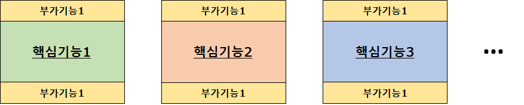


## AOP의 필요성

- 모든 **'핵심기능**'의 Controller 에 '부가기능' 코드를 추가했을 때..
  - '핵심기능' 이 100개라면??
    - 100개의 **'핵심기능**' 모두에 동일한 내용의 코드 추가 필요
  - '핵심기능' 이 나중에 추가된다면?
    - 항상 '부가기능' 추가를 신경써야 함
    - '부가기능' 추가를 깜박한다면?
      - 일부 API 수행시간이 추가되지 않음 → Top5 회원의 신뢰성 이슈
- **'핵심기능**' 수정 시
  - 같은 함수 내에 **'핵심기능**'과 '부가기능'이 섞여 있음
  - **'핵심기능**' 이해를 위해 '부가기능'까지 이해 필요
- '부가기능'의 변경이 필요하다면??
  - **'핵심기능**'의 개수만큼 '부가기능'도 수정해 줘야 함
  - '부가기능' 삭제


## 스프링이 제공하는 AOP

1. 어드바이스: 부가기능
2. 포인트컷: 부가기능 적용위치


**AOP의 기능**

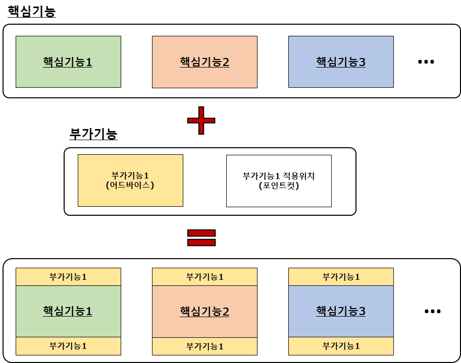


**AOP의 발동시점**

- 시퀀스 다이어그램 (Sequence Diagram)

  - AOP 적용 전

  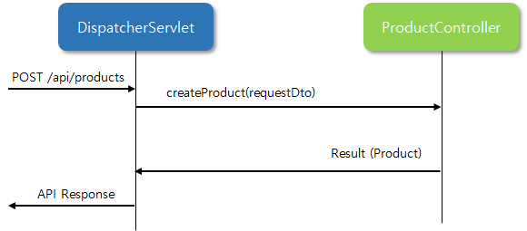

  - AOP 적용 후

    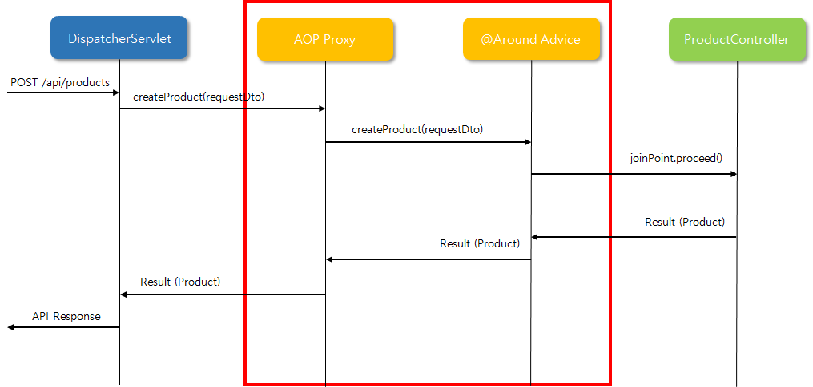

    - DispatcherServlet 과 ProductController 입장에서는 변화가 전혀 없음

      - 호출되는 함수의 input, output 이 완전 동일

      - **"joinPoint.proceed()"** 에 의해서 원래 호출하려고 했던 함수, 인수(argument) 가 전달됨

        → createProduct(requestDto)

- 스프링 서버가 기동될 때

  - 핵심 기능 DI 시
  - 프록시 객체를 중간에 삽입


## 스프링 AOP 어노테이션

1. @Aspect

   - 스프링 빈 (Bean) 클래스에만 적용 가능

2. 어드바이스 종류

   - @Around: '핵심기능' 수행 전과 후 (@Before + @After)
   - @Before: '핵심기능' 호출 전 (ex. Client 의 입력값 Validation 수행)
   - @After:  '핵심기능' 수행 성공/실패 여부와 상관없이 언제나 동작 (try, catch 의 finally() 처럼 동작)
   - @AfterReturning: '핵심기능' 호출 성공 시 (함수의 Return 값 사용 가능)
   - @AfterThrowing: '핵심기능' 호출 실패 시. 즉, 예외 (Exception) 가 발생한 경우만 동작 (ex. 예외가 발생했을 때 개발자에게 email 이나 SMS 보냄)

3. 포인트컷

   - 포인트컷 Expression Language

     - 포인트컷 Expression 형태

       ```bash
       execution(modifiers-pattern? `return-type-pattern` declaring-type-pattern? `method-name-pattern(param-pattern)` throws-pattern?)
       ```

       - ? 는 생략 가능

     - 포인트컷 Expression 예제

       ```java
       @Around("execution(public * com.sparta.springcore.controller..*(..))")
       public Object execute(ProceedingJoinPoint joinPoint) throws Throwable { ... }
       ```

     - modifiers-pattern

       - **public**, private, *

     - return-type-pattern

       - void, String, List<String>, *****

     - declaring-type-pattern

       - 클래스명 (패키지명 필요)
       - **com.sparta.springcore.controller.*** - controller 패키지의 모든 클래스에 적용
       - **com.sparta.springcore.controller..** - controller 패키지 및 하위 패키지의 모든 클래스

     - **method-name-pattern(param-pattern)**

       - 함수명
         - **addFolders** : addFolders() 함수에만 적용
         - **add*** : add 로 시작하는 모든 함수에 적용
       - 파라미터 패턴 (param-pattern)
         - **(com.sparta.springcore.dto.FolderRequestDto)** - FolderRequestDto 인수 (arguments) 만 적용
         - **()** - 인수 없음
         - **(\*)** - 인수 1개 (타입 상관없음)
         - **(..)** - 인수 0~N개 (타입 상관없음)

     - @Pointcut

       - 포인트컷 재사용 가능

       - 포인트컷 결합 (combine) 가능

         ```java
         @Component
         @Aspect
         public class Aspect {
         	@Pointcut("execution(* com.sparta.springcore.controller.*.*(..))")
         	private void forAllController() {}
         
         	@Pointcut("execution(String com.sparta.springcore.controller.*.*())")
         	private void forAllViewController() {}
         
         	@Around("forAllContorller() && !forAllViewController")
         	public void saveRestApiLog() {
         		...
         	}
         
         	@Around("forAllContorller()")
         	public void saveAllApiLog() {
         		...
         	}	
         }
         ```

- Controller - Service - Repository 3계층에 맞춰 구현을 해야 하는 다른 이유
  - Controller 에 비즈니스 로직을 추가한다면?
  - Controller 에서 Repository 를 바로 호출한다면??


# 보안

## JWT

## JWT 로그인 구현하기

- 1. JWT 란?

  - JWT 사용이유 파악

    1. 서버가 1대인 경우

       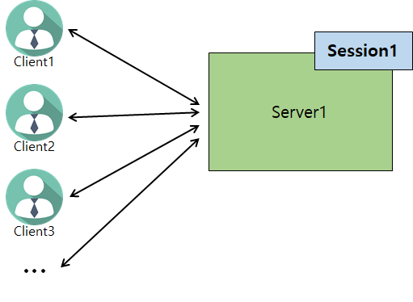

       - Session1 이 모든 Client 의 로그인 정보 소유

    2. 서버가 2대 이상인 경우

       - 서버의 대용량 트래픽 처리를 위해 서버 2대 이상 운영 필요

         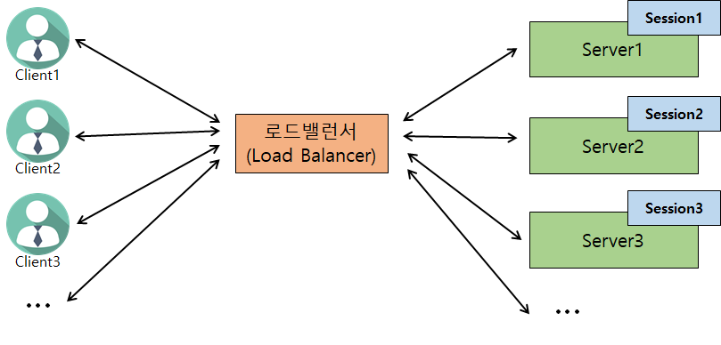

       - Session 마다 다른 Client 로그인 정보를 가지고 있을 수 있음
         - Session1: Client1, Client2, Client3
         - Session2: Client4
         - Session3: Client5, Client6
       - Client 1 로그인 정보를 가지고 있지 않은 Sever2 나 Server3 에 API 요청을 하게되면 어떻하지?
         - 해결방법
           1. Sticky Session: Client 마다 요청 Server 고정
           2. 세션 저장소 생성

    3. 세션 저장소 생성

       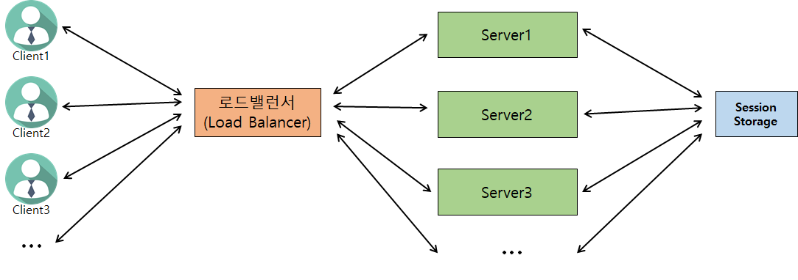

       - Session storage 가 모든 Client 의 로그인 정보 소유

  1. JWT 사용

     - 로그인 정보를 **Server** 에 저장하지 않고, **Client** 에 로그인정보를 JWT 로 암호화하여 저장 → JWT 통해 인증/인가

       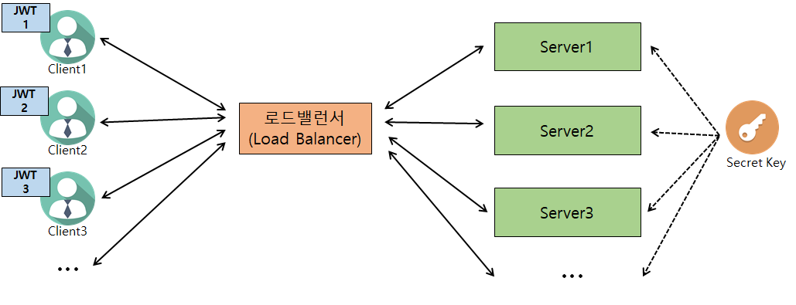

     - 모든 서버에서 **동일한 Secret Key** 소유

     - Secret Key 통한 암호화 / 위조 검증 (복호화 시)

       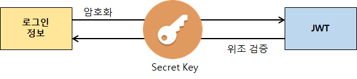

     - JWT 장/단점

       1. 장점
          - 동시 접속자가 많을 때 서버 측 부하 낮춤
          - Client, Sever 가 다른 도메인을 사용할 때
            - 예) 카카오 OAuth2 로그인 시 JWT Token 사용
       2. 단점
          - 구현의 복잡도 증가
          - JWT 에 담는 내용이 커질 수록 네트워크 비용 증가 (클라이언트 → 서버)
          - 기생성된 JWT 를 일부만 만료시킬 방법이 없음
          - Secret key 유출 시 JWT 조작 가능

  - JWT 사용 흐름 Overview

    1. Client 가 username, password 로 로그인 성공 시

       1. "로그인 정보" → JWT 로 **암호화** (Secret Key 사용)

          **Sample**

          

       2. **JWT** 를 Client 응답에 전달

       3. Client 에서 JWT 저장 (쿠키, Local storage 등)

    2. Client 에서 JWT 통해 인증방법

       1. JWT 를 API 요청 시마다 Header 에 포함

          예) HTTP Headers

          ```json
          Content-Type: application/json
          **Authorization: Bearer** **<JWT>
          ...**
          ```

       2. Server

          1. Client 가 전달한 **JWT 위조 여부 검증** (Secret Key 사용)

          2. JWT 유효기간이 지나지 않았는지 검증

          3. 검증 성공시,

             1. JWT → "로그인  정보" (**UserDetailsImpl**) 만들어 사용

                ex) **GET /api/products** : JWT 보낸 사용자의 관심상품 목록 조회

  - JWT 구조

    - JWT 는 누구나 평문으로 복호화 가능

    - 하지만 Secret Key 가 없으면 JWT 수정 불가능

      → 결국 JWT 는 **Read only 데이터**

    

    1. Header

       ```json
       {
         "alg": "HS256",
         "typ": "JWT"
       }
       ```

    2. Payload

       ```json
       {
         "sub": "1234567890",
         "username": "제이홉",
         "admin": true
       }
       ```

    3. Signature

# Spring Security

> [Spring Security (tistory.com)](https://iyk2h.tistory.com/158) - 스프링 시큐리티란?
>
> **[SPRING SECURITY + JWT 회원가입, 로그인 기능 구현 (tistory.com)](https://webfirewood.tistory.com/115)**
>
> [[Spring Boot 2.7.0\] Security + Jwt 구현 [1] (velog.io)](https://velog.io/@tjdals9638/Spring-Boot-2.7.0-Security-Jwt-구현-1)
>
> [[Spring Security\] 스프링 시큐리티 로그인, 회원가입 예제 - HoeStory (tistory.com)](https://hoestory.tistory.com/30)
>
> [Spring Security 적용해보기 (tistory.com)](https://dev-alxndr.tistory.com/4)


## **인증 vs 인가** 

> 인증(Authentication) 
>
> - 사용자 신원을 확인하는 행위 
> - ex). 회사 출입을 위한 출입증 확인 혹은 생체정보	 

> 인가(Authorization) 
>
> - 사용자 권한을 확인하는 행위
> - ex). 회사 건물 내 접근 권한 관리
>   1. 방문자 -> 회의실만 접근 가능
>   2. 직원 -> 회의실, 사무실 접근 가능
>   3. 관리자 -> 회의실, 사무실, 서버실, 물품보관실 접근 가능


## **쿠키와 세션** 

> **HTTP** 
>
> - 클라이언트와 서버는 HTTP 통신을 한다.
>
> - 클라이언트의 요청을 서버에게 보낸 후 응답을 받을 때까지가 하나의 HTTP 요청
>
>   ​		-> HTTP는 상태를 저장하지 않기 때문에 로그인 정보를 저장하지 않는다.

- 즉, 쿠키와 세션은 HTTP에 상태 정보를 유지하기 위해 사용됨.


> **쿠키** 
>
> > 클라이언트에 저장될 목적으로 생성한 작은 정보를 담은 파일 
>
> 1. 구성요소
>    - Name : 쿠키를 구별하는 데 사용되는 키(중복 x)
>    - Value : 쿠키의 값
>    - Domain : 쿠키가 저장된 도메인
>    - Path : 쿠키가 사용되는 경로
>    - Exprires : 쿠키의 만료기한(만료기한이 지나면 쿠키는 삭제된다.)
> 2. 사용 예
>    - 사이트 팝업의 "오늘 다시보지 않기" 정보 저장


> **세션**
>
> > 서버에서 일정시간 동안 클라이언트 상태를 유지하기 위해 사용
>
> 1. 동작 설명
>    - 클라이언트가 서버에게 1번 요청을 할 때 서버에서 '**세션 쿠키**' 라는 것에 유일무이한 '세션 ID'를 부여해 다시 클라이언트로 보냄. 이때 해당 요청을 다시 했을 때 클라이언트가 '세션쿠키'를 넣어 2번 요청을 하면 서버가 가지고 있는 정보가 있어 1번 요청과 같은 클라이언트임을 인지한다.
> 2. 사용 예
>    - 로그인 정보 저장


### XSS [ Cross-site Scripting ]

[저장형 XSS(Stored Cross Site Scripting) 공격과 방어 - Junhyunny’s Devlogs](https://junhyunny.github.io/information/security/spring-mvc/stored-cross-site-scripting/)

[반사형 XSS(Reflected Cross Site Scripting) 공격과 방어 - Junhyunny’s Devlogs](https://junhyunny.github.io/information/security/spring-mvc/reflected-cross-site-scripting/)

[DOM 기반 XSS(DOM based Cross Site Scripting) 공격과 방어 - Junhyunny’s Devlogs](https://junhyunny.github.io/information/security/dom-based-cross-site-scripting/)

> *주로 다른 웹사이트와 정보를 교환하는 식으로 작동하므로 사이트 간 스크립팅이라고 한다*
>
> SQL injection과 함께 웹 상에서 가장 기초적인 취약점 공격 방법의 일종으로, 악의적인 사용자가 **공격하려는 사이트에 스크립트를 넣는 기법**을 말한다. 공격에 성공하면 사이트에 접속한 사용자는 삽입된 코드를 실행하게 되며, 보통 의도치 않은 행동을 수행시키거나 쿠키나 세션 토큰 등의 민감한 정보를 탈취한다.
>
> 크로스 사이트 스크립팅이란 이름 답게, **자바스크립트를 사용하여 공격하는 경우가 많다**. 공격 방법이 단순하고 가장 기초적이지만, 많은 웹사이트들이 XSS에 대한 방어 조치를 해두지 않아 공격을 받는 경우가 많다. 여러 사용자가 접근 가능한 게시판 등에 코드를 삽입하는 경우도 많으며, 경우에 따라서는 메일과 같은 매체를 통해서도 전파된다. 심지어는 닉네임에 코드를 심기도 한다.
>
> 주로 CSRF를 하기 위해서 사용되기 때문에 종종 CSRF와 혼동되는 경우가 있으나, XSS는 자바스크립트를 실행시키는 것이고, CSRF는 특정한 행동을 시키는 것이므로 다르다.

#### Stored XSS (저장형 XSS)

- 보안이 취약한 서버에 해커가 악성 스크립트를 저장함으로써 발생한다.

#### Reflected XSS (반사형 XSS)

- 해커가 보안이 취약한 사이트를 통해서 악성 스크립트를 넣은 URL을 만들어 일반 사용자에게 스팸 메일로 전달한다.

#### DOM 기반 XSS

- 보안에 취약한 JavaScript 코드로 DOM 객체를 제어하는 과정에서 발생합니다.


### XSS 방어방법

> **스크립트를 실행시키지 않는 방법을 이용한다**

#### 저장형 XSS 방어

1. 사용자 입력 검증 및 변경

   - 사용자가 입력한 값을 그대로 저장하지 않습니다.

   - 태그를 만들 때 사용하는 `<`, `>`을 HTML에서 사용하는 특수 문자로 변경합니다.

2. 문자열 그대로 출력 (스크립트가 실행되지 않음)


#### 반사형 XSS 방어

1. 입력 값 제한
   - 브라우저에서 사용자 입력 시 특수 문자를 제한합니다.
2. 입력 값 치환
   - 악성 스크립트를 만들 수 있는 특수 문자들을 치환합니다. 모든 요청에 대해 치환을 적용할 수 있도록 필터를 만들어 이를 적용합니다.
3. 문자열 그대로 출력 (스크립트가 실행되지 않음)


## CSRF [ **C**ross-**S**ite **R**equest **F**orgery ]

[CSRF(Cross-Site Request Forgery) 공격과 방어 - Junhyunny’s Devlogs](https://junhyunny.github.io/information/security/spring-boot/spring-security/cross-site-reqeust-forgery/)

> 웹 애플리케이션 취약점 중 하나로 인터넷 사용자(희생자)가 자신의 의지와는 무관하게 **공격자가 의도한 행위**(수정, 삭제, 등록 등)를 **특정 웹사이트에 요청하게 만드는 공격 방법**이다. 공격의 난이도가 높지 않아 흔히 사용된다
>
> CSRF를 통해 해커는 희생자의 권한을 도용하여 중요 기능을 실행하는 것이 가능합니다. CSRF는 해커가 사용자의 컴퓨터를 감염시키거나 페이스북 서버를 해킹을 해서 이뤄지는 공격은 아니고, **클라이언트의 세션과 쿠키에 저장된 회원정보를 탈취하여 악용하는 것이다**. 
>
> 그래서 CSRF 공격이 이뤄지려면 다음 조건이 만족되어야 합니다.
>
> 1. 위조 요청을 전송하는 서비스(페이스북)에 희생자가 로그인 상태
>    (=> `Stateful` 한 서비스를 제공하기 위해 **인증된 사용자 정보를 세션에 저장하고, 세션 ID가 쿠키에 저장되기 때문에 문제가 발생**)
>
> 2. 희생자가 해커가 만든 피싱 사이트에 접속
>
> 또한 희생자가 해커가 만든 피싱 사이트를 하지 않더라도 해커가 **XSS 공격을 성공한 정상 사이트를 통해 CSRF 공격이 수행 될 수 도 있습니다**.


## CSRF 방어방법

> **탈취된 개인 정보인지 아닌지 확인하는 방법을 사용한다 (보낸 사람의 개인 정보가 맞는지 확인)**
>
> 일반적으로 CSRF 공격 방어는 조회성(HTTP GET Method) 데이터에는 방어 대상에 두지 않고, 쓰기/변경이 가능한 POST, PATCH, DELETE Method에만 적용하면 됩니다.

1. Referrer 검증

   - 서버에서 사용자가 요청한 헤더 정보에서 Referrer 확인 (**host와 Referrer값이 같은지 확인**)

   - Back-end 단에서 request의 referrer를 확인하여 domain이 일치하는지 검증하는 방법이다. 일반적으로 referrer 검증만으로 대부분의 CSRF 공격을 방어 할 수 있지만, 같은 도메인 내의 페이지에 XSS 취약점이 있는 경우 CSRF 공격에 취약해 질 수 있다. 이때는 domain 단위 검증에서 좀 더 세밀하게 페이지 단위까지 일치하는지 검증을 하면 도메인 내의 타 페이지에서의 XSS 취약점에 대한 CSRF 공격을 방어할 수 있다.

2. CSRF 토큰 검증

   - 임의의 CSRF 토큰을 만들어 세션에 저장합니다. 요청하는 페이지에 `hidden` 타입 input 태그를 이용해 **토큰 값을 함께 전달**합니다. 이후 서버에서 세션에 저장된 **CSRF 토큰 값과 요청 파라미터에 담긴 토큰 값을 비교**합니다.


제출

> XSS, CSRF란 무엇이며, 어떻게 해결할 수 있는지 설명해주세요.

```
XSS는 저장형 XSS와 반사형 XSS가 있다.
 저장형 XSS는 보안이 취약한 서버에 해커가 악성 스크립트를 저장함으로써 발생하고, 반사형 XSS는 해커가 보안이 취약한 사이트를 통해서 악성 스크립트를 넣은 URL을 만들어 일반 사용자에게 스팸 메일로 전달하는 방식으로 작동한다.
 XSS의 방어는 "악성 스크립트를 실행시키지 않는" 방법으로 진행되는데, 스크립트에 필수적인 태그나 특수 문자들을 치환하여 저장하고 특수 문자 입력을 제한하는 등의 방법을 사용한다.

CSRF는 클라이언트의 세션과 쿠키에 저장된 회원 정보를 탈취하여 악용하는 것이다.
 세션과 쿠키에 중요한 정보가 있는 상태에서 피싱 사이트 등의 공격으로 정보를 탈취당하면,
해커는 탈취한 정보를 바탕으로 클라이언트나 서버를 공격할 수 있게 된다.
 CSRF의 방어는 "탈취 된 정보인지 아닌지 확인하는 방법을 사용한다"(보낸 사람의 개인 정보가 맞는지 확인). 이러한 방법으로는 헤더의 host와 Referrer이 같은지 확인하는 방법과, CSRF 토큰을 사용하는 방법이 있다.
```


## CORS


### Reverse Proxy & Port Forwarding

[Proxy (Forward, Reverse), CORS — Duck9s' (tistory.com)](https://duckgugong.tistory.com/255)


## Access Token (Refresh Token)

[[인증\] Access Token, Refresh Token — Today Sangmin Learned (tistory.com)](https://steadily-worked.tistory.com/469)


# 팀 과제

1. JPA가 무엇인가요?

> - JPA(Java Persistence API)는 자바 진영의 ORM 기술 표준이며, JAVA 어플리케이션과 JDBC 사이에서 동작한다.
> - 여기서 ORM(Object-Relational Mapping)은 객체와 테이블을 매핑해서 패러다임의 불일치 문제를 개발자 대신 해결해주는 프레임워크이다.

2. Controller, Service, Repository 가 무엇인가요?

> 1. Controller
>    - 사용자의 요청을 받고, 클라이언트에게 응답하는 계층.
>    - 요청에 대한 처리는 서비스에게 전담한다.
> 2. Service
>    - 전반적인 비즈니스 로직을 수행하는 계층.
>    - 사용자의 요구사항을 처리한다.
>    - DB의 정보가 필요할 때는 Repositroy에게 전담한다.
> 3. Repository
>    - DB 관리(연결, 해제, 자원 관리)를 어떻게 할 것인지를 정의해주는 계층

3. 우리가 브라우저에서 구매한 도메인 주소를 입력하면 만들어 놓은 aws EC2 서버까지 전달이 되어서 해당 서버에게 요청을 보낼 수 있습니다. 이 과정이 상세하게 어떻게 진행되는지 그림으로 한번 그려볼까요?

> 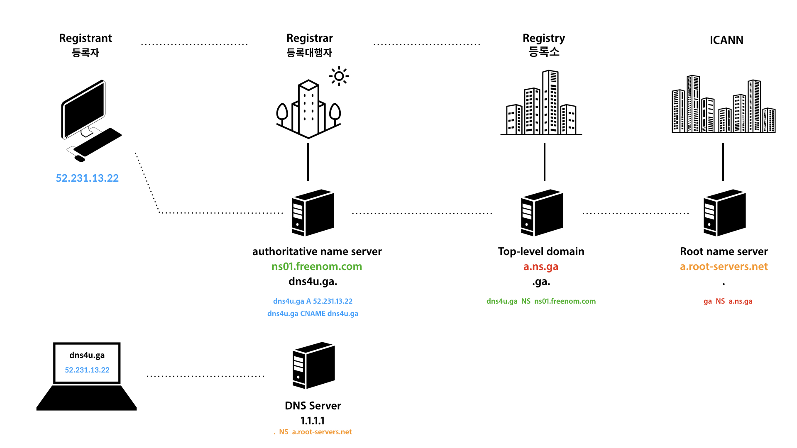

4. 스프링 프레임워크는 어떤 특징 혹은 장점을 가지고 있나요? (3가지 이상)

> 스프링은 내부적으로 **별도의 API를 사용하지 않고, 일반적인 Java 코드를 이용하여 객체를 구성**한다. 따라서, 이 프레임워크에서는 **개발자가 특정한 라이브러리나 컨테이너의 기술에 종속되지 않는다**. 또한, 프레임워크이기 때문에, 개발자의 수준과 실력에 상관없이 빠른 구현과 일정 수준의 품질을 기대할 수 있다. 담당자 혹은 개발자가 도중에 바뀌더라도, 유지보수에 관한 리스크를 줄일 수 있다. 

5. 스프링에서 DI (의존성 주입) 를 사용하는 이유가 무엇인가요? 예를 통해 설명 해 보세요?

> 의존 관계 주입(Dependency Injection)이란 외부에서 두 객체 간의 관계를 결정해주는 디자인 패턴으로 어떤 객체가 사용하는 의존 객체를 직접 만들어 사용하는게 아니라, 주입 받아 사용하는 방법이다. (new 연산자를 이용해서 객체를 생성하는 것이라고 생각하면 된다)
>
> 제어의 역전 (Inversion of Control)은 **IoC Container에게 모든 관계 설정에 대한 책임을 위임**하는 것이다
>
> ```java
> #제어의 역전을 한마디로 표현
> "Don't call us, we'll call you"
> ```
>
> 즉, 각 객체간의 의존성을 스프링 컨테이너(Spring Container)가 자동으로 연결해주는 것으로, 개발자가 빈(Bean) 설정파일에 의존관계가 필요한 정보를 추가해주면, 스프링 컨테이너가 자동적으로 연결해 준다 의존성이란 한 객체가 다른 객체를 사용할 때 의존성이 있다고 한다.
>
> 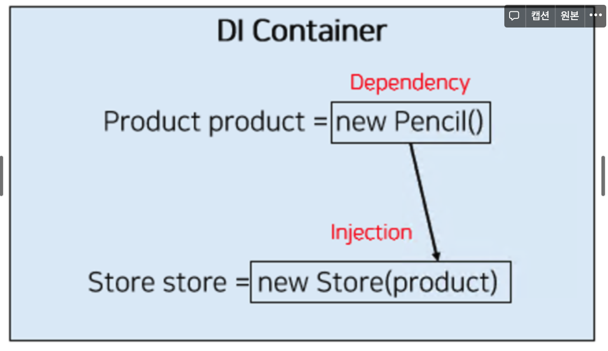

6. 스프링 시큐리티를 사용해 회원관리하는 방법을 순서도를 통해 정리해 보세요.

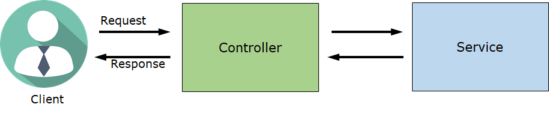

<center/>회원관리의 흐름


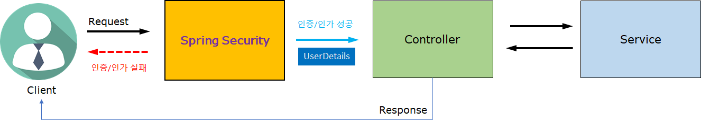

<center/> 스프링 시큐리티


> - Client 의 요청은 모두 Spring Security 를 거침
> - Spring Security 역할
>   1. 인증/인가
>      1. 성공 시: Controller 로 Client 요청 전달
>         1. Client 요청 + 사용자 정보 (UserDetails)
>      2. 실패 시: Controller 로 Client 요청 전달되지 않음
>         1. Client 에게 Error Response 보냄


7. 개발자 테스트 코드 작성 시 장/단점과 테스트 종류 별 (단위 테스트, 통합 테스트, E2E 테스트) 로 특징은?

> 1. 테스트 코드의 장단점
>    - 장점: 예상 동작과 실제 동작을 비교하여 빠르고 정확한 테스트가 가능하기 때문에 초기 개발의 디버깅이 쉬워진다.
>    - 단점: 테스트 코드까지 작성해야 하기 때문에 개발 시간이 오래 걸린다.
> 2. 단위 테스트
>    - 단위 테스트는 응용 프로그램에서 테스트 가능한 가장 작은 소프트웨어를 실행하여 예상대로 동작하는지 확인하는 테스트이다.
>    - 일반적으로 클래스 또는 메소드 수준의 단위로 테스트한다.
>    - 단위 테스트는 TDD와 함께 할 때 특히 더 강력해진다.
> 3. 통합 테스트
>    - 통합 테스트는 단위 테스트보다 더 큰 동작을 달성하기 위해 여러 모듈들을 모아 이들이 의도대로 협력하는지 확인하는 테스트이다.
>    - 단위 테스트와 달리 개발자가 변경할 수 없는 부분(외부 라이브러리 등) 까지 묶어 검증할 때 사용한다.
>    - 스프링부트 에서는 @SpringBootTest
> 4. E2E 테스트
>    - E2E(End to End)테스트는 개발물을 사용자 관점에서 테스트하는 방법이다.
>    - 다양한 시스템, DB 등 앱의 올바른 작동을 사용자 관점에서 확인한다.
>    - 다양한 앱의 의존관계가 정확히 작동하는지 확인한다.


8. ORM, JPA, Spring Data JPA 를 구분해서 설명해 보세요.

> **ORM**(Object-Relational Mapping) - 자바 객체와 RDBMS의 데이터를 자동으로 매핑해주는 것을 의미
>
> - 자바의 객체 지향 기술과 관계형 DataBase를 서로 연결 해주는 추상화된 기술
> - ORM을 통해 객체 간의 관계를 바탕으로 SQL을 자동으로 생성하여 불일치 해결
> - Object 필드와 데이터 베이스 데이터를 서로 매핑
> - 객체를 사용하여 갖접적으로 데이터베이스 데이터를 다루는 개념
> - 데이터 영속성을 위한 API(Persistant API)의 한 종류
>
> 
>
> **JPA**(Java Persistence API) - Java를 이용하여 데이터 관리/유지 기법을 정리해 놓은 표준 Spec
>
> - 데이터 베이스 관련 작업을 대신 처리해주는 추상화된 계층의 구현 스펙
> - Java의 ORM 기술에 대한 인터페이스의 모음
>
> 
>
> **Spring Data JPA**는 스프링 프레임워크에서 JPA를 편리하게 사용할 수 있도록 지원하는 프로젝트이고, 데이터 접근 계층을 개발할 때 지루하게 반복되는 CRUD 문제를 해결해준다.
>
> - CRUD를 처리하기 위한 공통 인터페이스를 제공한다.
> - Repository를 개발할 때 인터페이스만 작성하면 실행 시점에 구현 객체를 동적으로 생성해서 주입해준다.
> - 따라서, 구현 클래스 없이 인터페이스만 작성해도 개발을 완료할 수 있다.


9. Optional) 절차지향 프로그래밍, 객체지향 프로그래밍,  관점지향 프로그래밍은 각각 어떻게 다른가요? (각각 예제 1개 이상)


# Spring 특징

> [제어의 역전(Inversion of Control, IoC) 이란? :: Develogs (tistory.com)](https://develogs.tistory.com/19)


## 코드 컨벤션 (Code Convention)

[[Guide\]스프링 네이밍 컨벤션(Coding convention) - 개발자 지니의 기록 (tistory.com)](https://cocobi.tistory.com/27)

> (스택별) 코드의 생산성과 통일성을 위한 작성 방법에 대한 협의


### 협업 시 린트 설정 해보기

> 오래된 스웨터의 보푸라기 같은 것을 린트(Lint)라고 부른다. 보푸라기가 많으면 옷이 보기 좋지 않은데 코드에서도 이런 보프라기가 있다. 들여쓰기를 맞추지 않은 경우, 선언한 변수를 사용하지 않은 경우......
>
> 보프라기 있는 옷을 입을 수는 있듯이 이러한 코드로 만든 어플리케이션도 동작은 한다. 그러나 코드의 가독성이 떨어지고 점점 유지보수하기 어려운 애물단지가 되어버리기 일쑤다.
>
> 보푸라기를 제거하는 린트 롤러(Lint roller)처럼 코드의 오류나 버그, 스타일 따위를 점검하는 것을 [린트(Lint) 혹은 린터(Linter)](https://en.wikipedia.org/wiki/Lint_(software))라고 부른다.


## 도커

> 도커는 EC2과 같은 가상환경
> mysql 이미지(패키지랑 비슷)
> 컨테이너(프로젝트와 비슷)를 만들어서


## 싱글톤 (Singleton)

> 클래스 내에서만 객체를 생성할 수 있다

static private으로 객체를 생성한다 - dependency
생성된 객체를 하나만 쓸 수 있기 때문에 싱글톤
