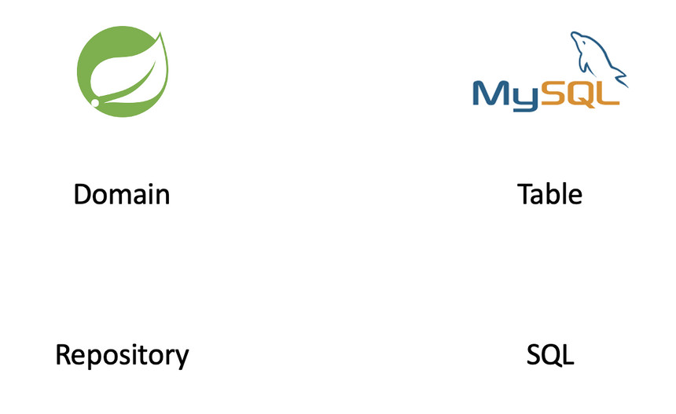

> [[스파르타코딩클럽\] 자바 문법 뽀개기 (notion.so)](https://www.notion.so/80db7f3685304ab3ac749e0e9cd29b30)
>
> [[스파르타코딩클럽\] 웹개발의 봄, Spring (notion.so)](https://www.notion.so/Spring-36bf83125a3e43acb863849f4902fa6c)
>
> [[스파르타코딩클럽\] Spring 심화반 (notion.site)](https://teamsparta.notion.site/Spring-5dceb99696bd471ab0618dfafc12f8f5)


설치해야하는 Dev Tools

> Lombok
>
> Spring Web
>
> Spring Data JPA
>
> H2 Database
>
> MySQL Driver


# 웹의 동작 개념

> 우리가 보는 웹페이지의 원리
>
> 1. 브라우저가 API에 요청을 보내면 **서버**에서 미리 준비해두었던 것을 보내주게 된다
> 2. 브라우저가 API에서 보내준 데이터를 **"받아서", "그려준다"**
>
> 
>
> **브라우저가 하는 일**
>
> 1) 요청을 보내고
> 2) 데이터나 HTML, CSS, JS 파일을 받는다
> 3) 받은 파일들로 화면을 구성하거나, 받은 데이터를 처리한다
>
> 브라우저는 데이터를 JSON형식으로 받고
> 서버에선 데이터를 RestController로 보낸다


## RestController

> JSON 데이터로 응답하려면 RestController를 사용해야 한다
>
> 단순히 클래스 앞에 `@RestController` 어노테이션을 붙여주면 된다

- Rest ?
  - 서버의 응답이 JSON 형식임을 나타냅니다.
  - HTML, CSS 등을 주고받을 때는 Rest 를 붙이지 않습니다.

- Conroller ?

  <aside> 👉 자동 응답기! 누군가 말을 걸면 응답하는 녀석이에요.

  - 클라이언트의 요청(Request)을 전달받는 코드를 Controller 라고 부릅니다.

    → JSON 만을 돌려주는 것은 RestController 라고 부릅니다.


```java
// RestController 예시
@RestController
public class CourseController {

    @GetMapping("/courses")
    public Course getCourses() {
        Course course = new Course();
        course.setTitle("웹개발의 봄 스프링");
        course.setDays(5);
        course.setTutor("노션");
        return course;
    }
}
```

> `@GetMapping`
>
> 브라우저에서 주소를 치는 행위를 GET 방식으로 정보를 요청한다고 합니다. 스프링 주소(http://localhost:8080) 뒤의 주소가 /courses 일 경우, getCourse 메소드를 실행함을 나타냅니다.


## 그레이들 (Gradle)

> 스프링 프로젝트를 빌드 할 수 있게 도와주기도 하고
>
> 다른 사람이 만들어둔 도구를 내려받는데 도움을 준다


언어별 다운로드받고 적용하는 과정을 편하게 해주는 도구들

- Javascript - NPM
- Python - pip
- Java - mavenCentral, jcenter


# MVC모델 요약


## DB

> RDBMS, H2, SQL


### RDBMS

> RDBMS(Relational DataBase Management System)은 컴퓨터에 정보를 저장하고 관리하는 기술입니다.
> **성능/관리 면에서 매우 고도화된 엑셀** 이라고 생각해도 좋다

(줄여서 RDB) **관계형 데이터베이스**를 뜻한다


#### RDBMS의 종류

> 각 제품 간 차이가 크지 않아서 사실 어떤 걸 사용하든 좋습니다. 유료인 Oracle을 제외하고 보통 MySQL, PostgreSQL 중에서 많이 고르는 편인데, 우리는 실제 배포 시 MySQL을 사용합니다.

- MySQL
- PostgreSQL
- Oracle Database


**H2**

> In-memory DB의 대표 주자인 H2
> 인메모리 DB란 서버가 작동하는 동안에만 내용을 저장하고, 서버가 작동을 멈추면 데이터가 모두 삭제되는 데이터베이스를 말합니다.

RDBMS의 한 종류로, 서버가 켜져있는 동안에만 작동하는 RDB


### SQL

> SQL(Structured Query Language)
>
> RDBMS의 고도화된 엑셀 파일 하나가 "데이터베이스"라면,
> 엑셀 시트 하나는 "테이블"이라고 부르고,
> 엑셀 행 하나는 "데이터"라고 부릅니다.

데이터베이스에서 데이터를 읽고, 저장하고, 변경하고, 삭제하는 구체적인 문법이다


## Model

> DB를 사용하기 위한 영역
> `@Entity` 를 선언하여 클래스를 바로 테이블로 만들어 사용하고, 각종 기능들을 구현한다
>
> 스프링은 자바로 작동하고, 데이터베이스는 SQL로 작동한다
> 한국어와 영어 사이에 번역기가 필요하듯, 스프링과 DB에도 번역기가 필요하다
> **JPA는 자바를 위한 번역기**라고 생각하면 된다


### JPA

> JPA(Java Persistence API)는 스프링을 위해 만들어졌다
> **Java로 코드를 작성하면 SQL로 번역**해줄 뿐만 아니라, **기본적인 기능이 거의 완벽하게 들어있다**
> Java - ORM 기술에 대한 인터페이스의 모음

JPA 사용 안했을 때

```java
String query = "SELECT * FROM EMPLOYEE WHERE ID = ?";
Employee employee = jdbcTemplate.queryForObject(
  query, new Object[] { id }, new EmployeeRowMapper());
```


JPA 설정

```java
implementation 'org.springframework.boot:spring-boot-starter-data-jpa'
```


JPA 사용 했을 때

> query없이 사용가능, 자동으로 SQL로 변환해준다

```java
repository.save(new Customer("Jack", "Bauer"));
repository.save(new Customer("Chloe", "O'Brian"));
```


### Repository

> 클래스의 한 역할 중 하나이고, 데이터에 접근할 때 사용하는 하나의 도구라고 생각하면 된다

 JPA를 작동시키는 매개체




- 자바로 DB를 사용하도록 도와주는 녀석이 JPA 라고 말씀드렸습니다.
- 그럼 DB를 이용하는데 핵심이었던 "테이블"과 "SQL"과 동일한 개념의 자바 용어가 있겠죠?
- **"테이블"은 Domain, "SQL"은 Repository** 입니다.


## Controller

> 클라이언트 - 서버 간의 약속인 API와 데이터를 주고받는 영역


### API, Controller, Service

> API 요청에도 다양한 방식이 있습니다. 생성, 조회, 수정, 삭제 각각에 맞는 방법을 알아봅니다.
>
> **스프링은 데이터를 주고받는 방법을 강제합니다**. 어떻게 하면 올바르게 주고받을 수 있는지 배웁니다.


### DTO

> **DTO [ Data Transfer Object ]**
> VO [ Value Object ] 로 정의하여 사용했던 클래스와 같다
>
> 현업에서는 데이터를 주고받을 때, DTO를 반드시 이용합니다. 왜 그러한지 이유와 방법을 배웁니다.


### Lombok

> 코드를 절약할 수 있는 Lombok 사용법을 익힙니다.


# JPA

> [[JPA\] ORM(Object-Relational Mapper) (tistory.com)](https://annajin.tistory.com/168)

```java
@NoArgsConstructor // 기본생성자를 대신 생성해줍니다.
@Entity // 테이블임을 나타냅니다.
public class Course {

    @Id // ID 값, Primary Key로 사용하겠다는 뜻입니다.
    @GeneratedValue(strategy = GenerationType.AUTO) // 자동 증가 명령입니다.
    private Long id;

    @Column(nullable = false) // 컬럼 값이고 반드시 값이 존재해야 함을 나타냅니다.
    private String title;

    @Column(nullable = false)
    private String tutor;

    public String getTitle() {
        return this.title;
    }

    public String getTutor() {
        return this.tutor;
    }

    public Course(String title, String tutor) {
        this.title = title;
        this.tutor = tutor;
    }
}
```

JPA를 사용하지 않는다면 아래처럼 입력해야한다

```sql
CREATE TABLE IF NOT EXISTS Course (
    id bigint(5) NOT NULL AUTO_INCREMENT,
    title varchar(255) NOT NULL,
    tutor varchar(255) NOT NULL,
    PRIMARY KEY (id)
);
```


### 인터페이스

> JPA는 Repository를 통해서만 사용할 수 있습니다.
>
> 인터페이스는 클래스에서 멤버가 빠진, 메소드 모음집이라고 보시면 됩니다.

```java
public interface CourseRepository extends JpaRepository<Course, Long> {
}	// (Primary Key가 Long 타입인) Course 클래스에 대한 Repository를 만든다
```


```java
@Bean
    public CommandLineRunner demo(BoardRepository repository) {
        return (args) -> {

            Board board1 = new Board();
            repository.save(board1);
            // BoardRepository에서 JpaRepository<Board, Long>를 상속했기 때문에
            // repository관련 메소드를 사용할 수 있다
            List<Board> boardList = repository.findAll();

            for (int i=0; i<boardList.size();i++){
                Board b = boardList.get(i);
                System.out.println(b.getTitle());
            }
        };
    }
```


#### 상속의 개념

> `public interface CourseRepository extends JpaRepository<Course, Long>{}`
> 에서 사용한 **extends는 클래스의 상속을 선언**할 때 사용한다
> 상속받은 클래스는 상속한 클래스의 **멤버변수, 메소드를 가지고 있다**


```java
// 상속 예시
class Person {
	private String name;
	private String getName() {
		return this.name;
	}
}

class Tutor extends Person {
	private String address;
	// Person 클래스를 상속했기 때문에,
	// name 멤버변수와 getName() 메소드를 가지고 있습니다.
}

```


## 생성일자, 수정일자

> 대부분의 DB는 기본으로 "생성일자"와 "수정일자"를 필드로 가지고 있다
>
> 생성일자와 수정일자를 다루는 클래스를 생성하고, 그것을 상속받아 사용하게 만든다


# CRUD

> 정보관리의 기본 기능
>
> → 생성 (Create)
> → 조회 (Read)
> → 변경 (Update)
> → 삭제 (Delete)


## 데이터 저장 (Create) & 조회 (Read)

1. Application단에서 `JpaRepository`를 상속받은 BoardRepository 인터페이스 클래스의
   JPA 메서드를 사용하여 저장 및 조회 기능을 구현

> JpaRepository를 상속받은 repository는 쿼리를 보내주는 클래스라고 생각하면 된다

```java
// 데이터 저장하기
repository.save(new Course("프론트엔드의 꽃, 리액트", "임민영"));

// 데이터 전부 조회하기
List<Course> courseList = repository.findAll();
for (int i=0; i<courseList.size(); i++) {
    Course course = courseList.get(i);
    System.out.println(course.getId());
    System.out.println(course.getTitle());
    System.out.println(course.getTutor());
}

// 데이터 하나 조회하기
// 데이터가 없을 수 있으므로 .orElseThrow로 예외를 처리해 줘야한다
Course course = repository.findById(1L).orElseThrow(
        () -> new IllegalArgumentException("해당 아이디가 존재하지 않습니다.")
);
```


> Repository에 기능추가
> https://docs.spring.io/spring-data/jpa/docs/current/reference/html/#jpa.query-methods

```java
public interface BoardRepository extends JpaRepository<Board, Long> {
    List<Board> findAllByOrderByModifiedAtDesc();
}
```


### Service의 개념

> 스프링의 구조는 3가지 영역으로 나눌 수 있습니다.
>
> 1. Controller : 가장 바깥 부분, 요청/응답을 처리함.
>
>    → 2주차 후반부에 배울 녀석
>
> 2. Service : 중간 부분, 실제 중요한 작동이 많이 일어나는 부분
>
>    → 지금 배울 녀석
>
> 3. Repo : 가장 안쪽 부분, DB와 맞닿아 있음.
>
>    → 여태 배운 녀석 (Repository, Entity)

Update 는 Service 부분에 작성해야 한다


## 데이터 변경 (Update)

> [[Spring\] @Transactional 정리 (tistory.com)](https://devkingdom.tistory.com/287)

1. Board 클래스에 update메서드를 추가한다
2. Service클래스에서 Board클래스의 update를 이용하여 update JPA를 생성한다
3. Application단에서 Service클래스의 update메서드를 호출하여 데이터 수정 기능을 구현한다
3. @Transactional 어노테이션으로 인해 update가 완료된다

```java
@Service // 스프링에게 이 클래스가 서비스임을 명시
public class BoardService {

    // final: 서비스에게 꼭 필요한 것이다 (생성자에서 사용할 수 있음)
    private final BoardRepository boardRepository;

    // 생성자를 통해, Service 클래스를 만들 대 꼭 Repository를 넣어주도록 스프링에게 알려줌
    public BoardService(BoardRepository boardRepository){
        this.boardRepository = boardRepository;
    }

    @Transactional // SQL 쿼리가 일어나야 함을 스프링에게 알려줌
    public Long update(Long id, Board board){
        Board board1 = boardRepository.findById(id).orElseThrow(
                () -> new IllegalArgumentException("해당 아이디가 존재하지 않습니다")
        );
        board1.update(board);
        return board1.getId();
    }
}
```

```java
 // 업데이트
            Board board2 = new Board("제목2", "콘텐츠2", "작성자2");
            boardService.update(1L, board2);
```


## 데이터 삭제 (Delete)

1. Application단에서 `JpaRepository`를 상속받은 BoardRepository 인터페이스 클래스의
   JPA 메서드를 사용하여 삭제 기능을 구현


# Lombok, DTO


### Lombok

> 어노테이션을 통해 코드를 줄일 수 있다
>
> ex) getter, setter생성 / 기본생성자 자동생성 / 매개변수 자동선언

```java
// 생성자를 통해, Service 클래스를 만들 때 꼭 Repository를 넣어주도록 스프링에게 알려줌
public BoardService(BoardRepository boardRepository){
    this.boardRepository = boardRepository;
}
```

```java
@RequiredArgsConstructor // 자동으로 위의 과정 실행
```


### DTO

> VO (Value Object)

```html
테이블을 막 건드려도 될까?
= read, update할 때 Course 클래스를 막 써도 될까?
= 내가 아닌 다른 사람이 변경이라도 한다면?? 😱

완충재로 활용하는 것이
DTO(Data Transfer Object)입니다.
```


# API

> 👉 클라이언트 - 서버 간의 약속입니다.
> 클라이언트가 정한대로 서버에게 요청(Request)을 보내면, 서버가 요구사항을 처리하여 응답(Response)을 반환합니다.


### REST

> 👉 REST란, 주소에 명사, 요청 방식에 동사를 사용함으로써 의도를 명확히 드러냄을 의미합니다.

- 여기에 쓰이는 동사는 우리가 JPA 시간에 배운 CRUD를 지칭합니다.
- 즉 A에 대해 생성(POST)/조회(GET)/수정(PUT)/삭제(DELETE) 요청을 하는 것이죠.

- 예시
  - GET /courses → 강의 전체 목록 조회 요청
  - GET /courses/1 → ID가 1번인 녀석 조회 요청
  - POST /courses → 강의 생성 요청
  - PUT /courses/3 → ID가 3번인 녀석 수정 요청
  - DELETE /courses/2 → ID 2번인 녀석 삭제 요청


#### GET

```java
@GetMapping("/api/boards")
    public List<Board> getBoards(){
        return boardRepository.findAll();
    }
```

#### POST

> `@RequestBody` POST의 특성 상 url에 데이터가 담기는 것이 아니라 body에 담긴다

```java
@PostMapping("/api/boards")
public Board createBoard(@RequestBody BoardDTO boardDTO) {
    // BoardDTO 는, 생성 요청을 의미합니다.
    // 강의 정보를 만들기 위해서는 강의 제목과 튜터 이름이 필요하잖아요?
    // 그 정보를 가져오는 녀석입니다.

    // 저장하는 것은 DTO가 아니라 Board이니, DTO의 정보를 Board에 담아야 합니다.
    // 잠시 뒤 새로운 생성자를 만듭니다.
    Board board = new Board(boardDTO);

    // JPA를 이용하여 DB에 저장하고, 그 결과를 반환합니다.
    return boardRepository.save(board);
}
```


#### PUT

> `@PathVariable`로 url의 변수와 이름이 같은 변수를 할당한다

```java
@PutMapping("/api/boards/{id}")
public Long updateBoard(@PathVariable Long id, @RequestBody BoardDTO boardDTO){
    return boardService.update(id, boardDTO);
}
```


#### DELETE

```java
@DeleteMapping("/api/boards/{id}")
public void deleteBoard(@PathVariable Long id){
    boardRepository.deleteById(id);
}
```


# JPA - PK / FK설정

> [[Spring\] JPA: 관계 표현. ManyToOne, OneToMany : 네이버 블로그 (naver.com)](https://m.blog.naver.com/sssang97/221777035267)
>
> [연관관계 매핑 기초 · JPA (gitbooks.io)](https://backend.gitbooks.io/jpa/content/chapter5.html)

**방향**(Direction) : [단방향, 양방향]이 있다. 예를 들어 회원과 팀이 관계가 있을 때 회원 -> 팀 또는 팀 -> 회원 둘 중 한 쪽만 참조하는 것을 단방향 관계라 하고, 회원 -> 팀, 팀 -> 회원 양쪽 모두 서로 참조하는 것을 양방향 관계라 한다. 방향은 객체관계에만 존재하고 테이블 관계는 항상 양방향이다.

**다중성**(Multiplicity) : [다대일(N:1), 일대다(1:N), 일대일(1:1), 다대다(N:N)] 다중성이다. 예를 들어 회원과 팀이 관계가 있을 때 여러 회원은 한 팀에 속하므로 회원과 팀은 다대일 관계다. 반대로 한 팀에 여러 회원이 소속될 수 있으므로 팀과 회원은 일대다 관계다.

**연관관계의 주인**(Owner) : 객체를 양방향 연관관계로 만들면 연관관계의 주인을 정해야 한다.


## 여러 Entity의 @GeneratedValue

> 과제 프로젝트를 진행하며 두 개의 Entity를 구성하였고,
> 두 개의 Entity 모두 Long 타입의 id를 PK로 갖는다

#### 문제

- 두개의 Entity의 id를 `GenerationType.AUTO`로 생성해줬더니 생성되는 숫자가 테이블 간에 공유가 됐다
  예를들면, **테이블1에서 1,2,3,4 까지의 id를 생성하고 테이블2에서 id를 생성하면 5부터 생성**된다

#### 원인

- `GenerationType.AUTO`는 **서버에서 생성**해주기 때문에, 테이블마다 별개로 인식하지 않는다

```java
    @Id
    @GeneratedValue(strategy = GenerationType.AUTO)
    private Long id;
```

#### 해결

- 첫 번째 방법은 `@SequenceGenerator`로 자동으로 하나씩 커지는 숫자를 생성해 주는 것이었다
- 그리고 `@GeneratedValue(strategy = GenerationType.SEQUENCE, generator = "BOARD_SEQ_GENERATOR")`를 사용하여 생성한 `@SequenceGenerator`를 사용했다

```java
@SequenceGenerator(
        name = "BOARD_SEQ_GENERATOR",
        sequenceName = "BOARD_SEQ",
        initialValue = 1,
        allocationSize = 1
)
	@Id
	@GeneratedValue(strategy = GenerationType.SEQUENCE, generator = "BOARD_SEQ_GENERATOR")
    private Long id;

```


- 두 번째 방법이 간단하고 효율적이었는데, `GenerationType.IDENTITY`를 사용하는 것이다
- `GenerationType.IDENTITY`는 **DB에서 생성**하는 것이기 때문에 테이블마다 별개로 생성되어,
  **모든 테이블의 id가 1부터 시작**하는 값을 갖는다
- 기술 매니저님의 말로는 현업에서도 `GenerationType.IDENTITY`를 많이 사용한다고 하셨다

```java
    @Id
    @GeneratedValue(strategy = GenerationType.IDENTITY)
    private Long id;
```


## Hibernate


# 배포

## 과정

1. RDS 구매

2. RDS 포트 열어주기

3. RDS 엔드포인트와 IntelliJ 연결

4. 스프링 부트 설정 (스프링 부트 설정의 대부분은 application.properties 에서 관리)

   - 스프링 부트를 MySQL과 연결하기

     ```yaml
     spring.datasource.url=jdbc:mysql://나의엔드포인트:3306/myselectshop
     spring.datasource.username=나의USERNAME
     spring.datasource.password=나의패스워드
     spring.jpa.hibernate.ddl-auto=update
     ```

5. EC2 구매 (AWS로 대여한 리눅스 컴퓨터)

6. EC2 포트 열어주기

7. EC2에 접속하기

   - 윈도우는 git bash를 통해 접속한다

     ```shell
     ssh -i /path/my-key-pair.pem ubuntu@13.125.250.20
     ```

   - Key fingerprint 관련 메시지가 나올 경우 Yes를 입력

   - git bash를 종료할 때는 exit 명령어를 입력하여 ssh 접속을 먼저 끊어주자

8. 배포파일 빌드하기 (IntelliJ에서 Gradle의 build를 사용하여 쉽게 배포파일을 빌드한다)

9. OpenJDK 설치하기

   ```shell
   sudo apt-get update
   sudo apt-get install openjdk-8-jdk
   java -version
   # 자바 jdk ver8을 설치한다
   ```

10. Filezilla를 이용해서 배포 파일을 업로드하기

11. 스프링 부트 작동시키기

    ```shell
    java -jar JAR파일명.jar
    ```

12. AWS에서 80, 8080 포트를 열어주기

    - 80번 포트는 모든 url의 기본포트이므로,
      **포트번호를 사용하지 않고 접속하려면 80번 포트를 열어야한다**

13. `http://내AWS아이피:8080`로 접속 해보기

포트포워딩 & nohup 적용하기

> - 지금은 8080 포트에서 웹 서비스가 실행되고 있습니다. 그래서 매번 :8080 이라고 뒤에 붙여줘야 하죠. 뒤에 붙는 포트 번호를 없애려면 어떻게 해야할까요?
> - http 요청에서는 80포트가 기본이기 때문에, 굳이 :80을 붙이지 않아도 자동으로 연결이 됩니다.
> - 포트 번호를 입력하지 않아도 자동으로 접속되기 위해, 우리는 80포트로 오는 요청을 8080 포트로  전달하게 하는 포트포워딩(port forwarding) 을 사용하겠습니다.
>
> 포트 번호 없애기 - 리눅스 자체 포트포워딩을 작동시키기
>
> - 띄워둔 터미널에서 새롭게 설정을 적용하기 전에 돌아가고 있던 서비스는 일단 끄고! (터미널에서 ctrl + c)
>
> - 포트포워딩 룰을 입력합니다.
>
>   ```shell
>   sudo iptables -t nat -A PREROUTING -i eth0 -p tcp --dport 80 -j REDIRECT --to-port 8080
>   ```
>
> - 다시 서비스 시작
>
> SSH 접속을 끊어도 서버가 계속 돌게 하기
>
> - 원격 접속을 종료하더라도 서버가 계속 돌아가게 하기
>
>   ```shell
>   nohup java -jar JAR파일명.jar &
>   ```
>
> - 서버 종료하기 \- 강제종료하는 방법
>
>   ```shell
>   # 아래 명령어로 미리 pid 값(프로세스 번호)을 본다
>   ps -ef | grep java
>   
>   # 아래 명령어로 특정 프로세스를 죽인다
>   kill -9 [pid값]
>   ```
>
> 


## EC2

- AWS EC2에 접속하기 (준비 상식 편)
  - SSH(Secure Shell Protocol)
    - 다른 컴퓨터에 접속할 때 쓰는 프로그램입니다. 다른 것들 보다 보안이 상대적으로 뛰어납니다.
    - 접속할 컴퓨터가 22번 포트가 열려있어야 접속 가능합니다. AWS EC2의 경우, 이미 22번 포트가 열려있습니다. 확인해볼까요?

- AWS EC2에 접속하기

  - Window: ssh가 없으므로, git bash라는 프로그램을 이용!

    - gitbash를 실행하고, 아래를 입력!

    > ssh -i 받은키페어를끌어다놓기 ubuntu@AWS에적힌내아이피
    >
    > ex) `ssh -i /path/my-key-pair.pem ubuntu@13.125.250.20`

  - Key fingerprint 관련 메시지가 나올 경우 Yes를 입력해주세요!

  - git bash를 종료할 때는 exit 명령어를 입력하여 ssh 접속을 먼저 끊어주세요.
