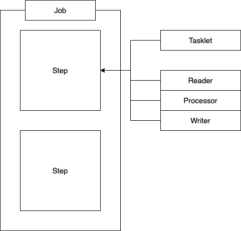

## YAML

```
원래 YAML은 'YAML은 마크업 언어가 아니다 - YAML Ain't Markup Language' 라는 뜻으로   
핵심이 문서 마크업이 아닌 데이터 중심에 있다는 것을 보여줍니다.   
그에 맞게 가독성이 좋으며 문법이 이해하기 수월하도록 작성된 언어입니다.
```


int와 Integer

> https://includestdio.tistory.com/1


## Java의 Optional

[까다로운 Optional 느낌있게 사용하는 법 (velog.io)](https://velog.io/@nswon/Java8-API-개발자-Optional-그렇게-쓰는거-아닌데)

[Java Optional 바르게 쓰기 - 뒤태지존의 끄적거림 (homoefficio.github.io)](https://homoefficio.github.io/2019/10/03/Java-Optional-바르게-쓰기/)


## SpringSecurity

[SPRING SECURITY + JWT 회원가입, 로그인 기능 구현 (tistory.com)](https://webfirewood.tistory.com/115)


## (SpringSecurity) antMatchers와 mvcMatchers의 차이

[spring - Difference between antMatcher and mvcMatcher - Stack Overflow](https://stackoverflow.com/questions/50536292/difference-between-antmatcher-and-mvcmatcher)

`antMatchers(String antPattern)` - Allows configuring the `HttpSecurity` to only be invoked when matching the provided ant pattern.

`mvcMatchers(String mvcPattern)` - Allows configuring the `HttpSecurity` to only be invoked when matching the provided Spring MVC pattern.

> 요약
>
> mvcMatcher가 antMatcher보다 더 안전하다. 그 이유는
> antMatchers("/url")은 `/url`에만 매치되고
> mvcMatchers("/url")은 `/url,` `/url/`, `/url.html`, `/url.xyz`에도 매치되기 때문
>
> 또한, mvcMatchers가 더 최근에 나온 API이다


## Unique column의 Exception처리방법

> https://dadadamarine.github.io/java/spring/2019/04/19/spring-sqlException-%EC%B2%98%EB%A6%AC.html


## image 파일 보내고 받기

> [Multipart/form-data란? – JungHyun Baek – Developer from South Korea (junghyun100.github.io)](https://junghyun100.github.io/Multipart_form-data/)


## Form-data

>[HTTP multipart/form-data 란? (velog.io)](https://velog.io/@shin6403/HTTP-multipartform-data-란)
>
>[HTTP multipart/form-data 이해하기 | 레나참나 (lena-chamna.netlify.app)](https://lena-chamna.netlify.app/post/http_multipart_form-data/)


## Multipartfile이란?

> A representation of an uploaded file received in a multipart request.


multipartFile 받는 법

multipartFile 변환하기

multipartFile 반환하기

[명월 일지 :: [Java\] Base64 인코딩, 디코딩하는 방법 (tistory.com)](https://nowonbun.tistory.com/476)


### java에서 Byte[]와 byte[]

[OKKY - 자바 byte와 Byte의 차이점](https://okky.kr/article/408892)

### byte[]의 길이 문제

com.mysql.cj.jdbc.exceptions.MysqlDataTruncation: Data truncation: Data too long for column 'image_byte' at row 1

https://helloworld.kurly.com/blog/jpa-uuid-sapjil/


## Java 8 변경점

> 면접 단골 질문


## Builder Pattern

> 빌더 패턴을 사용해야 하는 이유
>
> https://mangkyu.tistory.com/163
>
> https://lemontia.tistory.com/483
> https://lemontia.tistory.com/445
>
> [[Lombok\] @Builder :: 정리 중... (tistory.com)](https://royleej9.tistory.com/entry/Lombok-Builder)


빌더 패턴의 효과

1) 필요한 데이터만 설정할 수 있음

2) 유연성을 확보할 수 있음

3) 가독성을 높일 수 있음

4) 변경 가능성을 최소화할 수 있음

   > Setter 사용을 지양하자
   >
   > https://github.com/cheese10yun/spring-jpa-best-practices/blob/master/doc/step-06.md


- 예시 클래스

```java
public class UserInfo {
   private String name;
   private int age;
   private String addr;

   public UserInfo(String name, int age, String addr){
       this.name = name;
       this.age = age;
       this.addr = addr;
   }

    public String getName() {
        return name;
    }

    public void setName(String name) {
        this.name = name;
    }

    public int getAge() {
        return age;
    }

    public void setAge(int age) {
        this.age = age;
    }

    public String getAddr() {
        return addr;
    }

    public void setAddr(String addr) {
        this.addr = addr;
    }

    public String getUserInfo(){
       return String.format("name: %s, age: %d, addr: %s", name, age, addr);
    }
}
```

- 빌더 패턴 적용

```java
public class UserInfoBuilder {
    private String name;
    private int age;
    private String addr;

    public UserInfoBuilder setName(String name){
        this.name = name;
        return this;
    }

    public UserInfoBuilder setAge(int age){
        this.age = age;
        return this;
    }

    public UserInfoBuilder setAddr(String addr){
        this.addr = addr;
        return this;
    }

    public UserInfo build(){
        return new UserInfo(name, age, addr);
    }
}

```

builder를 사용한 객체 생성

```java
UserInfoBuilder userInfoBuilder = new UserInfoBuilder();
UserInfo userInfo3 = userInfoBuilder
        .setName("테스터3")
        .setAddr("주소")
        .setAge(26)
        .build();
```


### 롬복의 @Builder

> 빌더를 적용할 생성자에 어노테이션을 붙여주면 된다.
>


### static - 정적 선언 사용

https://coding-factory.tistory.com/524

> Static 키워드를 통해 생성된 정적멤버들은 Heap영역이 아닌 Static영역에 할당됩니다.
> Static 영역에 할당된 메모리는 **모든 객체가 공유하여 하나의 멤버를 어디서든지 참조**할 수 있는 장점을 가지지만 Garbage Collector의 관리 영역 밖에 존재하기에 **Static영역에 있는 멤버들은 프로그램의 종료시까지 메모리가 할당된 채로 존재**하게 됩니다. 그렇기에 Static을 너무 남발하게 되면 만들고자 하는 시스템 성능에 악영향을 줄 수 있습니다.


## Spring 예외처리

https://velog.io/@mooh2jj/%EC%9E%90%EB%B0%94-%EC%98%88%EC%99%B8%EC%B2%98%EB%A6%ACtry-catch-throw-throws

https://jeong-pro.tistory.com/195

[Spring Exception Handling :: 뱀귤 블로그 (tistory.com)](https://bcp0109.tistory.com/303)


## Spring의 Validation

https://velog.io/@_koiil/SpringBoot-Spring-Validation%EC%9D%84-%EC%9D%B4%EC%9A%A9%ED%95%9C-%EC%9C%A0%ED%9A%A8%EC%84%B1-%EA%B2%80%EC%A6%9D


- # 사용할 클래스

  - `ErrorCode` : 핵심. 모든 예외 케이스를 이곳에서 관리함
  - `CustomException` : 기본적으로 제공되는 Exception 외에 사용
  - `ErrorResponse` : 사용자에게 JSON 형식으로 보여주기 위해 에러 응답 형식 지정
  - `GlobalExceptionHandler` : Custom Exception Handler
    - `@ControllerAdvice` : 프로젝트 전역에서 발생하는 Exception 을 잡기 위한 클래스
    - `@ExceptionHandler` : 특정 Exception 을 지정해서 별도로 처리해줌


### @ExceptionHandler

> @Controller, @RestController가 적용된 Bean내에서 발생하는 예외를 잡아서 **하나의 메서드**에서 처리해주는 기능을 한다.

- 주의사항/알아 둘 것

Controller, RestController에만 적용가능하다. (@Service같은 빈에서는 안됨.)

리턴 타입은 자유롭게 해도 된다. (Controller내부에 있는 메서드들은 여러 타입의 response를 할 것이다. 해당 타입과 전혀다른 리턴 타입이어도 상관없다.)

@ExceptionHandler를 등록한 Controller에만 적용된다. 다른 Controller에서 NullPointerException이 발생하더라도 예외를 처리할 수 없다.

메서드의 파라미터로 Exception을 받아왔는데 이것 또한 자유롭게 받아와도 된다.

### @ControllerAdvice

> @ControllerAdvice는 모든 @Controller 즉, **전역에서 발생할 수 있는 예외를 잡아 처리**해주는 annotation이다.


### @RestControllerAdvice

> @RestController에서 예외가 발생하든 @Controller에서 예외가 발생하든 @ControllerAdvice + @ExceptionHandler 조합으로 다 캐치할 수 있고 @ResponseBody의 필요 여부에 따라 적용하면 된다.
>
> 전역의 예외를 잡긴하되 패키지 단위로 제한할 수도있다
>
> `@RestControllerAdvice("com.example.demo.login.controller")`


## Spring의 Response

[ResponseEntity - Spring Boot에서 Response를 만들자 (techcourse.co.kr)](https://tecoble.techcourse.co.kr/post/2021-05-10-response-entity/)


## AOP사용

https://javachoi.tistory.com/263


## 정규표현식 regax

> [정규 표현식, re 모듈 — Duck9s' (tistory.com)](https://duckgugong.tistory.com/155)
>
> [[ Java \] 자바 정규식 (Regular expressions) (tistory.com)](https://gogo-jjm.tistory.com/63)


## S3 사용해보기

https://pearlluck.tistory.com/61


## S3 파일명을 UUID로 한 이유

S3에 저장 시 파일이름을 UUID로 저장했다.

 첫번째 이유

-  파일명이 중복으로 발생할 수 있다

 두번째 이유

- 보안적인 (개발용 S3에만 국한) 이유이다. S3가 외부에 모두 오픈된 상태이기 때문에 UUID가 없을 경우 파일 이름을 통해 쉽게 S3에 저장된 파일에 쉽게 접근할 수 있기 때문에, 무분별한 접근을 막을 수 있도록 UUID를 적용하는 것이 좋다.


## N+1 문제

[[JPA\] N+1 문제 원인 및 해결방법 알아보기 — 슬기로운 개발생활 (tistory.com)](https://dev-coco.tistory.com/165)


## 즉시로딩 VS 지연로딩

[[JPA\] 즉시로딩과 지연로딩 알아보기(FetchType.EAGER, LAZY) — 슬기로운 개발생활 (tistory.com)](https://dev-coco.tistory.com/139)


## SQL 조인이란?

[조인(SQL Server) - SQL Server | Microsoft Docs](https://docs.microsoft.com/ko-kr/sql/relational-databases/performance/joins?view=sql-server-ver16)

> 조인을 사용하면 **테이블 간의 논리적 관계를 기준으로 둘 이상의 테이블에서 데이터를 검색할 수 있습니다**. 조인은 SQL Server에서 특정 테이블의 데이터를 사용하여 다른 테이블의 행을 선택하는 방법을 나타냅니다.


## JPQL로 좋아요 개수 순 정렬 기능 구현

```java
@Query(value = "select b " +
       "from Board b left join Like l " +
       "on b = l.boardId " +
       "group by b._id " +
       "order by count(l) desc ")
List<Board> findAllByOrOrderByLikeIdsCount();
```

하이버네이트로 본 위의 JPQL 쿼리문

```
Hibernate: 
    select
        board0_._id as _id1_0_,
        board0_.created_at as created_2_0_,
        board0_.modified_at as modified3_0_,
        board0_.content as content4_0_,
        board0_.layout as layout5_0_,
        board0_.user_id as user_id6_0_ 
    from
        board board0_ 
    left outer join
        likes like1_ 
            on (
                board0_._id=like1_.board_id
            ) 
    group by
        board0_._id 
    order by
        count(like1_._id) desc
```


## 이메일 인증

[[Spring\] 이메일 인증 구현 (tistory.com)](https://gilssang97.tistory.com/60)


## 이메일 인증 데이터를 폐기하는 법

https://jessyt.tistory.com/3

정해진 시간이후 테이블을 자동으로 삭제하는 기능을 추가하려면

**@Scheduled**라는 어노테이션을 사용


### **Spring Batch**

https://jessyt.tistory.com/3

**Spring에서 지원하는 대용량 데이터를 일괄적으로 처리하는 기능이다.**

**schema-mysql.sql 을 통해 Spring Batch Meta 정보 관련 Database table 생성**


> **Batch는 대용량 데이터를 일괄적으로 처리하는 기능이고 Quartz는 스케쥴링 역할**
>
> schema-mysql.sql 을 통해 Spring Batch **Meta 정보 관련 Database table 생성**





## WebRTC

https://velog.io/@heejinkim0812/WebRTC%EB%9E%80


## Random String 생성하는 법

1. ```java
   int leftLimit = 97; // letter 'a'
   int rightLimit = 122; // letter 'z'
   int targetStringLength = 10;
   Random random = new Random();
   StringBuilder buffer = new StringBuild(targetStringLength);
   for (int i = 0; i < targetStringLength; i++) {
       int randomLimitedInt = leftLimit + (int)
               (random.nextFloat() * (rightLimit - leftLimit + 1));
       buffer.append((char) randomLimitedInt);
   }
   String generatedString = buffer.toString()
   System.out.println(generatedString);
   
   ```

   > random 클래스를 사용하여 97~122 사이의 난수를 생성하고 char로 변환한 다음 (a~z)
   > StringBuilder에 하나씩 더해준다 -> 힙 메모리(Heap)에 많은 임시 가비지(Garbage)가 생성돼서 사용을 지양했다. (물론 GC(garbage collection)가 처리해주긴 하지만)

   

2. ```java
   import java.util.UUID;
   
   	String uuid = UUID.randomUUID().toString();
   	String randomString = uuid.substring(0,8);
   ```

   > UUID를 생성해 subString으로 잘라쓰는 방법

   

3. ```java
   import org.apache.commons.lang3.RandomStringUtils;
   
   	String randomString = RandomStringUtils.random(8, true, true);
   ```

   > **apache.commons.lang 을 사용하여 랜덤 스트링 생성**
   > 쉽고 편하게 만들 수 있다 + 길이, 숫자와 문자여부 등 변경이 자유롭다 -> 이용 Good


## Jackson 주의할 점

[Spring Request DTO 에 null 값이 들어가는 이유 (Jackson, Lombok) :: 뱀귤 블로그 (tistory.com)](https://bcp0109.tistory.com/309)


## Email Service (SMTP)

[springboot 구글 이메일 gmail 인.. : 네이버블로그 (naver.com)](https://blog.naver.com/ghdalswl77/222739067045)


## 소셜 로그인

[소셜로그인기능 구현(1)_그 원리와 절차에 대해 (velog.io)](https://velog.io/@hyunju-song/소셜로그인기능1OAuth)

> 1. 사용자가 소셜로그인 버튼을 누르면, 로그인하고자 하는 소셜의(카카오나 구글) 로그인페이지로 가게된다.
> 2. 이 때 이 로그인 페이지로 가게 하기 위해, 서비스제공자와 소셜 사이에서의 모종의 상호작용이 일어나게 된다. 이 상호작용을 위해 서비스 제공자는 미리 OAuth라는 서비스를 사용하게 된다. (이에 대해서는 이후에 추가적인 설명을 할 예정)
> 3. 로그인을 성공하면, 소셜은 사용자의 페이지가 기존에 사용하던 서비스 페이지로 redirect 되도록 해준다.

즉 소셜로그인은, 구글이나 카카오에서 "나"라는 제공자와 "사용자" 사이에서 로그인을 중개해주는 역할을 하는 것이다.
이 중개자의 역할을 가능하도록 해주는 서비스가 OAuth 이다.


### curl

https://github.com/gwonsungjun/wiki/blob/master/Linux/Ubuntu/curl.md

> [Client URL]


## Spring WebClient


## InitBinder & WebDataBinder

[@InitBinder와 WebDataBinder의 쓰임 (tistory.com)](https://live-everyday.tistory.com/m/227)


## Java 상속

[[Java\] 자바 상속의 특징 - extends, super, 오버라이딩, instanceof, 추상 클래스와 메소드, final (tistory.com)](https://scshim.tistory.com/210)


## 페이징 처리 - Offset, Cursor

[페이징 처리 - Offset, Cursor (velog.io)](https://velog.io/@suu07/페이징-처리)


## Redis

레디스는 고성능 키-값 저장소로서 문자열, 리스트, 해시, 셋, 정렬된 셋 형식의 데이터를 지원하는 NoSQL
