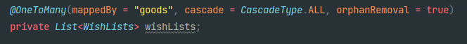
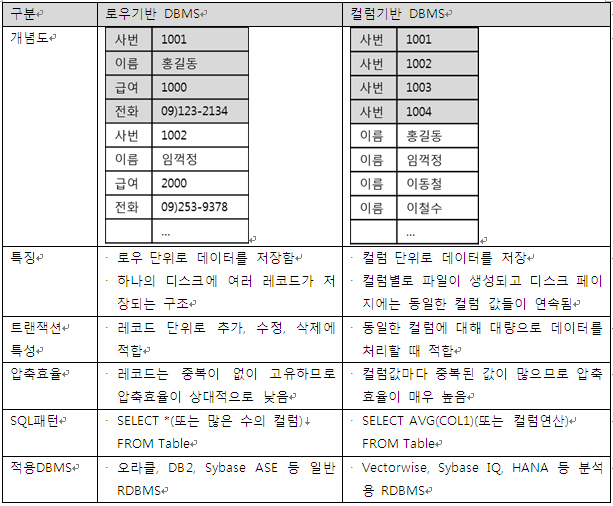

## YAML

```
원래 YAML은 'YAML은 마크업 언어가 아니다 - YAML Ain't Markup Language' 라는 뜻으로   
핵심이 문서 마크업이 아닌 데이터 중심에 있다는 것을 보여줍니다.   
그에 맞게 가독성이 좋으며 문법이 이해하기 수월하도록 작성된 언어입니다.
```


int와 Integer

> https://includestdio.tistory.com/1


## Java의 Optional

[까다로운 Optional 느낌있게 사용하는 법 (velog.io)](https://velog.io/@nswon/Java8-API-개발자-Optional-그렇게-쓰는거-아닌데)

[Java Optional 바르게 쓰기 - 뒤태지존의 끄적거림 (homoefficio.github.io)](https://homoefficio.github.io/2019/10/03/Java-Optional-바르게-쓰기/)


## SpringSecurity

[SPRING SECURITY + JWT 회원가입, 로그인 기능 구현 (tistory.com)](https://webfirewood.tistory.com/115)


## (SpringSecurity) antMatchers와 mvcMatchers의 차이

[spring - Difference between antMatcher and mvcMatcher - Stack Overflow](https://stackoverflow.com/questions/50536292/difference-between-antmatcher-and-mvcmatcher)

`antMatchers(String antPattern)` - Allows configuring the `HttpSecurity` to only be invoked when matching the provided ant pattern.

`mvcMatchers(String mvcPattern)` - Allows configuring the `HttpSecurity` to only be invoked when matching the provided Spring MVC pattern.

> 요약
>
> mvcMatcher가 antMatcher보다 더 안전하다. 그 이유는
> antMatchers("/url")은 `/url`에만 매치되고
> mvcMatchers("/url")은 `/url,` `/url/`, `/url.html`, `/url.xyz`에도 매치되기 때문
>
> 또한, mvcMatchers가 더 최근에 나온 API이다


## Unique column의 Exception처리방법

> https://dadadamarine.github.io/java/spring/2019/04/19/spring-sqlException-%EC%B2%98%EB%A6%AC.html


## image 파일 보내고 받기

> [Multipart/form-data란? – JungHyun Baek – Developer from South Korea (junghyun100.github.io)](https://junghyun100.github.io/Multipart_form-data/)


## Form-data

>[HTTP multipart/form-data 란? (velog.io)](https://velog.io/@shin6403/HTTP-multipartform-data-란)
>
>[HTTP multipart/form-data 이해하기 | 레나참나 (lena-chamna.netlify.app)](https://lena-chamna.netlify.app/post/http_multipart_form-data/)


## Multipartfile이란?

> A representation of an uploaded file received in a multipart request.


multipartFile 받는 법

multipartFile 변환하기

multipartFile 반환하기

[명월 일지 :: [Java\] Base64 인코딩, 디코딩하는 방법 (tistory.com)](https://nowonbun.tistory.com/476)


### java에서 Byte[]와 byte[]

[OKKY - 자바 byte와 Byte의 차이점](https://okky.kr/article/408892)

### byte[]의 길이 문제

com.mysql.cj.jdbc.exceptions.MysqlDataTruncation: Data truncation: Data too long for column 'image_byte' at row 1

https://helloworld.kurly.com/blog/jpa-uuid-sapjil/


## Java 8 변경점

> 면접 단골 질문
>
> 람다식, Optional, Generic, 


## Builder Pattern

> 빌더 패턴을 사용해야 하는 이유
>
> https://mangkyu.tistory.com/163
>
> https://lemontia.tistory.com/483
> https://lemontia.tistory.com/445
>
> [[Lombok\] @Builder :: 정리 중... (tistory.com)](https://royleej9.tistory.com/entry/Lombok-Builder)


빌더 패턴의 효과

1) 필요한 데이터만 설정할 수 있음

2) 유연성을 확보할 수 있음

3) 가독성을 높일 수 있음

4) 변경 가능성을 최소화할 수 있음

   > Setter 사용을 지양하자
   >
   > https://github.com/cheese10yun/spring-jpa-best-practices/blob/master/doc/step-06.md


- 예시 클래스

```java
public class UserInfo {
   private String name;
   private int age;
   private String addr;

   public UserInfo(String name, int age, String addr){
       this.name = name;
       this.age = age;
       this.addr = addr;
   }

    public String getName() {
        return name;
    }

    public void setName(String name) {
        this.name = name;
    }

    public int getAge() {
        return age;
    }

    public void setAge(int age) {
        this.age = age;
    }

    public String getAddr() {
        return addr;
    }

    public void setAddr(String addr) {
        this.addr = addr;
    }

    public String getUserInfo(){
       return String.format("name: %s, age: %d, addr: %s", name, age, addr);
    }
}
```

- 빌더 패턴 적용

```java
public class UserInfoBuilder {
    private String name;
    private int age;
    private String addr;

    public UserInfoBuilder setName(String name){
        this.name = name;
        return this;
    }

    public UserInfoBuilder setAge(int age){
        this.age = age;
        return this;
    }

    public UserInfoBuilder setAddr(String addr){
        this.addr = addr;
        return this;
    }

    public UserInfo build(){
        return new UserInfo(name, age, addr);
    }
}

```

builder를 사용한 객체 생성

```java
UserInfoBuilder userInfoBuilder = new UserInfoBuilder();
UserInfo userInfo3 = userInfoBuilder
        .setName("테스터3")
        .setAddr("주소")
        .setAge(26)
        .build();
```


### 롬복의 @Builder

> 빌더를 적용할 생성자에 어노테이션을 붙여주면 된다.
>


### static - 정적 선언 사용

https://coding-factory.tistory.com/524

> Static 키워드를 통해 생성된 정적멤버들은 Heap영역이 아닌 Static영역에 할당됩니다.
> Static 영역에 할당된 메모리는 **모든 객체가 공유하여 하나의 멤버를 어디서든지 참조**할 수 있는 장점을 가지지만 Garbage Collector의 관리 영역 밖에 존재하기에 **Static 영역에 있는 멤버들은 프로그램의 종료시까지 메모리가 할당된 채로 존재**하게 됩니다. 그렇기에 Static을 너무 남발하게 되면 만들고자 하는 시스템 성능에 악영향을 줄 수 있습니다.


## Spring 예외처리

https://velog.io/@mooh2jj/%EC%9E%90%EB%B0%94-%EC%98%88%EC%99%B8%EC%B2%98%EB%A6%ACtry-catch-throw-throws

https://jeong-pro.tistory.com/195

[Spring Exception Handling :: 뱀귤 블로그 (tistory.com)](https://bcp0109.tistory.com/303)


## Spring의 Validation

https://velog.io/@_koiil/SpringBoot-Spring-Validation%EC%9D%84-%EC%9D%B4%EC%9A%A9%ED%95%9C-%EC%9C%A0%ED%9A%A8%EC%84%B1-%EA%B2%80%EC%A6%9D


- # 사용할 클래스

  - `ErrorCode` : 핵심. 모든 예외 케이스를 이곳에서 관리함
  - `CustomException` : 기본적으로 제공되는 Exception 외에 사용
  - `ErrorResponse` : 사용자에게 JSON 형식으로 보여주기 위해 에러 응답 형식 지정
  - `GlobalExceptionHandler` : Custom Exception Handler
    - `@ControllerAdvice` : 프로젝트 전역에서 발생하는 Exception 을 잡기 위한 클래스
    - `@ExceptionHandler` : 특정 Exception 을 지정해서 별도로 처리해줌


### @ExceptionHandler

> @Controller, @RestController가 적용된 Bean내에서 발생하는 예외를 잡아서 **하나의 메서드**에서 처리해주는 기능을 한다.

- 주의사항/알아 둘 것

Controller, RestController에만 적용가능하다. (@Service같은 빈에서는 안됨.)

리턴 타입은 자유롭게 해도 된다. (Controller내부에 있는 메서드들은 여러 타입의 response를 할 것이다. 해당 타입과 전혀다른 리턴 타입이어도 상관없다.)

@ExceptionHandler를 등록한 Controller에만 적용된다. 다른 Controller에서 NullPointerException이 발생하더라도 예외를 처리할 수 없다.

메서드의 파라미터로 Exception을 받아왔는데 이것 또한 자유롭게 받아와도 된다.

### @ControllerAdvice

> @ControllerAdvice는 모든 @Controller 즉, **전역에서 발생할 수 있는 예외를 잡아 처리**해주는 annotation이다.


### @RestControllerAdvice

> @RestController에서 예외가 발생하든 @Controller에서 예외가 발생하든 @ControllerAdvice + @ExceptionHandler 조합으로 다 캐치할 수 있고 @ResponseBody의 필요 여부에 따라 적용하면 된다.
>
> 전역의 예외를 잡긴하되 패키지 단위로 제한할 수도있다
>
> `@RestControllerAdvice("com.example.demo.login.controller")`


## Spring의 Response

[ResponseEntity - Spring Boot에서 Response를 만들자 (techcourse.co.kr)](https://tecoble.techcourse.co.kr/post/2021-05-10-response-entity/)


## AOP사용

https://javachoi.tistory.com/263


## 정규표현식 regax

> [정규 표현식, re 모듈 — Duck9s' (tistory.com)](https://duckgugong.tistory.com/155)
>
> [[ Java \] 자바 정규식 (Regular expressions) (tistory.com)](https://gogo-jjm.tistory.com/63)


## S3 사용해보기

https://pearlluck.tistory.com/61

[AWS S3 (pkch.dev)](https://blog.pkch.dev/89)


## S3 파일명을 UUID로 한 이유

S3에 저장 시 파일이름을 UUID + 파일명으로 저장했다.

 첫번째 이유

-  파일명이 중복으로 발생할 수 있다

 두번째 이유

- 보안적인 (개발용 S3에만 국한) 이유이다. S3가 외부에 모두 오픈된 상태여서, UUID가 없을 경우 파일 이름을 통해 쉽게 S3에 저장된 파일에 쉽게 접근할 수 있기 때문에, 무분별한 접근을 막을 수 있도록 UUID를 적용하는 것이 좋다.


## N+1 문제

[[JPA\] N+1 문제 원인 및 해결방법 알아보기 — 슬기로운 개발생활 (tistory.com)](https://dev-coco.tistory.com/165)


## 즉시로딩 VS 지연로딩

[[JPA\] 즉시로딩과 지연로딩 알아보기(FetchType.EAGER, LAZY) — 슬기로운 개발생활 (tistory.com)](https://dev-coco.tistory.com/139)


## SQL 조인이란?

[조인(SQL Server) - SQL Server | Microsoft Docs](https://docs.microsoft.com/ko-kr/sql/relational-databases/performance/joins?view=sql-server-ver16)

> 조인을 사용하면 **테이블 간의 논리적 관계를 기준으로 둘 이상의 테이블에서 데이터를 검색할 수 있습니다**. 조인은 SQL Server에서 특정 테이블의 데이터를 사용하여 다른 테이블의 행을 선택하는 방법을 나타냅니다.


## JPQL로 좋아요 개수 순 정렬 기능 구현

> 현업에선 QueryDsl을 사용한다고 함, 공부해서 바꿀 것

```java
@Query(value = "select b " +
       "from Board b left join Like l " +
       "on b = l.boardId " +
       "group by b._id " +
       "order by count(l) desc ")
List<Board> findAllByOrOrderByLikeIdsCount();
```

하이버네이트로 본 위의 JPQL 쿼리문

```
Hibernate: 
    select
        board0_._id as _id1_0_,
        board0_.created_at as created_2_0_,
        board0_.modified_at as modified3_0_,
        board0_.content as content4_0_,
        board0_.layout as layout5_0_,
        board0_.user_id as user_id6_0_ 
    from
        board board0_ 
    left outer join
        likes like1_ 
            on (
                board0_._id=like1_.board_id
            ) 
    group by
        board0_._id 
    order by
        count(like1_._id) desc
```


## QueryDsl

[우아한 형제들의 Querydsl 사용법 (velog.io)](https://velog.io/@youngerjesus/우아한-형제들의-Querydsl-활용법)

[Spring Boot에 QueryDSL을 사용해보자 (techcourse.co.kr)](https://tecoble.techcourse.co.kr/post/2021-08-08-basic-querydsl/) - querydsl 설정

[[querydsl\] queryDsl 기본 문법 정리 - fetch, sort, paging, aggregation (tistory.com)](https://devkingdom.tistory.com/243) - 문법

[Querydsl - Spring Data JPA에서 제공하는 페이징 활용 :: IT 개발자들의 울타리 (tistory.com)](https://jddng.tistory.com/345) - paging

[Querydsl - 동적 쿼리(Dynamic SQL) 사용하기 ! (tistory.com)](https://jaehoney.tistory.com/185) - 문법

[힘차게, 열심히 공대생 :: [Spring\] 스프링 부트 JPA 페이징 성능 개선 - querydsl 페이지네이션(오프셋 페이징, 커서 페이징) (tistory.com)](https://thalals.tistory.com/298)


## 이메일 인증

[[Spring\] 이메일 인증 구현 (tistory.com)](https://gilssang97.tistory.com/60)


## 이메일 인증 데이터를 폐기하는 법

https://jessyt.tistory.com/3

정해진 시간이후 테이블을 자동으로 삭제하는 기능을 추가하려면

**@Scheduled**라는 어노테이션을 사용


## Scheduled

[[Spring\] 스케줄러 Cron 사용하기 — Wooncloud Blog (tistory.com)](https://wooncloud.tistory.com/75)

Cron 표현식


### **Spring Batch**

https://jessyt.tistory.com/3

**Spring에서 지원하는 대용량 데이터를 일괄적으로 처리하는 기능이다.**

**schema-mysql.sql 을 통해 Spring Batch Meta 정보 관련 Database table 생성**


> **Batch는 대용량 데이터를 일괄적으로 처리하는 기능이고 Quartz는 스케쥴링 역할**
>
> schema-mysql.sql 을 통해 Spring Batch **Meta 정보 관련 Database table 생성**


## WebRTC

https://velog.io/@heejinkim0812/WebRTC%EB%9E%80


## Random String 생성하는 법

1. ```java
   int leftLimit = 97; // letter 'a'
   int rightLimit = 122; // letter 'z'
   int targetStringLength = 10;
   Random random = new Random();
   StringBuilder buffer = new StringBuild(targetStringLength);
   for (int i = 0; i < targetStringLength; i++) {
       int randomLimitedInt = leftLimit + (int)
               (random.nextFloat() * (rightLimit - leftLimit + 1));
       buffer.append((char) randomLimitedInt);
   }
   String generatedString = buffer.toString()
   System.out.println(generatedString);
   
   ```

   > random 클래스를 사용하여 97~122 사이의 난수를 생성하고 char로 변환한 다음 (a~z)
   > StringBuilder에 하나씩 더해준다 -> 힙 메모리(Heap)에 많은 임시 가비지(Garbage)가 생성돼서 사용을 지양했다. (물론 GC(garbage collection)가 처리해주긴 하지만)

   

2. ```java
   import java.util.UUID;
   
   	String uuid = UUID.randomUUID().toString();
   	String randomString = uuid.substring(0,8);
   ```

   > UUID를 생성해 subString으로 잘라쓰는 방법

   

3. ```java
   import org.apache.commons.lang3.RandomStringUtils;
   
   	String randomString = RandomStringUtils.random(8, true, true);
   ```

   > **apache.commons.lang 을 사용하여 랜덤 스트링 생성**
   > 쉽고 편하게 만들 수 있다 + 길이, 숫자와 문자여부 등 변경이 자유롭다 -> 이용 Good


## Jackson 주의할 점

[Spring Request DTO 에 null 값이 들어가는 이유 (Jackson, Lombok) :: 뱀귤 블로그 (tistory.com)](https://bcp0109.tistory.com/309)


## Email Service (SMTP)

[springboot 구글 이메일 gmail 인.. : 네이버블로그 (naver.com)](https://blog.naver.com/ghdalswl77/222739067045)


## 소셜 로그인

[소셜로그인기능 구현(1)_그 원리와 절차에 대해 (velog.io)](https://velog.io/@hyunju-song/소셜로그인기능1OAuth)

> 1. 사용자가 소셜로그인 버튼을 누르면, 로그인하고자 하는 소셜의(카카오나 구글) 로그인페이지로 가게된다.
> 2. 이 때 이 로그인 페이지로 가게 하기 위해, 서비스제공자와 소셜 사이에서의 모종의 상호작용이 일어나게 된다. 이 상호작용을 위해 서비스 제공자는 미리 OAuth라는 서비스를 사용하게 된다. (이에 대해서는 이후에 추가적인 설명을 할 예정)
> 3. 로그인을 성공하면, 소셜은 사용자의 페이지가 기존에 사용하던 서비스 페이지로 redirect 되도록 해준다.

즉 소셜로그인은, 구글이나 카카오에서 "나"라는 제공자와 "사용자" 사이에서 로그인을 중개해주는 역할을 하는 것이다.
이 중개자의 역할을 가능하도록 해주는 서비스가 OAuth 이다.


### curl

https://github.com/gwonsungjun/wiki/blob/master/Linux/Ubuntu/curl.md

> [Client URL]


## Spring WebClient


## InitBinder & WebDataBinder

[@InitBinder와 WebDataBinder의 쓰임 (tistory.com)](https://live-everyday.tistory.com/m/227)


## Java 상속

[[Java\] 자바 상속의 특징 - extends, super, 오버라이딩, instanceof, 추상 클래스와 메소드, final (tistory.com)](https://scshim.tistory.com/210)


## 페이징 처리 - Offset, Cursor

[페이징 처리 - Offset, Cursor (velog.io)](https://velog.io/@suu07/페이징-처리)


## Redis

레디스는 고성능 키-값 저장소로서 문자열, 리스트, 해시, 셋, 정렬된 셋 형식의 데이터를 지원하는 NoSQL


## EC2 시간 설정

[[AWS\] EC2 Linux 서버 한국표준시간으로 변경하기 (tistory.com)](https://mosei.tistory.com/entry/AWS-EC2-Linux-서버-한국표준시간으로-변경하기?category=1189099)


## Https 배포

[[AWS\] Route53, ELB로 EC2의 웹 서비스 하기 (tistory.com)](https://three-beans.tistory.com/entry/AWS-Route53-ELB로-EC2의-웹-서비스-하기)


## SSL 인증서

[SSL(Secure Sockets Layer)이란 무엇입니까? | Cloudflare](https://www.cloudflare.com/ko-kr/learning/ssl/what-is-ssl/)


## java 동기 비동기

이메일 인증 광클 어떻게 대처할 것인가?


## orphanRemoval

https://tecoble.techcourse.co.kr/post/2021-08-15-jpa-cascadetype-remove-vs-orphanremoval-true/



> ```
> 보통 1:N 관계 테이블 설정할때 저렇게 옵션을 추가해준다.
> 자식 엔티티의 변경이 있다면
> JPA 에서 자식엔티티의 수정은 insert update update delete 순으로 이어지는데
> 변경된 자식을 먼저 insert 하고
> 기존의 자식을 NULL로 update 한다.
> 그리고 orphanRemoval 옵션을 true 로 하면 기존 NULL처리된 자식을 DELETE 한다. 
> PK(JoinColumn)값이 NULL로 변한 자식은 고아객체라고 하여 연결된 점이 없는 객체이다. 
> orphanRemoval옵션은 바로 이 고아객체를 삭제해주는 역활을 한다.
> ```
>
> 출처: https://dev-elop.tistory.com/entry/JPA-orphanRemoval-용도 [현직개발자:티스토리]


- ## 정리

  - #### CascadeType.REMOVE

    - 부모 엔티티를 삭제하면 자식 엔티티가 같이 삭제됨
    - 하지만 연관관계를 끊는다고 자식 엔티티가 삭제되지는 않음
      (연관관계를 끊는 것 => 부모 엔티티에서 자식 엔티티 제거)

  - #### orphanRemoval = true

    - 부모 엔티티를 삭제하면 자식 엔티티가 같이 삭제됨
    - 그리고 연관관계를 끊으면 자식 엔티티가 삭제됨 (고아가 된 엔티티를 삭제)
      (연관관계를 끊는 것 => 부모 엔티티에서 자식 엔티티 제거)

### 주의점

> 두 케이스 모두 자식 엔티티에 딱 하나의 부모 엔티티가 연관되어 있는 경우에만 사용해야 한다.
>
> 예를 들어 Member(자식)을 Team(부모)도 알고 Parent(부모)도 알고 있다면, `CascadeType.REMOVE` 또는 `orphanRemoval = true`를 조심할 필요가 있다. 자식 엔티티를 삭제할 상황이 아닌데도 어느 한쪽의 부모 엔티티를 삭제했거나 부모 엔티티로부터 제거됐다고 자식이 삭제되는 불상사가 일어날 수 있기 때문이다.
>
> 그러므로 `@OneToMany`에서 활용할 때 주의를 기울이고, @ManyToMany에서는 활용을 지양하자.


## 로깅

[[스프링부트 (5)\] Spring Boot 로그 설정(1) - Logback (tistory.com)](https://goddaehee.tistory.com/206)

[Spring Boot 에서 logback 사용하기 | Link Everything](https://linkeverything.github.io/springboot/spring-logging/)

[log4j2, log4j, logback 보안 취약점 조치사항 (tistory.com)](https://oingdaddy.tistory.com/437)


[[Spring\] AWS EC2에서 Spring Access log, logger log 저장하는 법 :: Gyun's 개발일지 (tistory.com)](https://devlog-wjdrbs96.tistory.com/427)

[Logback 으로 쉽고 편리하게 로그 관리를 해볼까요? ⚙️ (techcourse.co.kr)](https://tecoble.techcourse.co.kr/post/2021-08-07-logback-tutorial/)

[[Spring\] 스프링 부트에서 로그(Log) 사용하기 - Logback (Sync, AsyncAppender) (tistory.com)](https://loosie.tistory.com/829)


## Ubuntu에서 로그파일 확인하기

[로그 명령어와 grep 옵션 (tistory.com)](https://abbo.tistory.com/53)


## application.properties => profiles 설정

[spring boot 에서 profile 사용한 application.properties 로딩 (gradle build) | 개발자님 cs 드세요 (lejewk.github.io)](https://lejewk.github.io/springboot-gradle-spring-profiles-active/)


## 서버 부하테스트

> JMeter사용

[[JMeter\] 제이미터 사용방법 (tistory.com)](https://mosei.tistory.com/entry/JMeter-제이미터-사용방법)


## DBMS 공부

[[Database\] 인덱스(index)란? - MangKyu's Diary (tistory.com)](https://mangkyu.tistory.com/96)

[컬럼형 DB는 왜 빠른가 – DATA ON-AIR (dataonair.or.kr)](https://dataonair.or.kr/db-tech-reference/d-lounge/expert-column/?mod=document&uid=52606)

> 컬럼기반 / 로우기반




**컬럼기반시스템**

- 데이터중에서 **많은 양의 데이터를 집합적으로 분석하거나 많은 컬럼 중에서 분석하려는 몇가지 컬럼에 대해 처리하는 환경**에서 유리
- 한번에 모든 로우를 변경하지 않는, 즉 다른 컬럼에게 영향을 주지 않고 **특정 컬럼 값을 대체할 때 유리**


**로우기반시스템**

- **한 로우의 여러 컬럼을 동시에 작업할 때** 사용. 이때 로우의 길이가 짧고 모든 로우를 해당 디스크에서 한번에 읽어 올 수 있는 구조일수록 효율은 우수
- **모든 컬럼의 값을 동시에 입력**해야 할 때 더 효율적. 이 때는 동일한 디스크 블록에 한꺼번에 쓰일 수 있음


## @기본생성자 접근레벨

[[JPA\] Entity Class의 @NoargsConstructor (access = AccessLevel.PROTECTED) (tistory.com)](https://erjuer.tistory.com/106)

`@NoArgsConstructor(access = AccessLevel.PROTECTED)`
**FetchType.EAGER와 FetchType.LAZY** 그리고 **프록시**와 관련 있다
LAZY방식일때, 실제 엔티티가 아닌 프록시를 사용하기 때문에 PROTECTED를 사용한다.
(PUBLIC과 달리 Entity 외부 접근을 차단)


## OneToOne 자동쿼리

[JPA @OneToOne은 FetchType.LAZY가 안 먹힐 수 있다? (tistory.com)](https://jeong-pro.tistory.com/249)


### 분산락 (서버가 여러대일 때 scheduler가 작동되면 여러 문제가 생김)

https://hyperconnect.github.io/2019/11/15/redis-distributed-lock-1.html


### N+1문제 해결

[JPA 모든 N+1 발생 케이스과 해결책 (velog.io)](https://velog.io/@jinyoungchoi95/JPA-모든-N1-발생-케이스과-해결책)

default batch fetch size


# Redis이용

[[Redis\] 우분투에 Redis 설치/접속/사용하기 (tistory.com)](https://hayden-archive.tistory.com/429)

[환상(장)의 (ElastiCache + Spring Session + Spring Security) Memory Leak (velog.io)](https://velog.io/@betalabs/환상의-조합ElastiCache-Spring-Session-Spring-Security-Memory-Leak)


## 동시성 문제 해결 - 분산락

[다중 서버 환경에서 스케줄러 락 - HanghaeE5/Back-end Wiki (github-wiki-see.page)](https://github-wiki-see.page/m/HanghaeE5/Back-end/wiki/다중-서버-환경에서-스케줄러-락)

[레디스와 분산 락(1/2) - 레디스를 활용한 분산 락과 안전하고 빠른 락의 구현 | Hyperconnect Tech Blog](https://hyperconnect.github.io/2019/11/15/redis-distributed-lock-1.html)

[Redisson 분산락을 이용한 동시성 제어 (velog.io)](https://velog.io/@hgs-study/redisson-distributed-lock)

[분산 락을 사용하여, 동시성 문제 해결하기 (tistory.com)](https://hyos-dev-log.tistory.com/m/34)


## 캐싱

[SpringBoot에서 Redis 캐시를 사용하기 - Woolog (wool-dev.com)](https://www.wool-dev.com/backend-engineering/spring/springboot-redis-cache)

[Spring에서 어노테이션을 이용해 cache 적용하기 | Yoon Sung's Blog (unluckyjung.github.io)](https://unluckyjung.github.io/spring/kotlin/2022/07/31/srping-cache/)

[[#2\] Redis 캐시를 통해 읽기 성능 향상하기 (tistory.com)](https://souljit2.tistory.com/72)


**[Spring Boot DevTools 클래스로더 이슈 (brunch.co.kr)](https://brunch.co.kr/@springboot/212)**

[[Database\] 캐싱과 캐싱 전략에 대해 알아보자 (tistory.com)](https://loosie.tistory.com/800)

[[Spring 레퍼런스\] 28장 캐시 추상화 :: Outsider's Dev Story](https://blog.outsider.ne.kr/1094)


## SpEL [ Spring Expression Language ]

[Spring Expression Language(SpEL) 에 대해 공부하며 끄적이는 장소 🐶 (devwithpug.github.io)](https://devwithpug.github.io/spring/spring-spel/)


## Pub/Sub

> **Publish / Subscribe ( 발행 / 구독 )**

[pub/sub 이해하기 (JS 예시) (tistory.com)](https://fierycoding.tistory.com/83)


## TransactionalEventListener

트렌젝션을 컨트롤 하고 싶을 때 사용


## Redis를 이용한 caching

[LocalDateTime Jackson 직렬화 오류, 두 가지 해결 방법 (tistory.com)](https://wildeveloperetrain.tistory.com/147)


## 스토리지란?

[스토리지란? DAS란? / NAS란? / SAN 이란? 차이점? (tistory.com)](https://cheershennah.tistory.com/168)

[SAN vs. NAS vs. Object Storage (quobyte.com)](https://www.quobyte.com/storage-explained/san-nas-object-storage) - S3의 저장형태 : Object

> ## What is Object Storage?
>
> Now enters the new kid on the block - object storage. Object storage, also known as object-based storage, is the last category of enterprise storage. It is a data storage strategy that sections data into distinct units or objects and stores them in isolated buckets with all relevant metadata and a custom identifier. Object storage has a flat namespace, as opposed to file systems, or a NAS, which have a hierarchical folder structure. Since Amazon invented it to provide cost-effective storage for large amounts of data, the Amazon product name S3 is used synonymously with the term object storage.
>
> There are two main differences between object storage and both SAN and NAS. The first difference is consistency. Both SAN and NAS provide strong consistency, so when you write to a file or block, you have the guarantee that the next read will return the latest data you wrote to the file or block. This consistency model is very intuitive, and most applications rely on it. On the other hand, object storage has very relaxed consistency guarantees (also called eventual consistency), which in reality means that you have no guarantees. Your read might return any value previously written to the object, so applications have to be able to cope with this; therefore, object storage is mainly used for write-once data or archival only. You can find out more about the [differences between file and object here](https://www.quobyte.com/storage-explained/file-vs-object-storage).
>
> The second major difference is protocol. Object storage is accessed via the HTTP protocol - the same protocol your web browser uses to request the page you are reading right now. This makes it easy to access object storage from a variety of applications. However, HTTP was never designed for speed or efficiency, whereas SAN and NAS protocols are all about performance.


## Integer == Integer 에러

[Java의 Integer, int 숫자 비교의 주의사항 (tistory.com)](https://marobiana.tistory.com/130)


## @Cacheable 동일 클래스 내부 메서드 호출시 미동작 원인 및 해결

https://ifuwanna.tistory.com/202


## 공부

elk

Elastic search

logstash

kibana
