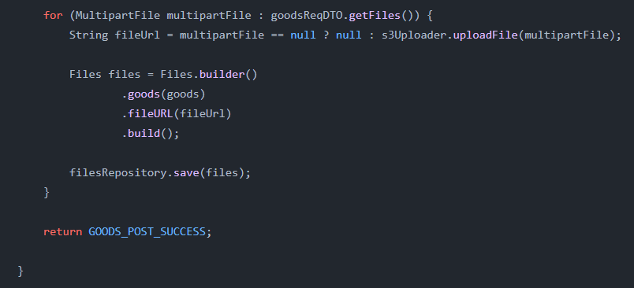
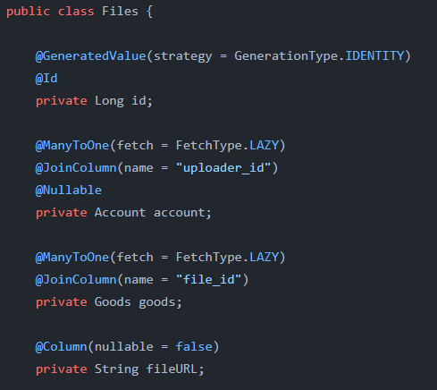
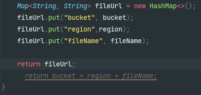
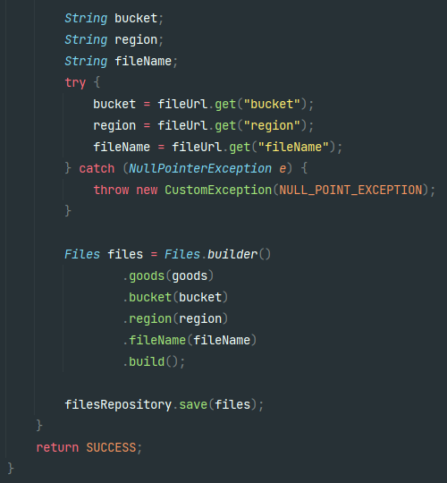
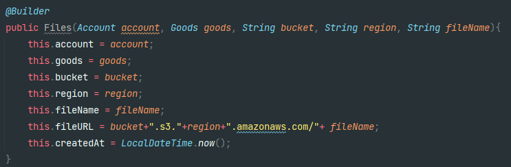
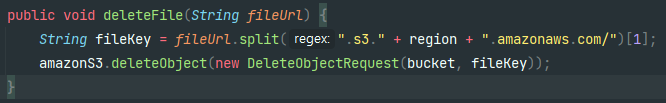
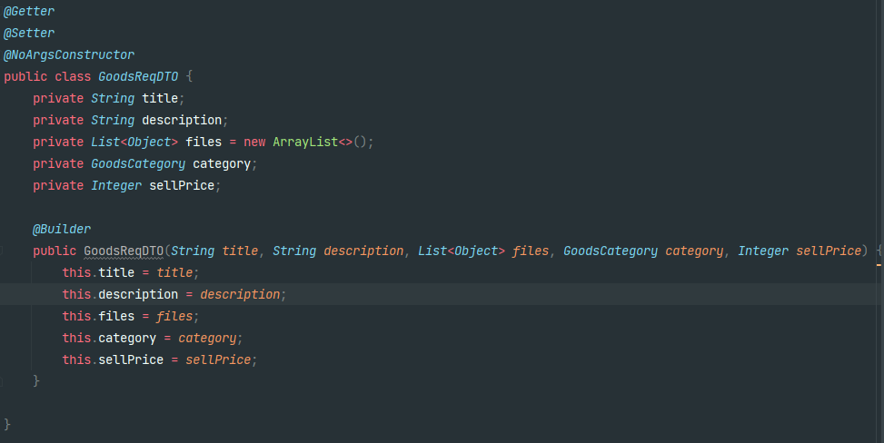

# 트러블 슈팅

## CICD 작업 이후 프로젝트 명 변경으로 인한 서버 에러 발생

> 2022년 06월 27일

```bash
REPOSITORY=/home/ubuntu/
cd $REPOSITORY

APP_NAME=marketclip
JAR_NAME=$(ls $REPOSITORY/build/libs/ | grep 'SNAPSHOT.jar' | tail -n 1)
JAR_PATH=$REPOSITORY/build/libs/$JAR_NAME

CURRENT_PID=$(pgrep -f $APP_NAME)

echo ">현재 구동 중인 애플리케이션 pid: $CURRENT_PID"

if [ -z $CURRENT_PID ]
then
  echo ">현재 구동 중인 애플리케이션이 없으므로 종료하지 않습니다."
else
  echo "> kill -9 $CURRENT_PID"
  sudo kill -15 $CURRENT_PID
  sleep 5
fi
```

- 프로젝트 명 변경으로 인해 kill 명령어가 실행되지 않아서 일어나는 오류

해결 - 단순히 EC2의 (전 프로젝트명의)프로젝트를 강제적으로 kill하고 재실행 해줬다


## 이메일 인증번호를 생성하는 방법 ( Random String )

> 2022년 06월 29일

1. random 클래스를 사용하여 97~122 사이의 난수를 생성하고 char로 변환한 다음 (a~z) StringBuilder에 하나씩 더해준다 → 힙 메모리(Heap)에 많은 임시 가비지(Garbage)가 생성돼서 사용을 지양했다. (물론 GC(garbage collection)가 처리해주긴 하지만)

```java
// 1. Random을 이용해 
int leftLimit = 97; // letter 'a'
int rightLimit = 122; // letter 'z'
int targetStringLength = 10;
Random random = new Random();
StringBuilder buffer = new StringBuild(targetStringLength);
for (int i = 0; i < targetStringLength; i++) {
    int randomLimitedInt = leftLimit + (int)
            (random.nextFloat() * (rightLimit - leftLimit + 1));
    buffer.append((char) randomLimitedInt);
}
String generatedString = buffer.toString()
System.out.println(generatedString);
```

2. UUID를 생성해 subString으로 잘라쓰는 방법

```java
import java.util.UUID;

	String uuid = UUID.randomUUID().toString();
	String randomString = uuid.substring(0,8);
```

3. ✅ **apache.commons.lang 을 사용하여 랜덤 스트링 생성** ✅ **→** 쉽고 편하게 만들 수 있다 + 길이, 숫자와 문자여부 등 변경이 자유롭다

> StringBuilder를 사용해서 garbage가 생기는 라이브러리인지 알아볼 것

```java
import org.apache.commons.lang3.RandomStringUtils;

	String randomString = RandomStringUtils.random(8, true, true);
```


## 예외처리

> 2022년 07월 02일
>
> GlobalExceptionHandler를 이용하여 예외 처리를 실행하는데,
> 편의를 위하여 성공한 응답을 GlobalExceptionHandler로 처리하면 어떻게 될까?

> 400 / BAD_REQUEST 예시
>
> 


> 200 / OK 예시
>
> 


> ### 업데이트를 실행할 때, 성공한 응답을 GlobalExceptionHandler로 처리하게 되면 @Transactional이 실행이 되지 않는 문제 발생

### 해결

성공한 응답은 ResponseEntity를 리턴하게 해결

> - Exception을 위해 만든 클래스 정리
> - ResponseCode => enum으로 HttpStatus와 message를 정리한 클래스
> - CustomException => RuntimeException을 상속받고 ResponseCode를 파라미터로 받는 클래스
> - HttpResponse => ResponseCode를 파라미터로 받아 ResponseEntity<HttpResponse>로 만들어주는 메서드가 있는 클래스
> - GlobalExceptionHandler => @RestControllerAdvice를 사용하여 Controller로 throw되는 모든 CustomException과 이외의 Exception을 ResponseEntity<HttpResponse>로 프론트앤드에 전달하는 역할을 한다
>   @ExceptionHandler를 사용한 메서드로 Exception을 종류별로 처리할 수 있다
>
> > 성공 응답시 data를 주기위하여 Object 타입으로 data를 받는 DataResponseCode 클래스를 만들어 HttpResponse의 메서드가 해당 클래스도 파라미터로 받게 설정


- Response 코드만 이용하여 RuntimeException을 상속받지 않는 리턴 타입을`ResponseEntity<HttpResponse>`로 설정하여 해결


## 깃헙액션 CI/CD 에러 이유

> 2022년 07월 02일

>  [application.properties](http://application.properties) 생성 불가
>
> 

이유 - .gitignore로 applications.properties를 제외하고 프로젝트를 올릴 때

./src/main/resources 의 경로에 있는 파일이 applications.properties하나이기 때문에

디렉토리들도 제외하고 올려진다 (파일이 없는 빈 디렉토리들은 무시됨)

따라서 main.yml에 작성한 cd ./src/main/resources 에서 에러가 생긴다

main.yml

```html
- name: application.properties 생성
        # branch가 main일 때
        if: true
        run: |
          # spring의 resources 경로로 이동
          cd ./src/main/resources
          touch ./application.properties
          # GitHub-Actions에서 설정한 값을 application.properties 파일에 쓰기
          echo "${{ secrets.APPLICATION_PROPERTIES }}" > ./application.properties
```

### 해결

> resources 디렉토리에 일단 applications.dev.properties를 추가하여 해결했지만, mvp를 구현하고 난 이후 applications.properties를 ignore하지 않고, 중요한 정보는 다른 곳에서 import받아 사용하는 방식으로 변경할 예정


## 성공 응답이 다양할 필요가 있을까

> 2022년 07월 06일

> 하나의 api요청에서 Exception은 몇가지, 또는 몇십가지까지도 생길 수 있다
> 그렇기에, 빠른 Exception의 처리를 위해서 실패 응답에는
> 가능한 모든 Exception의 이유가 기술되어 있어야 한다고 생각한다.
>
> 하지만 api의 성공 응답은 거의 하나(1:1 관계)이기 때문에,
> 굳이 다양한 성공 응답을 할 필요가 없다 (시간 자원이 낭비됨)


> 특별히 이메일 인증의 성공 응답은, 하나의 api에서 두 개의 성공 응답을 주기 때문에 살아남았다
> RIP. SuccessResponses  ㅜㅜ


## S3 스토리지와 Files 테이블

> 2022년 07월 07일

> 게시판 CRUD 기능들을 구현한 후 게시판 생성은 잘 작동하는데,
> 게시판 삭제 기능에서 게시판에 포함된 파일들이 S3 스토리지에서 지워지지 않는것을 확인했다
>
> 삭제하는 메서드의 파라미터로 url값을 사용하고 있었는데,
> S3 파일의 삭제에 사용하는 DeleteObjectRequest 클래스의 파라미터를 확인 해 보니,
> bucketName과 key라는 변수명의 파라미터를 받았다. 변수명이 fileUrl이 아닌 key인 것에 힌트를 얻어
> S3 파일의 생성에 쓰였던 PutObjectRequest에서의 key가 그대로 쓰인다는 것을 알았다
> (UUID와 OriginalFilename을 합친) fileName을 key로 사용하였다
>
> 애석하게도 Files 테이블에선 url만을 값으로 받고 있었고, S3Service와 GoodsService에서도 
> url(bucketName + ".s3." + region +".amazonaws.com/" + fileName)만을 사용하였기에, url내에 있는 fileName과 bucketName, region을 따로 다룰 수 있게 DB의 테이블을 수정하기로 하였다
>
> 
>
> <center>S3Service에서의 return값 `url` => bucketName+".s3.ap-northeast-2.amazonaws.com"+fileName
>
> 
>
> <center>GoodsService에서 goods객체와 fileUrl만을 Files테이블에 저장했다
>
> 
>
> <center>Files 테이블의 컬럼들
>
> 


### 해결

> 해당 url을 분석하여 fileName만을 뽑아내도 되지만, 
> S3Service에서 값을 나눠서 Map 타입으로 주는 방식을 택했다
>
> 
> 
> <center>변경한 S3Service => Map 타입으로 각 값들을 전달한다
> 
> 
>
> <center>GoodsService에서 bucket, region, fileName을 각각 입력받는다
> 
>
> 
><center>bucket, region, fileName을 각각 입력받아도 fileUrl은 자동으로 구성된다
> 
>**이로써 바꾼 코드에선 S3에서 파일을 삭제하거나 수정할 때**
> **Files.getFileName()으로 key값을 가져올 수 있다**


### ※수정

> 2022년 07월 09일
>
> 추가적인 구현을 하다보니 fileName보다 url을 사용 할 일이 많다는 것을 알게 되었다
> (fileName은 delete할 때 밖에 사용할 일이 없었다)
> 특히 게시했던 사진/동영상 파일들을 게시글을 수정할 때, 
> 프론트엔드에게 url을 받을 일이 많아져서 다시 한 번 로직을 수정하였다
>
> 
>
> <center>삭제 로직에서만 fileName(key)이 필요하므로 삭제시 url에서 fileName을 추출한다
>
> 파일 테이블은 원래대로 fileUrl값만을 가지게 되었고, 서비스들도 url만을 이용하게 롤백하였다


## 게시판 수정하기

> 2022년 07월 08일 ~ 2022년 07월 11일

> **구현 목표** => (사진+동영상)이미지 파일 update - 순서 있음 / S3 스토리지 부하 최소화
>
> 게시판 CRUD에서 **기존의 게시판 작성의 로직과 게시판 수정에서 목표로 한 것**
> - 기존의 게시판 작성은 모든 이미지를 MultipartFile로 전송한다
> - 게시판 수정은 새로운 이미지는 Multipartfile로, 이전의 이미지는 Url로 전송 할 계획
> - 작성과 수정 모두 List로 보내 순서를 알 수 있게 한다
>
> 
>
> MultipartFile과 url을 모두 받기 위해 `List<Object>`로 데이터들을 수신하는 DTO를 작성하였다
>
> 여기서 생기는 문제는 아직도 명확한 답을 찾지 못하였는데, 프론트에서 api를 호출할 때 url의 리스트 `List<String>` 또는 이미지 파일의 리스트 `List<MultipartFile>`로 보낼때는 `List<Object>`가 잘 작동을 하여 정상적인 로직이 실행된다 (즉, url만 보낼때나 MultipartFile만 보낼 땐 작동이 잘 되었다)
> `하지만, 프론트에서 api를 호출할 때 url과 MultipartFile을 동시에 보내게 된다면 url의 값들을 받지 못하고, MultipartFile의 값만을 리스트로 받는 현상이 있었다`
> (@Modelattribute 로 FE의 데이터를 가져올 때 casting 문제가 생기는 것으로 예상됨)
>
> 이를 해결하기 위하여 `HashMap<String, Object>`, DTO 클래스 정의, 수신부분 변경 (@RequestParm 등)을 시도 해 봤지만 결과는 같았다

### 해결

> 해결법을 찾다가 대부분의 기업에서 사용한다는 방법을 배웠는데,
> 그것은 MultipartFile을 가능한 다루지 않는 (한번만 다루는) 것 이었다.
> (정확히 말하자면, **S3파일 업로드 기능을 글쓰기와 분리**하는 것)


#### 로직

> 1. 이미지를 Url로 변환시켜주는 (S3에 저장하는) api를 따로 만듦
> 2. FE에서 이미지를 업로드 하는 동시에 위의 api를 호출
> 3. MultipartFile을 받아 String 타입의 url로 return
> 4. 해당 url을 가지고 게시글 작성과 수정 api를 호출하는 로직 호출
> 5. BE서버는 `List<String>`의 request를 처리
>
> BE는 `List<String>`으로 이미지를 request 받을 수 있어 문제의 원인을 제거할 수 있었다
>
> 하지만, 이 해결법은 S3 스토리지에 dummy data가 생길 수 있기 때문에,
> 주기적으로 dummy data를 삭제 해 주는 scheduler의 관리가 필요했다.


## Scheduler의 O(N^2 문제)

> 2022년 07월 13일 ~ 2022년 07월 14일

> 위의 방법처럼 이미지를 S3에 저장하고 테이블에는 기록하지 않는다면, Scheduler를 사용할 때
> 사용된 모든 이미지 url과 (테이블에 존재하는) S3 스토리지 에 존재하는 모든 이미지 url을 비교해서 테이블에 존재하지 않지만 S3에는 존재하는 url을 삭제하는 로직이 필요하다

### 문제

> 1. 이 방법은 두 테이블(DB, S3스토리지에서 가져온 테이블)의 데이터를 비교해야 하기때문에 기본적으로 O(N^2)의 시간복잡도를 갖는다 (물론 sort를 사용해서 O(Nlog N)으로 만들 수 도 있을 것 같다). 아무리 사용자가 적은 시간대에 실행하는 로직이라 하더라도 서버에 과한 부담이 될 것이다
> 2. S3 스토리지 서버의 데이터 관리에 어려움이 있다. 만약 스케줄러가 작동되기 바로 전에 사용자가 글을 올리거나 수정하려고 이미지를 S3서버에 저장했다면, 사용자는 "게시글의 이미지를 찾을 수 없습니다."라는 예외 메세지를 받게 될 것이다. 이를 해결하기 위해 스케줄러에서 S3스토리지에 저장된 시간을 조회해 생성된 지 한 시간이 지났는데도 게시판에 등록되지 않는 이미지를 삭제하는 조건을 추가하려 했지만, S3 파일의 생성시간을 가져오는것이 쉽지 않았다

### 해결

**물리적 삭제가 아닌 논리적 삭제(Soft Delete)를 이용**

> 
>
> 1. S3 스토리지에 이미지를 저장할 때, DB에 goods_id값을 null로 저장한다
>    (아직 글이 등록된 상태가 아니므로 당연히 null이기도 하다)
> 2. 글이 **등록될 때 요청이 온 이미지들의 컬럼만을 goods_id를 해당 글의 id로 등록**한다
> 3. S3 스토리지에 저장은 됐지만, 사용되지 않는(게시글 등록 시 요청이 오지 않은) **dummy data들은 goods_id가 null**이 유지된다
> 4. Scheduler 작동 시 **goods_id가 null이고, created_at이 한시간이 지난 데이터를 삭제**하며
>    **해당 데이터의 url로 S3 스토리지의 dummy data를 삭제**한다
>
> (sequence 컬럼이 있는 이유 : 사용자가 이미지 등록 이후, 게시글 등록 전에 이미지의 순서를 변경할 수 있는데, 이것을 위해 row의 순서를 바꾸긴 힘듦)

#### 결과

> DB를 통해 이미지를 관리하면 Scheduler는 O(N)의 시간복잡도를 갖고, created_at 과 같은 컬럼을 통해 삭제하는 조건을 다양하게 조절할 수 있다
>
> 추가적인 소득 - 이미지가 바로 DB에 저장되므로 index로 값을 찾을 수 있다 (이를 위해 FE에 map의 형식으로 id와 url을 보내주었다). 그래서 글을 등록할 때의 request를 index로(List<Long>) 주는 방식으로 수정하였다. url로 db에서 값을 찾는 것 보다 index로 찾는 것이 서버에 부담이 적고, 빠르기 때문에 채택하였다


## 동적쿼리를 위한 다양한 시도...

결국 답은 queryDsl


## N+1 문제를 "Hibernate Batch Fetch Size"로 해결하기

service에서 주입하려하면 안됨 DTO에서 객체를 매칭해 줄 때 객체에서 타고타고 들어가서 주입하는게 편함

repository로 처음 가져온 객체에서 모두 호출


## S3 는 roll back이 되지 않는것 꼭 확인


## Redis 를 이용한 caching

[Spring Boot DevTools 클래스로더 이슈 (brunch.co.kr)](https://brunch.co.kr/@springboot/212)

(데이터 이중화)

직렬화 안되는 친구들 2

1. HttpResponse
2. LocaleDateTime


레디스 커먼 컴포넌트 이용

select와 update/delete의 비율이 어느정도가 됐을 때

GA와 같은 데이터 분석 툴을 통한 의사결정이 있었으면 좋았을듯


### 캐싱 + 페이징

value와 key로 페이징을 포함한 key를 한꺼번에 지우는(CacheEvict) 로직을 해결 할 수 없다

해결 - 첫번째 페이지만 캐싱함