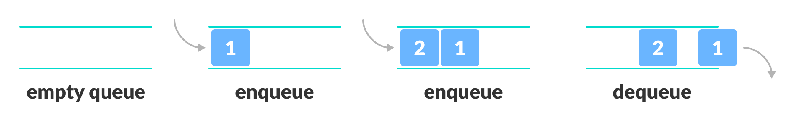

> <파이썬 알고리즘 인터뷰> [책만]
>
> [[스파르타코딩클럽\] 파이썬 문법 뽀개기 (notion.so)](https://www.notion.so/dfb89a042c6f4b29b64ea4da03a37ea6#9e45965f552e4768b295f003bc5a3436)

# 1주차


## 파이썬 문법 공부


## Call by value

> **변수를 복사한 값을 전달하는 방식**
>
> 함수의 인자(argument)를 받을 때, 변수에 **담긴 값 자체**를 stack에다가 **복사하여 넘겨준다**

예를 들어 변수 `a`가 있고 함수 `def1`이 있을 때,
**`def1(a)`에서 전달받은 `a`는 `a`자체(주소 값)가 아니라 a의 복사 값(레플리카)이다**

따라서 함수 내에서 해당 인자를 조작하여 바꾸었다고 해도 **원본 변수 a는 변하지 않는다**

- 원본을 건드리지 않아 안전하지만, 함수의 사용으로 해당 전역 변수를 바꾸고 싶을 때는,
  리턴 값을 다시 전역 변수로 집어넣어야 하는 번거로움과 시간 사용의 단점이 있다


## Call by reference

> **인자로 받은 변수의 주소 값을 전달하는 것**
>
> 함수의 인자를 받을 때, 변수가 가리키는 주소 값을 전달한다

예를 들어 변수 `a`가 있고 함수 `def2`가 있을 때,
**`def2(a)`에서 전달받은 `a`는 원본 전역 변수 a의 주소 값이다**

따라서 함수 내에서 해당 인자를 조작하면 **원본 변수의 주소 값을 타고 들어가 해당 값 자체를 바꿔버린다**

- 이를 통해 전역 변수의 즉각적 변경이 가능하지만, 부주의하면 변수를 잘못 조작해 프로그램에 문제를 야기할 수 있다


## Call by assignment (Call by object-reference) -- 파이썬

https://aalphaca.tistory.com/4

객체 복사

- 얕은 복사, 깊은 복사 [객체 복사 - 위키백과, 우리 모두의 백과사전 (wikipedia.org)](https://ko.wikipedia.org/wiki/객체_복사)

- [python] 파이썬 얕은복사, 깊은복사 (copy, deepcopy, [:], =) 총 정리
  https://blockdmask.tistory.com/576

> 파이썬의 경우는 위의 경우처럼 주소 값 참조나, 값 복사와 조금 다르다
>
> 이유는 **파이썬은 모든 것을 "객체"로 판단한다**는 데에 있다
>
> **그렇기에 파이썬은 얕은 복사를 한다**
>
> 불변객체는 변경할 수 없지만 가변객체는 변경할 수 있다


#### 포인터와 데이터

> > **포인터 - 이동**
>
> 포인터는 메모리 주소값을 가리킨다 (**여러 포인트가 한 메모리 주소를 가리킬 수 있다**)
> **객체 자체를 호출**하는 것은, 포인터를 조작하는 것이고 데이터의 값에 영향을 주지 않는다
> 하지만 **객체 내의 요소나 속성을 직접 조작(생성,수정,삭제)**하게 되면
> **데이터의 값 자체가 수정된다**
> 당연하게도 데이터가 수정되면 데이터를 가리키는 포인터들의 값 또한 바뀌게된다


python에서 변수를 선언할 때,

a="alpaca"라는 선언문이 있다고 생각해보자.

 

선언문이 실행되면 "alpaca"라는 문자열 객체가 생기고, 그 객체에 대하여 a라는 이름표를 붙이게 된다.
즉, python에서 변수는 위에서처럼 특정 메모리 공간을 할당받은 컨테이너 개념이 아니라, **어떤 객체에 붙여진 이름표일 뿐**이다.

python에서는 global인지 local인지 영역에 따라 변수들의 정보를 저장하는 namespace가 따로 있다.
즉, **전역 변수를 함수에서 인자로 받아오더라도 함수 내에서는 지역변수(이름표)에 불과**하다.
함수 내에서 이름표를 떼서 다른 객체에 붙인다고 하더라도,
그 이름표는 함수 내에서만 사용하는 이름표일 뿐이다.
결국 함수 호출이 끝나면 전역 변수(이름표)가 여전히 그 객체에 붙어있다.

예를 들어 list 1 = [1,2,3,4] 일 때, 함수 내에서 list 1을 [5,6,7,8]이라는 새로운 객체랑 binding 한다고 해도
함수 호출이 끝나면 list 1은 그대로 [1,2,3,4]이다.

주의할 점은
이름표(변수)만 떼고 붙이는 것이 아니라, **이름표가 붙여진 물건(객체)의 구성품을 직접 조작하는 경우**이다.

예를 들어 위의 예시와 같이 `list 1 = [1,2,3,4]` 일 때,
함수 내에서 list 1이라는 이름표가 붙여진 객체 [1,2,3,4]에 대하여

`list 1 [0] = 5`

이와 같이 **객체 내의 요소(element)를 조작**할 수 있다.
이 경우에 함수의 호출이 끝나서 지역 이름표가 전역 이름표로 바뀐다고 하더라도
객체가 변한 상태이므로 **list 1은 [5,2,3,4]가 된다**.

이때, 객체 자체를 바꾸려면 당연히 객체가 mutable, 즉 가변적인 포맷이어야 한다.

따라서 Call by object-reference 방식은
**immutable 한 포맷의 객체(tuple 등)는 변경할 수 없지만,**
**mutable한 포맷의 객체(list, dictionary, 직접 만든 클래스 등)는 변경할 수 있다**는 특성을 갖는다.


### 인덴트 [Indent]

> 들여쓰기 - 공백 4칸을 기준으로 하고 행간의 구별 뿐 아니라 코드를 구분해준다


### 네이밍 컨벤션

> `_`를 사용하는 스네이크 케이스를 따른다


### 타입 힌트

> 동적 타이핑 언어임에도 타입을 선언할 수 있는 방식

```python
	a: str = "1"
    a: int = 1
```


# *리스트 컴프리헨션

> [2.6 리스트 컴프리헨션 - 실용 파이썬 프로그래밍: 프로그래밍 유경험자를 위한 강좌 (wikidocs.net)](https://wikidocs.net/84393)
>
> 파이썬의 매우 강력한 기능 중 하나이고, 파이썬을 대표하는 특징 중 하나이다
>
> map, filter와 같은 함수형 기능을 지원하며, 람다 표현식 [ Lambda Expression ] 도 지원한다
>
> 리스트 컴프리헨션은 파이썬에서 데이터를 변환, 필터링, 수집하는 데 일반적으로 사용된다.
> 그 구문이 복잡하므로, 가능하면 리스트 컴프리헨션을 단순하게 유지하라. 여러 단계의 코드로 나눠 구현해도 괜찮다.

- 람다 표현식 (익명 함수)

> [7.2 익명 함수와 람다 - 실용 파이썬 프로그래밍: 프로그래밍 유경험자를 위한 강좌 (wikidocs.net)](https://wikidocs.net/84427)
>
> 주로 콜백 함수를 쓰는 대신 사용한다

> - 람다는 매우 제한적이다.
> - 단일 표현식만 허용한다.
> - `if`, `while` 같은 문장은 허용하지 않는다.
> - `sort()`의 예와 같이 함수와 함께 사용하는 것이 일반적인 용도다.

```python
## 람다 함수 사용
portfolio.sort(key=lambda s: s['name'])

## 원래 표현식
def stock_name(s):
    return s['name']

portfolio.sort(key=stock_name)
```


- 람다 표현식 안에서는 새 변수를 만들 수 없어서, 반환값 부분은 변수 없이 식 한 줄로 표현할 수 있어야 한다

```python
## 리스트 컴프리헨션 예시

a = [1,2,3,4,5,6,7,8,9]
b = [2,3,4]

c = [i*2 for i in a]
>>> [2, 4, 6, 8, 10, 12, 14, 16, 18]

## b에 있는 값들 중 a에 포함되는 것
d = [i in b for i in a]
>>> [False, True, True, True, False, False, False, False, False]

## enumerate를 사용한 index추가
e = [i for i in enumerate(a)]
>>> [(0, 1), (1, 2), (2, 3), (3, 4), (4, 5), (5, 6), (6, 7), (7, 8), (8, 9)]


f = [(i,v) for (i,v) in enumerate(a)]
>>> [(0, 1), (1, 2), (2, 3), (3, 4), (4, 5), (5, 6), (6, 7), (7, 8), (8, 9)]

g = [(i+1,v) for (i,v) in enumerate(a)]
>>> [(1, 1), (2, 2), (3, 3), (4, 4), (5, 5), (6, 6), (7, 7), (8, 8), (9, 9)]


## 기존의 함수
def plus_ten(x):
return x + 10
plus_ten(1)
11

## 람다 표현식
plus_ten = lambda x: x + 10
plus_ten(1)
11


```

- 새 리스트 생성하기

  - 일반적인 구문: `result = [ <표현식> for <변수명> in <시퀀스> ]`

- 필터링

  - 일반적인 구문: `result = [ <표현식> for <변수명> in <시퀀스> if <조건>]`

  - ```python
    ## 풀어쓰면 이것과 같다
    result = []
    for 변수명 in 시퀀스:
        if 조건:
            result.append(표현식)
    ```

  - ```python
    a = [1, -5, 4, 2, -2, 10]
    b = [2*x for x in a if x > 0 ]
    >>> b = [2, 8, 4, 20]
    ```


### 제너레이터

> 루프의 반복 동작을 제어할 수 있는 루틴 형태를 말한다
>
> yield 구문을 사용해서 루프의 종료없이 값을 양보(리턴)받을 수 있다


### _ (언더바)의 쓰임

- 인터프리터에서 마지막 값을 저장할 때
- **값을 무시하고 싶을 때 (흔히 "I don't care"라고 부른다)**
- 변수나 함수명에 특별한 의미 또는 기능을 부여하고자 할 때
- 국제화/지역화 함수로써 사용할 때
- 숫자 리터럴값의 자릿수 구분을 위한 구분자로써 사용할 때


### range

> 제너레이터 방식을 활용하는 대표적인 함수이고, 주로 for 문에서 쓰인다
>
> 미리 생성한 리스트와 달리 range 함수를 사용하면 메모리를 아낄 수 있다

```python
a = [n for n in range(1000000)]
b = range(1000000)
sys.getsizeof(a)
>>> 8697464
sys.getsizeof(b)
>>> 48
```


### print

> 실무에서는 print를 활용한 디버깅을 추천하지 않지만, 코딩테스트에서는 주로 유일한 디버깅 방법이기 때문에 잘 쓸 줄 알아야한다

```python
print('a1','b1')
>>> a1 b1		## 콤마로 구분하면 한칸 공백이 디폴트이다

print('a1','b1',sep=',')
>>> a1,b1

## 프린트 함수는 항상 줄바꿈을 한다.
## 아래는 긴 루프의 값을 반복적으로 처리할때 한줄로 나타내는 방법
print('a1', end='')
print('b1')
>>> a1 b1

## 리스트를 출력할 때는 join()으로 묶어서 처리한다
a = ['a1', 'b1']
print(''.join(a))
>>> a1 b1

## 프린트 시 {}로 미리 위치를 지정해 놓고 .format()으로 지정된 위치에 순서대로 출력한다
a, b = 'a1', 'b1'
print("{},{}".format(a,b))
>>> a1 b1
```


### pass

> 널 연산으로 아무것도 하지 않는 기능이지만, 구현하지 못 한 함수의 indent 오류를 지나쳐준다


### locals

> locals()는 로컬 심볼 테이블 딕셔너리를 가져오는 메소드이다
> 로컬에 선언된 모든 변수를 조회할 수 있는 강력한 명령으로, 디버깅에 도움이 많이 된다

```python
import pprint
pprint.pprint(locals())
## pprint로 출력하게 되면 보기 좋게 줄바꿈 처리를 해주기 때문에 가독성이 높다
>>> {변수 : 값,
    변수 : 값}
```


### 구글 파이썬 스타일 가이드

> 함수의 기본값으로 가변 객체 (Mutable Object)를 사용하지 않아야 한다. - EX) list, dict, set
> 함수가 객체를 수정하면 기본값이 변경되기 때문이다.
>
> 대신에 None과 같은 불변 객체 (Immutable Object)를 할당 해야한다.

```python
import this ## 파이썬 철학이 나온다
```


## 1회차 - 알고리즘 개요

> [1회차 알고리즘 개요 (notion.site)](https://teamsparta.notion.site/1-eed263c144bf4d9fb9866cc668c1b977)

- 문제

  <aside> ❓ Q. 다음과 같이 숫자로 이루어진 배열이 있을 때, 이 배열 내에서 가장 큰 수를 반환하시오.</aside>

  ```python
  [3, 5, 6, 1, 2, 4]
  ```

- 생각해보기

  - 1억 개라면?

    - 시간복잡도를 낮추는 알고리즘을 이용
      - **반복문 중첩이 적을수록 좋다!!**

  - 메모장이 작다면?

    - 공간복잡도를 낮추는 알고리즘을 이용

      - 메모리 공간을 적게 쓸수록 좋다

      > (공간복잡도는 C언어나 임베디드쪽이 아니면 크게 신경 안써도 됨)


- 최빈값 찾기

  - Q. 문제 설명

    <aside> ❓ Q.  다음과 같은 문자열을 입력받았을 때, 어떤 알파벳이 가장 많이 포함되어 있는지 반환하시오</aside>

    ```python
    "hello my name is sparta"
    ```

  - Answer

```python
import string
## pprint - prety print 더 예쁘게 출력됨
from pprint import pprint

text = 'hello, this is sparta'

counter = {}
# 21 번 연산
for char in text:
    if not char.isalpha():
        continue
    if char in counter:
        counter[char] += 1
    else:
        counter[char] = 1
pprint(counter)
```

### 점근 표기법

> 알고리즘의 성능을 수학적으로 표기하는 방법입니다. 알고리즘의 “효율성”을 평가하는 방법입니다.

```HTML
점근 표기법의 종류에는 
빅오(Big-O)표기법, 빅오메가(Big-Ω) 표기법이 있습니다.

빅오 표기법은 최악의 성능이 나올 때 어느 정도의 연산량이 걸릴것인지,
빅오메가 표기법은 최선의 성능이 나올 때 어느 정도의 연산량이 걸릴것인지에 대해 표기합니다.

예를 들어 
빅오 표기법으로 표시하면 $O(N)$,
빅 오메가 표기법으로 표시하면 $Ω(1)$ 의 시간복잡도를 가진 알고리즘이다
```

> (빅 오메가 거의 안씀)


### 빅오(O)

> 빅오 표기법은 주어진(최선/최악/평균) 경우의 수행 시간의 **상한**을 나타낸다
>
> 특히 가장 늦게 실행될 때를 **빅오(O)**라고 한다 **(최악의 경우의 상한)**


### 분할 상환 분석

> 시간 또는 메모리를 분석하는 알고리즘의 복잡도를 계산할 때, 알고리즘 전체를 보지 않고 최악의 경우만을 살펴보는 것은 지나치게 비관적이라는 이유로 생겨났다
>
> 최악의 경우를 여러 번에 걸쳐 골고루 나눠주는 형태로 알고리즘의 시간 복잡도를 계산할 수 있다
> 유용함 덕분에 최근에는 시간 복잡도를 계산할 때 매우 보편적으로 널리 사용된다


### 병렬화

> 일부 알고리즘들은 병렬화로 실행 속도를 높일 수 있다
>
> GPU가 병렬 연산을 위한 대표적인 장치이다
> GPU의 각각의 코어는 CPU의 코어보다 느리지만, 개수가 많기 때문에 GPU를 사용하여 병렬연산을 할 수 있는 알고리즘은 속도가 빠르고 우수하다고 평가받는다


#### 문제) 알파벳 찾기

> [10809번: 알파벳 찾기 (acmicpc.net)](https://www.acmicpc.net/problem/10809)

- `ord()` - 문자를 아스키 코드로 바꿔줌
  - ord(a) => 97
- `chr()` - 아스키 코드를 문자로 바꿔줌
  - chr(97) => a
- `string.ascii_lowercase` - a~z까지 26개의 알파벳 반환
  - `len(string.ascii_lowercase)`으로 26을 구할 수 있다 (불필요하다 생각해서 쓰지않았다)

```python
#내 풀이
def find(word):
    result = [-1]*26
    for i in range(len(word)):
        char = word[i]
        num = ord(char)
        if result[num-97]==-1:
            result[num-97] = i
    #print(result)
    #int를 char로 바꾸고 공백(' ')을 추가해서 프린트
    print(' '.join([str(num) for num in result]))

find('baekjoon')
```

> 접근
>
> 1. 어떤 알파벳이 단어에 포함되지 않는다면 -1을 출력하므로 default값이 [-1]*26 배열
> 2. 주어진 word의 char만 확인하고 그것을 배열에 적용시킨다
> 3. 알파벳은 `ascii code`에서 하나씩 커진다
> 4. 배열의 시작인 a의 `ascii code`가 97이므로 배열의 알파벳과 ord(char)-97 인덱스가 매칭된다
> 5. 한번만 넣어야 하므로 if문으로 해당 위치의 값이 -1인지 확인한다
> 6. 해당 인덱스에 word의 인덱스 i값을 넣는다


### 동적배열

> 크기가 고정되지 않은 배열
>
> 파이썬 리스트의 가장 좋음 점은 매우 다양한 기능을 제공한다는 점이다
> 리스트를 사용하면 사실상 스택을 사용할지, 큐를 사용할지를 고민하지 않아도 되며,
> 스택과 큐에서 사용 가능한 모든 연산을 함께 제공한다

### 시간복잡도

빅오가 O(1)인 기능

- `len(리스트)`
  - 전체 요소의 개수 리턴 
- `a[i]`
  - 인덱스 i의 요소 가져오기 
- `.append()`
  - 리스트 마지막에 요소 추가 
- `.pop()`
  - 리스트 마지막 요소 추출 

빅오가 O(n)인 기능

- `ele in 리스트`
  - ele 요소 존재여부 확인
- `.count(ele)`
  - ele 요소의 개수를 리턴
- `.index(ele)`
  -  ele 요소의 인덱스를 리턴한다
- `.pop(0)`
  - 첫 번째 요소를 추출 
- `del 리스트[i]`
  - i 인덱스의 값 삭제
- `min(리스트)`,`max(리스트)`
  - 최솟값/최댓값을 계산하기 위해서는 전체를 선형 탐색해야 한다
- `리스트.reverse()`
  - 뒤집는다

빅오가 O(nlogn)인 기능

- `.sort`
  - 정렬한다


> https://wayhome25.github.io/python/2017/06/14/time-complexity/

### List

| Operation     | Example         | Big-O      | Notes                     |
| :------------ | :-------------- | :--------- | :------------------------ |
| Index         | l[i]            | O(1)       |                           |
| Store         | l[i] = 0        | O(1)       |                           |
| Length        | len(l)          | O(1)       |                           |
| Append        | l.append(5)     | O(1)       |                           |
| Pop           | l.pop()         | O(1)       | l.pop(-1) 과 동일         |
| Clear         | l.clear()       | O(1)       | l = [] 과 유사            |
| Slice         | l[a:b]          | O(b-a)     | l[:] : O(len(l)-0) = O(N) |
| Extend        | l.extend(…)     | O(len(…))  | 확장 길이에 따라          |
| Construction  | list(…)         | O(len(…))  | 요소 길이에 따라          |
| check ==, !=  | l1 == l2        | O(N)       | 비교                      |
| Insert        | ㅣ.insert(i, v) | O(N)       | i 위치에 v를 추가         |
| Delete        | del l[i]        | O(N)       |                           |
| Remove        | l.remove(…)     | O(N)       |                           |
| Containment   | x in/not in l   | O(N)       | 검색                      |
| Copy          | l.copy()        | O(N)       | l[:] 과 동일 - O(N)       |
| Pop           | l.pop(i)        | O(N)       | l.pop(0):O(N)             |
| Extreme value | min(l)/max(l)   | O(N)       | 검색                      |
| Reverse       | l.reverse()     | O(N)       | 그대로 반대로             |
| Iteration     | for v in l:     | O(N)       |                           |
| Sort          | l.sort()        | O(N Log N) |                           |
| Multiply      | k*l             | O(k N)     | [1,2,3] * 3 » O(N**2)     |


### Dict

| Operation      | Example     | Big-O     | Notes                   |
| :------------- | :---------- | :-------- | :---------------------- |
| Index          | d[k]        | O(1)      |                         |
| Store          | d[k] = v    | O(1)      |                         |
| Length         | len(d)      | O(1)      |                         |
| Delete         | del d[k]    | O(1)      |                         |
| get/setdefault | d.method    | O(1)      |                         |
| Pop            | d.pop(k)    | O(1)      |                         |
| Pop item       | d.popitem() | O(1)      |                         |
| Clear          | d.clear()   | O(1)      | s = {} or = dict() 유사 |
| View           | d.keys()    | O(1)      | d.values() 동일         |
| Construction   | dict(…)     | O(len(…)) |                         |
| Iteration      | for k in d: | O(N)      |                         |


#### defaultdict

> **원래 dict**에서 **선언하지 않은 키에 값을 넣으려고 하면 에러**가 뜨지만
>
> defaultdict을 사용하면 키를 따로 선언해 줄 필요없이 삽입해 줄 수 있다

```python
defdict = collections.defaultdict()
```


#### Counter

> Counter 객체는 아이템에 대한 개수를 계산해 딕셔너리로 리턴한다

```python
a = [1,2,3,4,5,5,5,6,6]
b = collections.Counter(a)
print(b)
>>> ['5':3, '6':2, '1':1, '2':1, '3':1, '4':1]
```


#### OrderedDict

> 해시 테이블을 이용한 자료형은 거의 입력 순서가 유지되지 않는데,
> 입력 순서를 유지하려면 OrderedDict를 사용해야 한다


### 내장함수

- 리스트와 문자열 관련


#### 슬라이싱 **`[start:end:step]`** - 리스트+문자열

> 파이썬에는 슬라이싱 [ slicing ] 간결하고 강력한 기능이 있다
> **따라서 문자열이나 리스트에서 슬라이싱은 많이 활용하자**
>
> b>a일때 `리스트 또는 문자열`[a:b] 로 슬라이싱을 한다면 슬라이싱 된 값의 개수는 **b-a-1개**이다
> 이것은 **인덱스 b의 값이 슬라이싱 된 값에 포함되지 않기** 때문에 발생된다
> 자주 헷갈리니 조심해야 한다
>
> step이 음수일 경우에는 index가 큰수에서 작아진다 (카운트다운)

- ex) 인덱스 1에서 인덱스 3 **이전**까지 값을 가져오기
  - `리스트[1:3]`
  - `문자열[1:3]`

> 세번째 파라미터(step) 활용 - step만큼 건너뛰기

- 인덱스1에서 10이전까지 홀수번째 (**step씩 건너**뛰어) 인덱스의 값을 가져오기
  - `리스트[1:10:2]`

- 뒤집기
  - `리스트[::-1]`


> **파이썬에서 음수 인덱스를 사용 할 일이 많으므로 익숙해지자**


#### delete, remove, pop - 리스트

> delete - index로 삭제하기, remove - 값으로 삭제하기, pop - 값 반환 + 삭제

- `del 리스트[i]`
  - index가 i인 값을 삭제한다
- `리스트.remove(값)`
  - 값에 해당하는 요소 삭제
- `리스트.pop(i)`
  - index가 i인 값을 삭제하고 반환


#### .join() - 리스트

> **''.join(리스트)**
>
> **'구분자'.join(리스트)**

- 리스트를 문자열로 만들어주는 기능
- 구분자가 있는 경우 문자열 사이에 구분자가 들어간다
- **`''.join(리스트)`** <== 많이쓴다


#### sorted() - 리스트 + 문자열

- `sorted(문자열)`
  - 문자열과 리스트의 **정렬 결과를 list로 리턴**
  - list타입 정렬 결과를 다시 조립할 때 `''.join(리스트)` 사용
- `sorted(리스트)`
  - 리스트를 **정렬해 list로 리턴**

#### .sort() - 리스트 + 문자열

> sorted()와는 다르게 sort()는 **리스트 자체를 제자리 정렬**하기에 **리턴값이 없다**

- `리스트.sort()`
  - 리스트 자체를 정렬하여 정렬된 값으로 덮어씌운다

##### sort 정렬방법

> sort()와 sorted() 모두 `key=len`과 같이 key= 로 정렬 옵션을 지정해 줄 수 있다


#### `range(start:end:step)`

> java의 `for(int i=0; i<end; i++)` 와 비슷한 역할을 한다
>
> **슬라이싱과 사용법이 거의 같다**
>
> step으로 음수를 지정할 수 있다 (step이 음수면 **카운트다운**)


#### map()

> 집단함수
>
> map(`각 요소에 적용시킬 함수`, `반복가능한 객체`)
>
> map함수는 리스트의 요소를 지정된 함수로 처리해주며, 원본 리스트를 변경하지 않고 새 리스트를 생성한다

```python
a = [1.2, 2.5, 3.7, 4.6]
a = list(map(int, a))
a
[1, 2, 3, 4]
```


#### zip()

> 마치 옷의 지퍼(zipper)처럼 **두 그룹의 데이터를 서로 엮어주는** 파이썬의 내장 함수
>
> 여러 개의 순회 가능한(iterable) 객체를 인자로 받고, 각 객체가 담고 있는 원소를 터플의 형태로 차례로 접근할 수 있는 반복자(iterator)를 반환

```python
numbers = [1, 2, 3]
letters = ["A", "B", "C"]
for pair in zip(numbers, letters):
print(pair)
...
(1, 'A')
(2, 'B')
(3, 'C')
```

> 여러 그룹의 데이터를 루프를 **한 번만 돌면서** 처리할 수 있는데요. 가변 인자를 받기 때문에 2개 이상의 인자를 넘겨서 **병렬 처리**를 할 수 있다
>
> 예를 들어, 아래 코드는 3개의 문자열 내의 글자를 하니씩 **병렬해서 출력**하고 있다

```python
for number, upper, lower in zip("12345", "ABCDE", "abcde"):
print(number, upper, lower)
...
1 A a
2 B b
3 C c
4 D d
5 E e
```


##### 사전변환

> `zip()` 함수를 이용하면 두 개의 리스트나 터플 부터 쉽게 사전(dictionary)을 만들 수 있다
> 키를 담고 있는 리스트와 값을 담고 있는 리스트를 `zip()` 함수에 넘긴 후, 그 결과를 다시 `dict()` 함수에 넘기면 된다

```python
keys = [1, 2, 3]
values = ["A", "B", "C"]
dict(zip(keys, values))
print(dict)
...
{1: 'A', 2: 'B', 3: 'C'}
```


주의사항

> `zip()` 함수로 넘기는 인자의 길이가 다를 때는 주의를 해야 한다
> 왜냐하면 가장 짧은 인자를 기준으로 데이터가 엮이고, 나머지는 버려지기 때문이다


##### unzip

> `zip()` 함수로 엮어 놓은 데이터를 다시 해체(unzip)하고 싶을 때도 `zip()` 함수를 사용할 수 있다

```python
numbers = (1, 2, 3)
letters = ("A", "B", "C")
pairs = list(zip(numbers, letters))
print(pairs)
...
[(1, 'A'), (2, 'B'), (3, 'C')]
```

> 이 리스트 앞에 풀기(unpacking) 연산자 붙여서 다시 `zip()` 함수에 넘기면 다시 원래의 2개의 터플을 얻을 수 있습니다.

```python
numbers, letters = zip(*pairs)
print(numbers)
print(letters)
...
(1, 2, 3)
('A', 'B', 'C')
```


### 백트래킹

> 모든 경우의 수를 전부 고려하는 [알고리즘](https://namu.wiki/w/알고리즘). 상태공간을 트리로 나타낼 수 있을 때 적합한 방식이다. 일종의 트리 탐색 알고리즘이라고 봐도 된다. 방식에 따라서 깊이우선탐색(Depth First Search, DFS)과 너비우선탐색(Breadth First Search, BFS), 최선 우선 탐색(Best First Search/Heuristic Search)이 있다. 그냥 뇌없이 짤 수 있다는 것이 장점이다.
>
> 모든 경우의 수를 고려해야 하는 문제라면[[1\]](https://namu.wiki/w/백트래킹#fn-1), DFS가 낫다. BFS로도 구현이 물론 가능하지만, BFS로 구현했다간 큐의 크기가(...). 심지어 속도도 똑같다. 따라서 경우의 수 구하기는 일반적으로 DFS가 편리하다. 대다수의 문제들은 DFS를 써도 일단 답은 나온다.
>
> 그러나 DFS를 절대 쓰면 안되는 경우가 있는데, 트리의 깊이가 무한대가 될 때이다. 미로찾기에서 루프(회로)가 발생하는 경우, DFS는 이 가지를 탈출할 수 없게 된다. 물론 중복검사를 막기 위한 장치를 넣을 수도 있지만, 그럴 바에는 BFS가 편하다. 또 분기점 없이 길이만 죽어라 긴 길이 나타나면 [스택 오버플로우](https://namu.wiki/w/스택 오버플로우)가 발생할 수 있다. 위의 미로찾기도 4방향(또는 8방향)중 마지막으로 진입하는 방향으로만 갔을 때 도착점이 있다거나 하면 DFS는 느리다. 그리고 최단거리 구하기에서는 BFS를 사용하는게 편리하다.
>
> DFS는 상태공간을 나타낸 트리에서 바닥에 도달할 때까지 한 쪽 방향으로만 내려가는 방식이다. 미로찾기를 생각하면 쉽다. 한 방향으로 들어갔다가 막다른 길에 다다르면(=트리의 바닥에 도착) 왔던 길을 돌아가서 다른 방향으로 간다. 이 짓을 목표지점(=원하는 해)이 나올 때까지 반복한다.
> 재귀함수로 구현할 수 있으며, 재귀함수에 익숙하지 않다면 [스택](https://namu.wiki/w/스택)을 써서 할 수도 있다.
>
> BFS는 모든 분기점을 다 검사하면서 진행하는 방식이다. 철수와 영희가 계단에서 가위바위보를 하며 게임을 하고 있을 때, 철수가 원하는 지점에 갈 수 있는 최소 승리 횟수는 얼마인가? 같은 문제에서 효과를 발휘한다. 이 경우 DFS는 깊이가 무한인 경우에 빠져나오지 못하며, 중복 방지를 한다고 치더라도 올바른 해를 찾는데 시간이 많이 걸린다. BFS는 모든 분기를 다 검색하면서 상태공간을 탐색한다. 철수가 이겼을 때, 비겼을 때, 졌을 때를 검사하고, 그 경우마다 각각 또다른 3가지 가능성을 전부 검사한다. 이러다가 어느 한 부분에서 원하는 해를 발견하면, 이것이 최단 거리가 된다.
>
> BFS는 [큐](https://namu.wiki/w/큐(자료구조))를 써서 구현한다. 각 경우를 검사하면서 발생하는 새로운 경우를 큐에 집어넣고, 검사한 원소는 큐에서 뺀다. BFS의 장점은 DFS가 못 건드리는 문제를 풀 수 있는 것이지만, 공간 복잡도가 지수 스케일로 폭발하기 때문에 가지치기를 제대로 안하면 DFS보다 빨리 오버플로우에 다다를 수 있다.

### 파이썬 문법 2


**나누고 나머지 버리기**

```python
15 // 2 = 7
```

**나머지 반환**

```python
10 % 8 = 2
```


#### 다중할당

```python
one, two = 1, 2
```


#### 함수 사용법

```python
def funName(x: str, y: float = 6.5) -> int:		##type hinting
    return x + y

value = funName(3)
print(value)
```

> **함수명 : def 다음에 나와있는 funName**
>
> **`x : str` - 콜론(:) 다음에 적어주는 것은 매개변수에 할당되는 형식을 말한다.**
>
> **`y : float = 6.5` - 초기값을 콜론다음에 해당 형식 뒤에 = 하고 값을 적어줄 수 있다. (변수 : 형식 = 기본값)**
>
> **`-> int :` - 이 함수가 반환해주는 값의 형식이 int라는 것을 말한다!** (type hinting)


#### if문 - 삼항연산자

> `(참일 때 값) if (조건) else (거짓일 때 값)`으로 항이 3개라 삼항 연산자

```python
num = 3
result = "짝수" if num%2 == 0 else "홀수"
print(f"{num}은 {result}입니다.")
```


### for in 과 enumerate

> https://wikidocs.net/16045

- iterable 하지 않은 타입
  - int
  - float
  - None
  - char

- dictionary의 for문은 key값만 출력된다
  - (당연하다 dictionary는 key로 값을 찾으면 되지만, 값으로는 정확한 정보를 얻지 못한다)


#### enumerate

> 반복문 사용 시 몇 번째 반복문인지 확인이 필요할 때 사용한다
>
> 인덱스 번호와 컬렉션의 원소를 tuple형태로 반환합니다

```python
t = [1, 5, 7, 33, 39, 52]
for p in enumerate(t):
print(p)
... 
(0, 1)
(1, 5)
(2, 7)
(3, 33)
(4, 39)
(5, 52)
```

> tuple형태 반환을 이용하여 아래처럼 활용할 수 있습니다

```python
for i, v in enumerate(t):
## 프린트 시 {}로 미리 위치를 지정해 놓고 .format()으로 지정된 위치에 순서대로 출력한다
print("index : {}, value: {}".format(i,v))
... 
index : 0, value: 1
index : 1, value: 5
index : 2, value: 7
index : 3, value: 33
index : 4, value: 39
index : 5, value: 52
```


#### for문 - 한방에 써버리기

> [원하는값(temp) for temp in 리스트]

```python
a_list  = [1, 3, 2, 5, 1, 2]

b_list = [a*2 for a in a_list]

print(b_list)
```


#### ***self 이해하기

> https://wikidocs.net/1742
>
> 파이썬 메서드의 첫 번째 인자로 항상 인스턴스가 전달되기 때문에 발생하는 문제
> self가 인자로 있는 메소드는 인스턴스를 이용할 수 있고
> self가 인자로 없는 메소드는 클래스 자체를 이용해야한다

```python
class example:
    def test1(self, arg:int) -> str:
        return f'테스트1 {arg}'
    def test2(arg:int) -> str:
        return f'테스트2 {arg}'


result1 = example()
print(result1.test1(arg=12))
#### this인자가 있는 메소드를 사용할 땐 객체 result1을 class로 인스턴스화 시켜 사용한다

result2 = example.test2(arg=54)
print(result2)
#### this인자가 없는 메소드는 인스턴스를 통해 호출할 수 없는 대신 파이썬의 클래스는
#### 그 자체가 하나의 네임스페이스이기 때문에, 인스턴스 생성과 관계없이 클래스 내의 메서드를 직접 호출할 수 있다

## 에러코드 ##
# result1 = example.test1(arg=12)		# self 위치에 (인스턴스)인자를 전달해야함

# result2 = example()
# print(result2.test2(arg=54))		# self 파라미터가 없는데 (인스턴스)인자가 전달됨
```


## 2회차 - 8장 연결 리스트

> **[ Linked List ]**


|       기능       |                            Array                             |                         LinkedList                          |
| :--------------: | :----------------------------------------------------------: | :---------------------------------------------------------: |
|  특정 원소 조회  |                             O(1)                             |                            O(N)                             |
| 중간에 삽입 삭제 |                             O(N)                             |                            O(1)                             |
|   데이터 추가    | 데이터 추가 시 모든 공간이 다 차버렸다면, 새로운 메모리 공간을 할당 받아야한다 | 모든 공간이 다 찼어도 맨 뒤의 노드만 동적으로 추가하면 된다 |
|       정리       |     데이터에 접근하는 경우가 빈번하다면 Array를 사용하자     |  삽입과 삭제가 빈번하다면 LinkedList를 사용하는게 더 좋다   |


```python
class Person:
    def __init__(self, name):
        self.name = name

    def sayhello(self, to):
        print(f"hello {to}, I'm {self.name}")

rtan = Person("rtanny")
rtan.sayhello("hanghae")
```


```python
## 연결 리스트 구현하기
class ListNode:
    def __init__(self, val=0, next=None):
        self.val = val
        self.next = next

# node들을 head로 연결하고 제어하는 LinkedList 클래스와 각종 메서드
class LinkedList:
    # 첫 생성시 self.head 필드를 생성해주고 값은 None  -  LinkedList의 필드값은 head 하나이다.
    def __init__(self):
        self.head = None        #== ListNode(None, None)


    # 추가하기 - 헤드를 이동해가며 노드들을 연결해간다  (head.next에 ListNode를 할당하며 이동한다)
    def append(self, val):
        #헤드가 None이면 ListNode 타입 객체의 값만 가지되 next로 가리킬 곳은 없다 (*마지막 ListNode의 next는 None이다)
        if not self.head:
            self.head = ListNode(val, None)
            return

        node = self.head
        # 클래스의 필드 head(ListNode 타입)의 next인자에 다음 ListNode객체가 들어간다 (*next가 None일 때까지) 할당한다
        while node.next:
            node = node.next
        # 마지막 노드에 추가
        node.next = ListNode(val, None)

    # 헤드 삭제 (제일 첫 노드)
    def deleteHead(self):
        if not self.head:
            # 헤드의 값이 head.next로 바뀌기에 기존의 헤드는 사라진다
            # node = self.head
            self.head = self.head.next

    # 헤드 삭제 + 데이터 가져오기
    def popHead(self):
        if not self.head:
            self.head = self.head.next
            # 헤드의 값이 head.next로 바뀌기에 기존의 헤드는 사라진다. 값은 return된다
        return self.head.val

    # 테일 삭제 (제일 마지막 노드)
    def deleteTail(self):
        if not self.head:
            node = self.head
            lastNode = node.next
            # 현재 노드의 next로 다음 노드를 확인한다.
            # 만약 다음 노드의 next가 None이면 그 노드가 마지막 노드이므로 다음 노드를 삭제한다
            while lastNode.next is not None:
                node.next = None

    # 테일 삭제 + 데이터 가져오기
    def popTail(self):
        if not self.head:
            node = self.head
            lastNode = node.next
            while lastNode.next is not None:
                node.next = None
                return lastNode.val
```


## 3회차 - 9장 스택

> LIFO [ Last In First Out ] 자료 구조로 나중에 들어간 데이터가 가장 먼저 나온다
>
> Ex) 컴퓨터의 되돌리기(Ctrl + Z) 기능


스택도 연결 리스트와 노드의 작동방식이 비슷하기에, 같은 노드가 필요하다

```python
## 스택 구현하기
class Node:
    def __init__(self, item, next):
        self.item = item
        self.next = next
        
class Stack:
    def __init__(self):
        self.top = None

    ## 푸쉬 - 넣기
    def push(self, value):
        ## 새로 푸쉬된 노드는 기존의 탑 노드를 가리켜야한다
        self.top = Node(item, self.top)

    ## 팝 - 꺼내기
    def pop(self):
        if self.top is None:
            return None

        node = self.top
        ## 기존의 탑 노드를 가리키고 있는 top.next를 사용해 탑을 교체한다
        self.top = self.top.next

        return node.item
	
    ## 픽 - 탑을 교체하지 않고 살펴보기
    def peek(self):
        return self.top.item
    
    def is_empty(self):
        return self.top is None
```


## 4회차 - 9장 큐

> FIFO [ First In First Out ] 자료 구조로 먼저 들어간 순서대로 나온다
>
> Ex) 놀이공원 줄, 순차적인 처리



### Deque [ Double-ended-queue ]

> 파이썬은 데크를 원형 큐로 구현하여 메모리 낭비 문제를 해결한다
>
> deque는 append와 appendleft, pop과 popleft가 모두 빠르고 간결해서 queue는 deque를 사용한다


### 원형 큐 [ Circular Queue ] - 큐의 한계

> 원형큐가 필요한 이유
>
> 큐는 메모리를 할당 한 후 사용하기 때문에, pop에 의해 앞의 메모리에 공간이 남아있어도
> 앞의 메모리 공간에 push할 수 없다
> 원형 큐를 사용하면 순환이 되므로 빈 앞공간을 활용 할 수 있다


```python
## 원형 큐 구현하기
class Node:
    def __init__(self, value, next):
        self.value = value
        self.next = next

class Queue:
    def __init__(self):
        self.front = None

    def push(self, value):
        if not self.front:
            self.front = Node(value, None)
            return
        
        ## 제일 끝까지 간 다음 넣어줘야 함
        node = self.front
        while node.next:
            node = node.next
        node.next = Node(value, None)

    def pop(self):
        if not self.front:
            return None

        node = self.front
        self.front = self.front.next
        return node.value
    
    def peek(self):
        return self.front.value

    def is_empty(self):
        return self.front is None
```


## 5회차 - 11장 해시 테이블

> 키를 값에 매핑할 수 있는 구조인, 연관 배열 추상 자료형(ADT)를 구현하는 자료구조이다  Ex) dict
>
> 해시 테이블의 핵심은 해시 함수이다
> **해시 함수**는 **임의 크기 데이터를 고정 크기 값으로 매핑하는데 사용 할 수 있는 함수**를 말한다
>
> 해시 **테이블을 인덱싱하기 위해 이처럼 해시 함수를 사용하는 것**을 **해싱(Hashing)**이라 하며,
> 해싱은 정보를 가능한 한 빠르게 저장하고 검색하기 위해 사용하는 중요한 기법 중 하나다


추상화

> 컴퓨터 과학에서 추상화는 복잡한 자료, 모듈, 시스템 등으로부터 핵심적인 개념 또는 기능을 간추려 내는 것을 말한다.
>
> **구체적인 사물들간의 공통점을 취하고 차이점을 버리는 일반화**를 사용하거나,
> 중요한 부분을 강조하기 위해 **불필요한 세부 사항을 제거함**으로써 단순하게 만드는 것


추상 자료형 - ADT [ Abstract Data Type ]

> 컴퓨터 과학에서 자료들과 그 자료들에 대한 연산들을 명기한 것이다. **추상적 자료형은 구현 방법을 명시하고 있지 않다는 점에서 자료 구조와 다르다**. 비슷한 개념의 추상적 자료 구조는 각 연산의 시간 복잡도를 명기하고 있지만 추상적 자료형에서는 이것조차 명기하지 않는다
>
> 추상적 자료형은 **인터페이스와 구현을 분리**하여 추상화 계층을 둔 것이다.
>
> 예를 들어, 전기 밥솥을 추상적 자료형에 비유한다면, 그 속에 들어가는 밥은 자료가 되고, 밥솥에 있는 취사, 예약취사 버튼들과 남은 시간을 표시하는 디스플레이에 어떤 내용들이 표시되어야 하는지를 명기한 것이다. 추상적 자료형에서는 이것들이 어떻게 구성되는지 관심이 없고, 몇 와트의 전기를 소모하는지에 대해서도 관심이 없다.


#### 성능이 좋은 **해시 함수들의 특징**

- 해시 함수 값 충돌의 최소화
- 쉽고 빠른 연산
- 해시 테이블 전체에 해시 값이 균일하게 분포
- 사용할 키의 모든 정보를 이용하여 해싱
- 해시 테이블 사용 효율이 높을 것


#### 로드 팩터 (Load Factor)

> 해시 테이블에 저장된 데이터 개수 n을 버킷의 개수 k로 나눈 것이다
>
> load factor = n/k
>
> 일반적으로 로드 팩터가 증가할 수록 해시 테이블 성능은 점점 감소하게 되며,
> 자바 10의 경우 0.75를 넘어설 경우 동적 배열처럼 해시 테이블의 공간을 재할당한다
> 이 해시맵의 디폴트 로드 팩터 0.75이 '시간과 공간 비용의 적절한 절충안'이다

가장 단순하면서도 널리 쓰이는 정수형 해싱 기법인 모듈로 연산(mod)을 이용한 나눗셈 방식

`h(x) = x mod m`

h(x) - 입력값 x의 해시 함수를 통해 생성된 결과
m - 해시 테이블의 크기 (일반적으로 2의 멱수에 가까지 않은 소수를 선택하는 것이 좋다)


#### 충돌시 대처법

- 개별 체이닝 - 충돌 발생시 연결 리스트로 연결

> 흔히 해시 테이블이라고 하면 바로 이 방식을 말한다
> 간단한 원리를 요약하면
>
> 1. 키의 해시 값을 계산한다
> 2. 해시 값을 이용해 배열의 인덱스를 구한다
> 3. 같은 인덱스가 있다면 연결 리스트로 연결한다
>
> 잘 구현하면 대부분의 탐색은 O(1)

- 오픈 어드레싱

> 충돌이 일어나면, 테이블 공간 내 탐사(Probing)을 통해 빈 공간을 찾아 해결하며,
> 이 때문에 모든 원소가 반드시 자신의 해시값과 일치하는 주소에 저장된다는 보장이 없다
>
> 테이블 공간 내 탐사는 **선형 탐사**의 방식으로 진행되는데, 데이터들이 고르게 분포되지 않고
> 뭉치는 경향이 있기 때문에 선형 탐사에 문제가 된다
>
> 또한 버킷이 가득 차면 데이터가 들어갈 자리가 없기에 리해싱을 해야한다


파이썬의 해시 테이블은 **딕셔너리**이고 오픈 어드레싱 방식으로 구현되어 있고, 로드 팩터는 0.66


```python
## 해쉬 테이블 구현하기
class HashTable:
    def __init__(self):
        self.size = 1000
        self.table = collections.defaultdict(ListNode)

    def put(self, key:int, value) -> None:
        index = key % self.size
        ## index에 노드가 없다면 삽입 후 종료
        if self.table[index].val is None:
            self.table[index] = ListNode(key, value)
            return
        ## index에 노드가 있다면 연결 리스트 처리
        p = self.table[index]
        while p:
            ## key가 같다면 값을 교체 (update) - index는 같지만 key는 다름
            if p.key == key:
                p.val = value
                return
            ## 연결리스트의 테일까지 이동
            if p.next is None:
                break
            p = p.next
        ## 연결리스트의 테일에 값 삽입
        p.next = ListNode(key, value)

    def get(self, key:int):
        index = key % self.size
        ## 문제에서 해당 index에 값이 존재하지 않는 경우에 -1을 반환하라 했음 (원래는 None반환)
        if self.table[index].val is None:
            return False

        ## 연결리스트를 수색하며 해당 key가 들어있는 노드를 찾는다
        p = self.table[index]
        while p:
            if p.key == key:
                return p.val
            p = p.next
        ## index에는 값이 존재하지만 맞는 key가 없는 경우에도 -1을 반환한다 (원래는 None반환)
        return -1

    def remove(self, key:int) -> None:
        index = key % self.size
        if self.table[index] is None:
            return

        ## index 내의 key값 중, 해당하는 key가 첫번째 노드일 경우의 삭제 처리
        p = self.table[index]
        if p.key == key:
            ## index 내의 노드가 첫번째 하나밖에 없을 경우
            if p.next is None:
                p = ListNode(val=None,next=None)
                return
            ## index 내의 노드가 2개 이상인 경우 self.table[index]를 next 노드로 교체
            p.next
            return

        ## index 내의 key값 중, 해당하는 key가 첫번째 노드가 아닐 경우의 삭제 처리
        prev = p
        while p:
            if p.key == key:
                ## 링크드리스트의 중간 노드를 삭제하는 것과 원리가 같다
                prev.next = p.next
                return
            prev, p = p, p.next
```


## 6회차 - 12장 그래프 + DFS

### 그래프란?

> 연결되어 있는 정점과 정점간의 관계를 표현할 수 있는 자료구조
>
> 비선형 자료구조로써 (여태까지 배운) 선형구조와 다르게 표현에 초점이 맞춰져 있음
> (선형구조는 자료를 저장하고 꺼내는 것에 초점이 맞춰져 있다)
>
> 유방향 그래프 와 무방향 그래프가 있다

- 노드(Node)
  - 연결 관계를 가진 각 데이터를 의미, 정점(Vertex)라고도 함
- 간선(Edge)
  - 노드 간의 관계를 표시한 선
- 인접노드(Adjacent Node)
  - 간선으로 직접 연결된 노드(또는 정점)


### 그래프의 표현방법

1. 인접 행렬(Adjacency Matrix) : 2차원 배열로 그래프의 연결 관계를 표현
2. 인접 리스트(Adjacency List) : (링크드) 리스트로 그래프의 연결 관계를 표현

 

> 주로 인접 리스트로 구현


### DFS란?

> DFS [ Depth First Search ] - 깊이 우선 탐색
>
> 갈 수 있는 만큼 계속해서 탐색하다가 갈 수 없게 되면 다른 방향으로 다시 탐색하는 구조

1. 노드를 방문하고 깊이 우선으로 인접한 노드를 방문한다
2. 또 그 노드를 방문해서 깊이 우선으로 인접한 노드를 방문한다
3. 위 과정을 반복한다.


구현 1 - 스택을 이용

구현 2 - 재귀함수 이용


