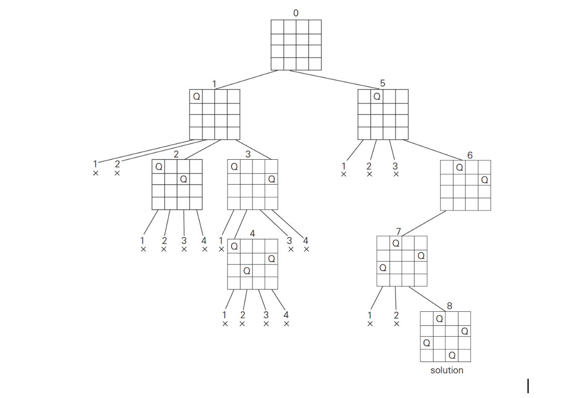
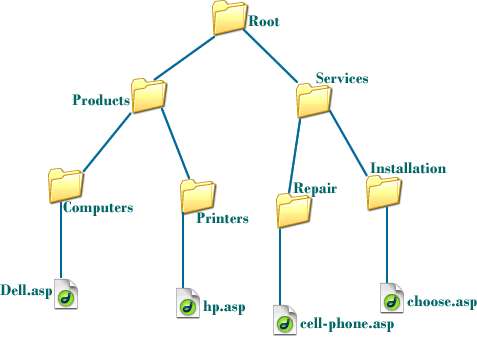
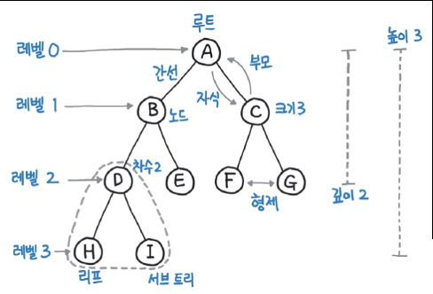
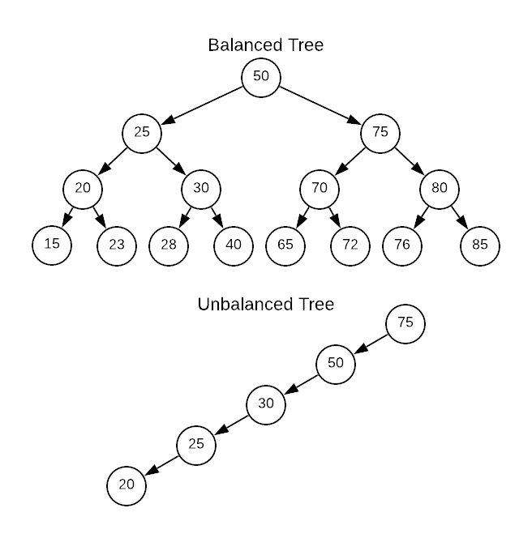
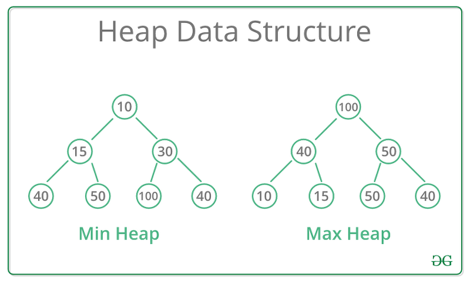

# 2주차


## 순열과 조합

> 파이썬의 itertools 라이브러리를 이용하여 매우 간편하게 순열, 조합, 중복순열, 중복조합을 구할 수 있다


### 순열

> `for 변수 in permutations(리스트, 뽑는개수) ` ==  `리스트`**P**`뽑는개수`
>
> 수학에서 배운 P기호와 같다
>
> EX) 5 **P** 3 == 5!/3! ==    (5 X 4 X 3 X 2 X 1) / 3 X 2 X 1

- 중복을 허용하지 않고 r개를 뽑힌 순서대로 나열한다
- 만약 (1,2) (2,1)이 있다면 다른 경우의 수로 취급한다
- 튜플로 반환된다

```python
from itertools import permutations

for i in permutations([1, 2, 2, 3], 2):
    print(i, end=" ")
    
// (1, 2) (1, 2) (1, 3) (2, 1) (2, 2) (2, 3) (2, 1) (2, 2) (2, 3) (3, 1) (3, 2) (3, 2)
```


### 조합

> `for 변수 in combinations(리스트, 뽑는개수) ` ==  `리스트`**C**`뽑는개수`
>
> 수학에서 배운 C기호와 같다
>
> EX) 5 **C** 3 == 5!/(3!X2!) ==    (5 X 4 X 3 X 2 X 1) / 3 X 2 X 1 X (2 X 1)

- 중복을 허용하고 r개를 뽑기만 한다
- 만약 (1,2) (2,1)이 있다면 같은 경우의 수로 취급한다

```python
from itertools import combinations

for i in combinations([1, 2, 2, 3], 2):
    print(i, end=" ")

// (1, 2) (1, 2) (1, 3) (2, 2) (2, 3) (2, 3)
```


## 7회차 - 12장 BFS


### BFS와 DFS의 차이

> BFS [ Breath First Search ] - 너비 우선 탐색
>
> DFS 는 탐색하는 원소를 **최대한 깊게 따라가야** 합니다.
> 이를 구현하기 위해 인접한 노드 중 **방문하지 않은 모든 노드들을 저장**해두고,
> **가장 마지막에 넣은 노드를 꺼내서 탐색**하면 됩니다. → 그래서 **스택**을 이용해서 DFS 구현
>
> BFS 는 현재 **인접한 노드 먼저 방문**해야 합니다.
> 이걸 다시 말하면 인접한 노드 중 **방문하지 않은 모든 노드들을 저장**해두고,
> **가장 처음에 넣은 노드를 꺼내서 탐색**하면 됩니다. → **큐**를 이용해서 BFS 구현
>
> 

- 구현방법

1. 루트 노드를 큐에 넣습니다.
2. 현재 큐의 노드를 빼서 visited 에 추가한다.
3. 현재 방문한 노드와 인접한 노드 중 방문하지 않은 노드를 큐에 추가한다. 
4. 2부터 반복한다. 
5. 큐가 비면 탐색을 종료한다.


## 8회차 - 12장 백트래킹

> DFS와 BFS의 **완전탐색을 효율적으로 만들어주는 기법** (볼 필요가 없는 데이터는 제외하자)

- N-Queen 문제

  - N*N 체스판에 N개의 퀸을 배치할 수 있는 경우의 수를 센다.

  - 퀸은 상하좌우, 대각선 방향으로 거리 제한 없이 이동할 수 있다.

  - N=8인 경우, 경우의 수는 다음과 같다.
    - 64 * 63 * ... * 57 = 178,462,987,637,760
    - C 기준 1초에 1억 번을 연산하므로 모든 경우의 수를 탐색하는데 약 20.6시간이 소요된다.




- 필요없는 경우를 가지치기(pruning)함으로써 시간복잡도를 줄이는 방법을 백트래킹이라 한다


```python
def nqueen(n):
    """
    visited 의 인덱스는 행, 값은 열을 나타낸다.
    (1, 3)에 놓은 경우, visited[1] = 3 으로 표현하겠다는 것.

    예시) n=4 이고 visited = [1, 3, 0, 2] 인 경우,
    체스판을 그려보면 아래와 같다. (1이 퀸)
    0 1 0 0
    0 0 0 1
    1 0 0 0
    0 0 1 0
    """
    ## 행 하나 표현
    visited = [-1] * n
    cnt = 0
    answers = []

    ## 백트래킹 함수
    def is_ok_on(nth_row):
        """
        n번째(nth) 행에 퀸을 놓았을 때, 올바른 수인지 검사한다.
        nth 행의 퀸 위치와, 0번째 행부터 n-1번째 행까지 놓여진 퀸의 위치를 비교한다.
        nth 행에 놓여진 퀸이 규칙을 깼다면 False 를 반환한다.
        """
        # 0번째 행 ~ nth_row-1번째 행의 퀸 위치를 차례대로 꺼내온다.
        # 영상에서 n-1이라고 말하는데 오류입니다. nth_row-1까지 살펴봅니다.
        for row in range(nth_row):
            # 방금 놓여진 nth 퀸은 (nth_row, visited[nth_row]) 에 놓여져있다.
            # 각 행에 차례대로 단 한 번만 두기 때문에 행이 겹치는 것은 검사하지 않아도 된다.
            # 1) 열 번호가 겹치지는 않는지? visited[nth_row] == visited[row]:
            # 2) 또는 대각선으로 존재하지는 않는지? nth_row - row == abs(visited[nth_row] - visited[row]) 살펴본다. <-- x값의 차이와 y값의 차이가 같은지?   abs() <-- 절대값
            if visited[nth_row] == visited[row] or nth_row - row == abs(visited[nth_row] - visited[row]):
                return False
        return True

    def dfs(row):
        """
        row 는 퀸을 놓을 행번호를 의미한다.
        dfs(0) 은 0번째 행에서 퀸의 위치를 고르는 것이고,
        dfs(1) 은 1번째 행에서 퀸의 위치를 고르는 것이고,
        ...
        dfs(n-1) 은 n-1번째 행에서 퀸의 위치를 고르는 것이다.
        따라서 row 는 n-1까지 가능하며, n이 되었다는 것은 n개의 퀸을 모두 올바른 위치에 두었다는 의미이다.
        """

        # 0 ~ n-1 행에 퀸을 모두 하나씩 두었을 때 경우의 수를 1 증가시키고 *재귀탐색을 종료*한다.
        # if row == n:  이라고 써도 무관하다
        if row >= n:
            # nonlocal 은 지역변수가 아님을 의미한다.
            nonlocal cnt
            cnt += 1
            print("*" * 80)
            print(f"{cnt}번째 답 - visited: {visited}")
            ## grid - 격자 생성
            grid = [['.'] * n for _ in range(n)]
            for idx, value in enumerate(visited):
                grid[idx][value] = 'Q'
            result = []
            for row in grid:
                print(row)
                result.append(''.join(row))
            answers.append(result)
            ################
            return 

        # visited[row] 의 값을 결정한다.
        # n*n 의 체스판이므로 가능한 열의 범위는 0 ~ n-1 이다.
        for col in range(n):
            # (row, col) 위치에 퀸을 두었다고 가정하고, 규칙을 깨지 않는다면 row+1 행에 다시 퀸을 둔다.
            visited[row] = col
            if is_ok_on(row):
                dfs(row + 1)

    # 0번째 행에 퀸을 둔다.
    dfs(0)
    return answers


assert nqueen(4) == [[".Q..", "...Q", "Q...", "..Q."], ["..Q.", "Q...", "...Q", ".Q.."]]
```


## 9회차 - 12장 이진 트리

> https://velog.io/@inyong_pang/18%EA%B0%95-%EC%9D%B4%EC%A7%84-%ED%8A%B8%EB%A6%ACBinary-Trees

### 트리란?

> 뿌리와 가지로 구성되어 거꾸로 세워놓은 나무처럼 보이는 계층형 비선형 자료 구조


#### 선형 자료 구조와 비선형 자료 구조

> 선형 구조란 자료를 구성하고 있는 데이터들을 순차적으로 나열시킨 형태를 의미하고,
> 앞서 공부한 큐(Queue), 스택(Stack)이 자료구조에서 선형 구조이다
>
> 비선형 구조는 선형 구조와는 다르게 데이터가 계층적 혹은 망으로 구성되어있다
>
> 선형 구조는 자료를 저장하고 꺼내는 것에 초점이 맞춰져 있고,
> 비선형 구조는 표현에 초점이 맞춰져 있습니다




트리의 용어

> Node: 트리에서 데이터를 저장하는 기본 요소
> Root Node: 트리 맨 위에 있는 노드
> Level: 최상위 노드를 Level 0으로 하였을 때, 하위 Branch로 연결된 노드의 깊이를 나타냄
> Parent Node: 어떤 노드의 상위 레벨에 연결된 노드
> Child Node: 어떤 노드의 하위 레벨에 연결된 노드
> Leaf Node(Terminal Node): Child Node가 하나도 없는 노드
> Sibling: 동일한 Parent Node를 가진 노드
> Depth: 트리에서 Node가 가질 수 있는 최대 Level




그래프와 트리의 차이점 - 트리는 **순환 구조를 갖지 않는**, **루트가 하나인 그래프** (위계가 존재한다)


### 트리의 종류

> 이진 트리, 이진 탐색 트리, 균형 트리(AVL 트리, red-black 트리), 이진 힙(최대힙, 최소힙) 등
> 다양한 트리가 있지만, 오늘은 **이진 트리와 완전 이진 트리**만 알아볼 것
>
> **이진 트리(Binary Tree)의 특징**은 바로 **각 노드가 최대 두 개의 자식**을 가진다는 것이다
>
> **완전 이진 트리(Complete Binary Tree)의 특징**은 **노드가 삽입될 때 최하단 왼쪽 노드부터 차례대로 삽입**되는 이진 트리


### 트리 구조를 표현하는 방법

> 1. 직접 클래스를 구현해서 사용
> 2. 배열로 표현 (완전 이진 트리인 경우)
>
> 완전 이진 트리는 왼쪽부터 데이터가 쌓이게 되는데,  이를 순서대로 배열에 쌓으면서 표현할 수 있다

```python
      8      Level 0 -> [8] 첫번째 레벨의 8을 넣고,
    6   3    Level 1 -> [8, 6, 3] 다음 레벨인 6, 3을 넣고
   4 2 5     Level 2 -> [8, 6, 3, 4, 2, 5] 다음 레벨인 4, 2, 5를 넣으면 됩니다!
```


### 트리의 높이

> 트리의 높이(Height)는, 루트 노드부터 가장 아래 리프 노드까지의 길이 (==depth)

*각 레벨에 노드가 꽉 차 있을때 - 레벨당 노드의 개수와 노드의 총 개수 구하기*

```python
아래 예시에서 레벨을 k라고 한다면, 각 레벨에 최대로 들어갈 수 있는 노드의 개수는 2^k 이다

      1            Level 0 -> 1개
    2   3          Level 1 -> 2개 
   4 5 6 7         Level 2 -> 4개
 8 9....... 14 15  Level 3 -> 8개 
                   Level k -> 2^k 개
        
높이가 h일 때 모든 노드가 꽉 차 있는 완전 이진 트리라면 모든 노드의 개수는 2^(h+1) - 1 이다
1 + 2^1 + 2^2 + 2^3 + 2^4 ..... 2^h = 2^(h+1) - 1 

노드의 개수가 N이라면, h = log_2(N+1)-1 으로, 이진 트리의 높이는 최대로 해봤자 O(log(N))이다
```

> 이진 트리의 높이는 최대 log(N)이다 - **이진 탐색의 시간복잡도가 O(log(N))인 이유**


## 10회차 - 12장 이진 트리


### 이진 탐색 트리 (Binary Search Tree)

> 부모 기준 왼쪽에는 작은 값, 오른쪽에는 큰 값을 가지는 이진트리
>
> 평균적으로 탐색의 시간복잡도는 O(logN)이고 치우친(skewed) 경우O(n), 따라서 균형이 중요하다
>
> 자가균형 이진 탐색 트리는 AVL, 레드블랙 트리 등이 있다
>
> 자바의 **해시맵이 체이닝 시 연결리스트와 함께 레드블랙 트리를 병행해 저장**한다





## 11회차 - 15장 힙

> 힙은 데이터에서 최대값과 최소값을 빠르게 찾기 위해 고안된 **완전 이진 트리**(Complete Binary Tree)이다

### 최대 힙

> 항상 큰 값이 상위 레벨에 있고 작은 값이 하위 레벨에 있도록 하는 자료구조입니다.
> 다시 말하면 **부모 노드의 값이 자식 노드의 값보다 항상 커야 합니다**.
> 그러면 가장 큰 값은 모든 자식보다 커야 하기 때문에 가장 위로 가겠죠!
> 따라서 최대의 값들을 빠르게 구할 수 있게 되는 것입니다.

### 최소 힙

> 최대 힙의 정 반대이다
> 항상 작은 값이 상위 레벨에 있고 큰 값이 하위 레벨에 있도록 하는 자료구조
> 그러면 가장 작은 값은 모든 자식보다 작아야 하기 때문에, 가장 위의 값이 최솟값이 된다




- BST(이진탐색트리)와 다르다. 좌, 우 자식의 위치가 대소관계를 반영하지 않음.
- 계산 편의를 위해 인덱스는 1부터 사용한다. (parent: x, left: 2x, right: 2x+1)


#### 최대 힙 - 삽입 알고리즘

> 원소를 추가하거나 삭제할 때도 힙의 규칙을 성립해야한다

1.  원소를 맨 마지막에 넣습니다
2.  그리고 부모 노드와 비교합니다. 만약 더 크다면 자리를 바꿉니다
3.  부모 노드보다 작거나 가장 위에 도달하지 않을 때까지 
4.  2의 과정을 반복합니다


```python
이 맥스 힙에서 9를 추가해보겠습니다!
      8      Level 0
    6   3    Level 1  
   4 2 1     Level 2 

1. 맨 마지막에 원소를 넣습니다.

      8      Level 0
    6   3    Level 1  
   4 2 1 9   Level 2 

2-1. 부모 노드와 비교합니다. 3보다 9가 더 크니까! 둘의 자리를 변경합니다.

      8      Level 0
    6   3    Level 1  
   4 2 1 9   Level 2 

      8      Level 0
    6   9    Level 1  
   4 2 1 3   Level 2 

2-2. 다시 부모 노드와 비교합니다. 8보다 9가 더 크니까! 둘의 자리를 변경합니다.

      8      Level 0
    6   9    Level 1  
   4 2 1 3   Level 2 

      9      Level 0
    6   8    Level 1  
   4 2 1 3   Level 2 

3. 가장 위에 도달했으므로 멈춥니다. 힙의 특성을 그대로 유지해 데이터를 삽입했습니다!

      9      Level 0
    6   8    Level 1  
   4 2 1 3   Level 2
```


#### 최대 힙 - 추출 알고리즘

> **루트 노드만 추출/삭제 할 수 있다**
> 스택과 같이 맨 위에 있는 원소만 제거할 수 있고, 다른 위치의 노드를 삭제할 수는 없습니다!

1.  루트 노드와 맨 끝에 있는 원소를 교체한다.
2.  맨 뒤에 있는 원소를 (원래 루트 노드)를 삭제한다. 
3.  변경된 노드와 자식 노드들을 비교합니다. 두 자식 중 더 큰 자식과 비교해서 자신보다 자식이 더 크다면 자리를 바꿉니다. 
4.  자식 노드 둘 보다 부모 노드가 크거나 가장 바닥에 도달하지 않을 때까지, 3의 과정을 반복합니다.
5.  2에서 제거한 원래 루트 노드를 반환합니다.


```python
이 맥스 힙에서 원소를 제거해보겠습니다! (항상 맨 위의 루트 노드가 제거 됩니다.)
      8      Level 0
    6   7    Level 1  
   2 5 4 3   Level 2 

1. 루트 노드와 맨 끝에 있는 원소를 교체한다.

      8      Level 0
    6   7    Level 1  
   2 5 4 3   Level 2 

      3      Level 0
    7   6    Level 1  
   2 5 4 8   Level 2 

2. 맨 뒤에 있는 원소를 (원래 루트 노드)를 삭제합니다. 
이 값이 기존 맥스힙에 있던 가장 큰 값입니다. 따라서 이 값을 마지막에는 반환해줘야 합니다!

      3      Level 0
    6   7    Level 1  
   2 5 4 X   Level 2 

3-1. 변경된 노드를 더 큰 자식 노드와 비교해야 합니다. 
우선 부모와 왼쪽 자식을 비교합니다. 그리고 부모와 오른쪽 자식을 비교합니다.
그리고 부모 보다 큰 자식 중, 더 큰 자식과 변경해야 합니다.
왼쪽 자식인 6과 오른쪽 자식인 7 중에서 7이 더 크고, 부모인 3보다 크니까 둘의 자리를 변경합니다.

      3      Level 0
    6   7    Level 1  
   2 5 4     Level 2 

      7      Level 0
    6   3    Level 1  
   2 5 4     Level 2 

3-2. 다시 자식 노드와 비교합니다. 
우선 부모와 왼쪽 자식을 비교합니다.
왼쪽 자식인 4는 부모인 3보다 더 크니까 둘의 자리를 변경합니다.

      7      Level 0
    6   3    Level 1  
   2 5 4     Level 2 

      7      Level 0
    6   4    Level 1  
   2 5 3     Level 2 


4. 가장 아래 레벨에 도달했으므로 멈춥니다. 힙의 특성을 그대로 유지해 데이터를 삭제했습니다!

      7      Level 0
    6   4    Level 1  
   2 5 3     Level 2 

5. 그리고, 아까 제거한 원래 루트 노드, 8을 반환하면 됩니다!
```


### 시간 복잡도

> 삽입은 원소를 맨 밑에 넣어서 꼭대기까지 비교하면서 올리고,
> 추출은 작은 값으로 교체된 루트 노드와 가장 큰 자식을 바꿔가며 내립니다.
> 완전 이진트리의 최대 높이는 O(log(N)) 이라고 말씀 드렸었죠!
> 그러면, 반복하는 최대 횟수도 O(log(N)) 입니다.
> 즉! 맥스 힙의 원소 추가는  O(log(N)) 만큼의 시간 복잡도를 가진다고 분석할 수 있습니다.


### heapq

> 파이썬의 내장함수이다
>
> 0부터 시작하는 인덱스를 사용한다

```python
heapq.nlargest(n, iterable, key=None)
"""
iterable에 정의된 데이터 집합에서 *n개의 가장 큰 요소로 구성된 리스트를 반환*합니다
"""
```


## 12회차 - 17장 정렬

> 데이터를 순서대로 나열하는 방법을 의미합니다. 
> 정렬은 알고리즘의 굉장히 중요한 주제입니다. 
> 이진 탐색을 가능하게도 하고,  데이터를 조금 더 효율적으로 탐색할 수 있게 만들기 때문입니다.


## 버블 정렬 (Bubblesort)

- 근처의 요소와 비교 (두 요소의 비교)

> 가장 쉽고 직관적이다
>
> 버블 정렬은 **첫 번째 자료와 두 번째 자료를, 두 번째 자료와 세 번째 자료를, 세 번째와 네 번째**를, … 이런 식으로 (마지막-1)번째 자료와 마지막 자료를 **비교**하여 **교환하면서 자료를 정렬**하는 방식입니다! 
> 작은 숫자, 큰 숫자 순서로 있으면 내버려두고 큰 숫자,  작은 숫자 순서로 있으면 둘의 위치를 변경하시면 됩니다!
>
> 이런식으로 한 바퀴를 돌면 가장 큰 숫자가 리스트의 끝으로 이동하게 된다


## 선택 정렬 (Selectionsort)

- 모든 요소들과 temp를 비교하여 최촛(최댓)값 산출 (한 요소와 모든 요소들의 비교)

> **전체에서 최솟(최댓)값을 선택해서 정렬**한다
> 사람들이 일렬로 쭉~ 서 있는데,  한번 쓱 둘러보면서 가장 키 작은 사람을 찾는겁니다.
> 그리고 전부 다 봤다면, 그 중 가장 키 작은 사람! 맨 앞으로 와
> 한 다음에 또 둘러보면서 두 번째로 키 작은 사람을 두 번째에 배치 시킵니다.
>
> 한 바퀴를 돌면 가장 작은 숫자가 리스트의 처음으로 이동하게 된다


## 삽입 정렬 (Insertionsort)

- 배열의 범위를 넓혀가며 정렬 (버블정렬에 백트래킹을 적용한 느낌)

> 선택 정렬이 전체에서 최솟값을 "선택" 하는 거 였다면,
> 삽입 정렬은 **전체에서 하나씩 올바른 위치에 "삽입"** 하는 방식
>
> 선택 정렬은 현재 데이터의 상태와 상관없이 항상 비교하고 위치를 바꾸지만,
> 삽입 정렬은 필요할 때만 위치를 변경하므로 더 효율적인 방식입니다!

