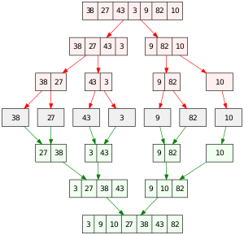
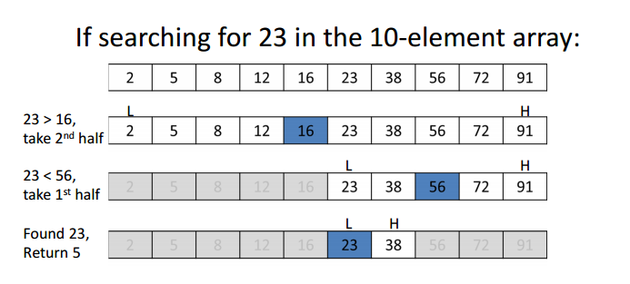
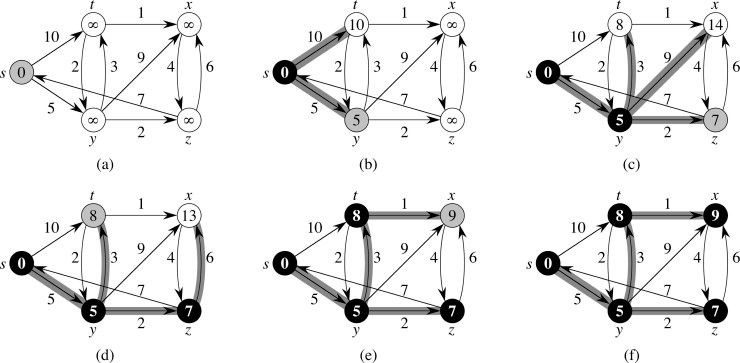
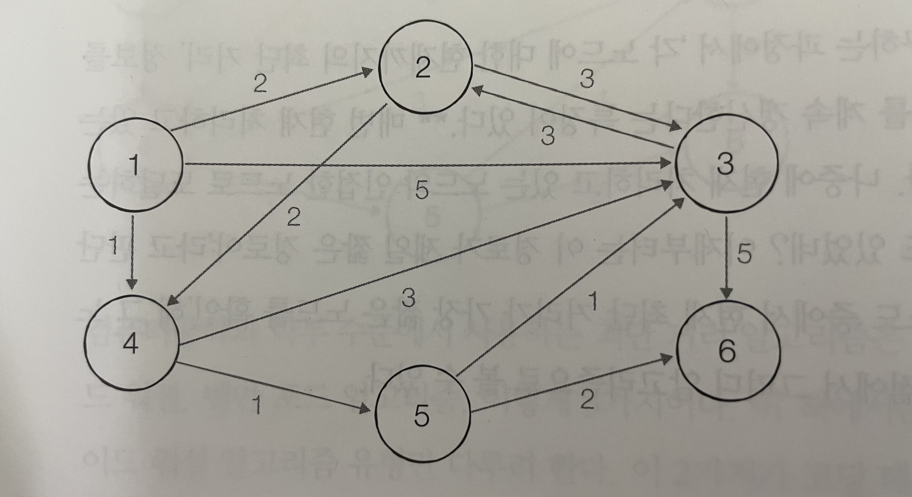
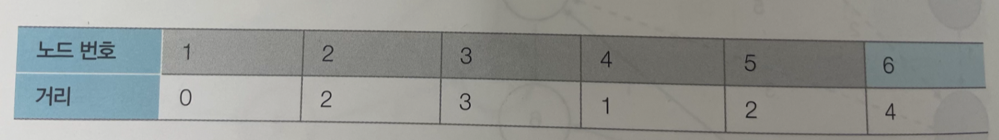

# 3주차

## 13회차 - 17장 정렬


### 퀵 소트 - Quicksort

> 분할 정복(Divide and Conquer)을 통해 주어진 배열을 정렬하는 알고리즘입니다.
> 배열에서 **기준(pivot)을 잡고, 기준보다 값이 작은 집합과 큰 집합으로 나눕니다(Divide)**.
> 그리고 **그 사이에 기준을 위치**시킵니다. 작은 집합과 큰 집합을 대상으로 재귀호출하여 정렬한 뒤(Conquer) 결과를 합치면 정렬된 배열을 얻을 수 있습니다.
>
> 내림차순 정렬되어 있는 배열을 정렬하려면 O(n^2)이고 일반적으로는 O(nlogn)이다

but) mergesort, heapsort 알고리즘은 O(nlogn)을 보장한다


```python
## i: pivot보다 작은 집합의 마지막index (구분 칸막이)
## j: 진행도 (현재 비교하는 index)

[1, 6, 2, 9, 4]  # 정렬되지 않은 배열

1단계: [1, 6, 2, 9, 4]
      마지막 원소인 4를 pivot으로 삼습니다.
	    pivot보다 작은 집합의 인덱스 i를 -1로 설정합니다.
			(i=-1)

2단계: [1, 6, 2, 9, 4]
			j를 0에서부터 3까지 살펴봅니다. 
			j가 0이므로 지금 살펴보고 있는 값은 1 입니다.
      1는 pivot(4)보다 작습니다.
			i를 1 증가시켜 0으로 만듭니다.
			i 와 j 의 위치를 바꿉니다.
      i와 j가 동일하므로 아무 일도 일어나지 않습니다.
			(i=0, j=0)

3단계: [1, 6, 2, 9, 4]
			j를 1 증가시켜 1로 만듭니다.
		  지금 살펴보고 있는 값은 6 입니다.
      6은 pivot(4)보다 큽니다.
			넘어갑니다.
			(i=0, j=1)

4단계: [1, 6, 2, 9, 4]
			j를 1 증가시켜 2로 만듭니다.
		  지금 살펴보고 있는 값은 2 입니다.
      2는 pivot(4)보다 작습니다.
			i를 1 증가시켜 1로 만듭니다.
			i(1) 와 j(2) 의 위치를 바꿉니다.
			배열은 [1, 2, 6, 9, 4]가 됩니다.
			(i=0, j=2)

5단계: [1, 2, 6, 9, 4]
			j를 1 증가시켜 3으로 만듭니다.
		  지금 살펴보고 있는 값은 9 입니다.
      9는 pivot(4)보다 큽니다.
			넘어갑니다.
			(i=1, j=3)

6단계: j를 0부터 3까지 모두 살펴보았습니다.
		  i는 pivot보다 작은 집합의 범위를 나타내므로, i+1과 pivot의 위치를 바꿉니다.
	    배열은 [1, 2, 4, 9, 6] 이 됩니다.

7단계: [1, 2]와 [9, 6]을 대상으로 1~6단계를 반복합니다.
      결과적으로 [1, 2, 4, 6, 9]가 됩니다.
			정렬이 끝났습니다.
```


### 머지 소트 - Mergesort

> 배열을 쪼개고 합치면서 정렬시킨다
>
> 배열을 잘개 쪼개면 알아서 쪼개진 배열은 정렬된다 (요소가 하나이면 정렬된 것)





```python
[1, 2, 3, 5]  # 정렬된 배열 A
[4, 6, 7, 8]  # 정렬된 배열 B
[] # 두 집합을 합칠 빈 배열 C


        ↓
1단계 : [1, 2, 3, 5] 
        ↓
       [4, 6, 7, 8] 
        1과 4를 비교합니다!
        1 < 4 이므로 1을 C 에 넣습니다.
     C:[1]

           ↓
2단계 : [1, 2, 3, 5] 
        ↓
       [4, 6, 7, 8] 
        2와 4를 비교합니다!
        2 < 4 이므로 2를 C 에 넣습니다.
     C:[1, 2]


              ↓
3단계 : [1, 2, 3, 5] 
        ↓
       [4, 6, 7, 8] 
        3과 4를 비교합니다!
        3 < 4 이므로 3을 C 에 넣습니다.
     C:[1, 2, 3]

                 ↓
3단계 : [1, 2, 3, 5] 
        ↓
       [4, 6, 7, 8] 
        5와 4를 비교합니다!
        5 > 4 이므로 4을 C 에 넣습니다.
     C:[1, 2, 3, 4]

                 ↓
3단계 : [1, 2, 3, 5] 
           ↓
       [4, 6, 7, 8] 
        5와 6을 비교합니다!
        5 < 6 이므로 5을 C 에 넣습니다.
     C:[1, 2, 3, 4, 5]

엇, 이렇게 되면 A 의 모든 원소는 끝났습니다!

그러면 B에서 안 들어간 원소인
       [6, 7, 8] 은 어떡할까요?
하나씩 C 에 추가해주면 됩니다.
     C:[1, 2, 3, 4, 5, 6, 7, 8] 이렇게요!

그러면 A 와 B를 합치면서 정렬할 수 있었습니다.
```


### 힙 소트 - Heapsort

> Heap을 이용하여 정렬


## 14회차 - 18장 이진 탐색

> 배열이 **정렬되어있을 경우**, **절반씩 줄여나가면서 탐색**하는 기법 (=이분 탐색)





### 내장함수 bisect

> `bisect.bisect_left(nums :list , target: int)` 를 사용한다
>
> 원하는 target 값의 index 하나를 반환한다
>
> 예외상황
>
> 1. 원하는 target 값이 여러개 - target과 값이 같은 index중 가장 작은 index 반환
> 2. 원하는 target 값이 리스트에 없을 때 - target값보다 큰 첫번째 값의 index 반환
> 3. 원하는 target 값이 리스트의 모든 값보다 클 때 - 배열의 길이 **len(nums)** 반환 (배열내에 없음)
> 4. 원하는 target 값이 리스트의 모든 값보다 작을 때 -  **(-1)** 반환 (배열내에 없음)

```python
import bisect
def binary_search_builtin(nums, target):
    idx = bisect.bisect_left(nums, target)
		# idx == len(nums) 가능하기 떄문.
		"""Return the index where to insert item x in list a, assuming a is sorted.

    The return value i is such that all e in a[:i] have e < x, and all e in
    a[i:] have e >= x.  So if x already appears in the list, a.insert(x) will
    insert just before the leftmost x already there.

    Optional args lo (default 0) and hi (default len(a)) bound the
    slice of a to be searched.
    """
    if idx < len(nums) and nums[idx] == target:
        return idx
    else:
        return -1

## 예외1. 만약 [-1,1,3,3,5]배열에서 3를 찾는다면 첫 번째 3의 index 2 반환
## 예외2. 만약 [-1,1,3,3,5]배열에서 2를 찾는다면 1,3사이까지 찾은 후 3의 index 2 반환
## 예외3. 만약 [-1,1,3,3,5]배열에서 2를 찾는다면 1,3사이까지 찾은 후 3의 index 2 반환
## 예외4. 만약 [-1,1,3,3,5]배열에서 9를 찾는다면 5반환
## 예외5. 만약 [-1,1,3,3,5]배열에서 -2를 찾는다면 -1반환
```


## 15회차 - 18장 이진 탐색

문제 풀이

## 16회차 - 13장 최단 경로

- **그래프**로 표현. 각 **지점은 노드, 도로는 간선**.
- **다익스트라**, 플로이드-워셜을 배울 예정.




```python
1. 출발지를 s로 정하고, 다음과 같이 표시한다.
      (s,    t,     x,     y,     z  순)
거리 = [0,    inf,   inf,   inf,   inf]
방문 = [True, False, False, False, False]

2. 갈 수 있는 노드들의 최소거리를 측정한다.
s->t: 10
s->y: 5
      (s,    t,     x,     y,     z  순)
거리 = [0,    10,    inf,   5,     inf]
방문 = [True, False, False, False, False]

3. 방문 안한 녀석들 중 가장 가까운 녀석인 y를 방문하고, 최소거리를 측정한다.
y->t: 3
y->x: 9
y->z: 2
      (s,    t,     x,     y,    z  순)
거리 = [0,    8,     14,    5,    7]
방문 = [True, False, False, True, False]

4. 방문 안한 녀석들 중 가장 가까운 녀석인 z를 방문하고, 최소거리를 측정한다.
z->x: 6
      (s,    t,     x,     y,    z  순)
거리 = [0,    8,     13,    5,    7]
방문 = [True, False, False, True, True]

5. 방문 안한 녀석들 중 가장 가까운 녀석인 t를 방문하고, 최소거리를 측정한다.
t->x: 1
t->y: 2
      (s,    t,     x,    y,    z  순)
거리 = [0,    8,     9,    5,    7]
방문 = [True, True, False, True, True]

6. 방문 안한 녀석들 중 가장 가까운 녀석인 x를 방문하고, 최소거리를 측정한다.
x->z: 4
      (s,    t,     x,    y,    z  순)
거리 = [0,    8,     9,    5,    7]
방문 = [True, True, True, True, True]

7. 방문 안한 노드가 없으므로 끝낸다.
      (s,    t,     x,    y,    z  순)
거리 = [0,    8,     9,    5,    7]
방문 = [True, True, True, True, True]
```







```python
6 11
1
1 2 2
1 3 5
1 4 1
2 3 3
2 4 2
3 2 3
3 6 5
4 3 3
4 5 1
5 3 1
5 6 2
```


### 다익스트라 구현 1

> naive (순진한) 구현
>
> 시간복잡도 - 이중 for 문이므로 O(V^2)
>
> V [ Vertex ]

```python
### 그래프 구성하기

import sys

from min_cost.dijkstra import dijkstra_naive, dijkstra_pq

with open('testcase1.txt') as f:
    sys.stdin = f
    input = sys.stdin.readline
    n, m = map(int, input().split())
    start = int(input())
    graph = [[] for _ in range(n + 1)]

    for _ in range(m):
        ## a노드에서 b노드로의 거리 c를
        ## 딕셔너리의 a키에 대한 튜플로 저장한다
        a, b, c = map(int, input().split())
        graph[a].append((b, c))

assert dijkstra_naive(graph, start) == [1000000000, 0, 2, 3, 1, 2, 4]
assert dijkstra_pq(graph, start) == [1000000000, 0, 2, 3, 1, 2, 4]
```

```python
INF = int(1e9)

def dijkstra_naive(graph, start):
    def get_smallest_node():
        ## 유의미한 값과 분리하기 위해,
        ## 무의미한 값은 INF와 같이 큰 수를 정의하여 사용한다
        min_value = INF
        idx = 0
        for i in range(1, N):
            ## 방문하지 않은 최소값을 저장하고, 그 인덱스를 반환한다
            if dist[i] < min_value and not visited[i]:
                min_value = dist[i]
                idx = i
        return idx


    N = len(graph)
    ## visited와 dist 배열을 False와 INF로 생성한다
    visited = [False] * N
    dist = [INF] * N

    ## 두 리스트의 같은 index에 노드와 거리를 저장해서 사용한다
    visited[start] = True
    dist[start] = 0

    for adj, d in graph[start]:
        dist[adj] = d

    # N개의 노드 중 첫 노드는 이미 방문했으므로,
    # N-1번 수행하면 된다.
    for _ in range(N - 1):
        # 가장 가깝고 방문 안한 녀석을 고르고,
        cur = get_smallest_node()
        visited[cur] = True
        # 최단거리를 비교, 수정한다.
        for adj, d in graph[cur]:
            ## 현재 노드를 통해 인접한 노드로 가는 거리를 계산한다
            cost = dist[cur] + d
            ## 현재 노드를 통해 인접한 노드로 가는 것이 더 가깝다면, dist[adj]의 값을 수정한다
            if cost < dist[adj]:
                dist[adj] = cost

    return dist
```


### 다익스트라 구현 2

> heap과 우선순위 queue를 사용한다
>
> 시간복잡도가 O(ElogV)로 구현 1보다 더 좋기에 일반적으로 구현 2의 방법을 사용하여 구현한다

```python
import heapq

def dijkstra_pq(graph, start):
    N = len(graph)
    dist = [INF] * N

    q = []
    ## 튜플일 경우 0번째 요소 기준으로 최소 힙 구조.
    ## 당연하게 첫 번째 방문 누적 비용은 0으로 설정한다
    heapq.heappush(q, (0, start))
    dist[start] = 0

    while q:
        # 누적 비용이 가장 작은 녀석을 꺼낸다.
        acc, cur = heapq.heappop(q)

        # 이미 답이 될 가망이 없다.
        if dist[cur] < acc:
            continue

        # 인접 노드를 차례대로 살펴보며 거리를 업데이트한다.
        ## naive 구현과 달리 heapq에 push하여 시간 복잡도를 줄인다
        for adj, d in graph[cur]:
            cost = acc + d
            if cost < dist[adj]:
                dist[adj] = cost
                heapq.heappush(q, (cost, adj))

    return dist
```


## 17회차 - 13장 최단 경로

## 18회차 - 23장 Dynamic Programming


