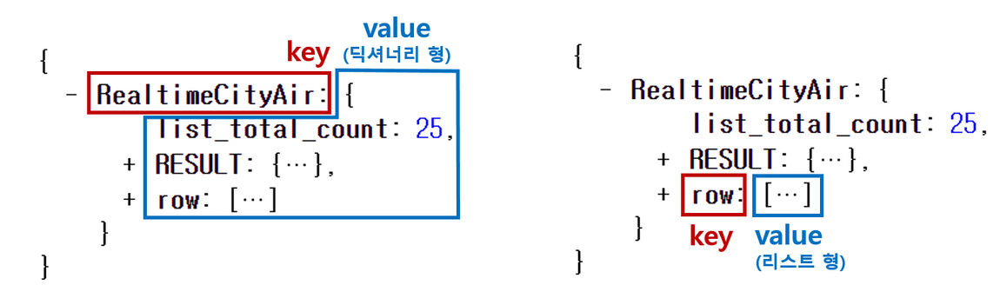
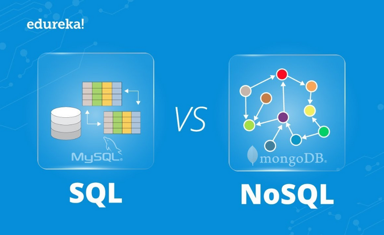

# 웹 개발 종합반

> [[스파르타코딩클럽\] 웹개발 종합반 - 1주차 (notion.site)](https://teamsparta.notion.site/1-da6d8595945d4b868e5fcfa933c56011#9bff651bc9864a66b3f30a57baa4dc36)
>
> [[스파르타코딩클럽\] 웹개발 종합반 - 2주차 (notion.site)](https://teamsparta.notion.site/2-21a967ffde614955a6aff1e9765b0c82)
>
> [[스파르타코딩클럽\] 웹개발 종합반 - 3주차 (notion.site)](https://teamsparta.notion.site/3-baced734e9a44ffc9fd96e2ab6ad34f7)
>
> [[스파르타코딩클럽\] 웹개발 종합반 - 4주차 (notion.site)](https://teamsparta.notion.site/4-0056714b522240a68f7c778237525282)
>
> 


## 1 주차

**[수업목표]**

1. 서버와 클라이언트의 역할에 대해 이해한다
2. HTML, CSS의 기초 지식을 이해한다 + 부트스트랩을 가져다 쓸 줄 안다!
3. Javascript 기초 문법을 익힌다


### 1-1 오늘 배울 것

1. 서버 / 클라이언트 / 웹의 동작 개념
   - 네이버 웹페이지를 해킹해보자!
   - 웹의 동작 개념 (HTML을 받는 경우)
     - 웹 브라우저 - 받아온 데이터 (HTML, CSS, JS)를 구현하여 보여준다
     - HTML - 웹페이지의 뼈대
     - CSS - 꾸미는 기능
     - JS - 동적인 기능
   - 웹의 동작 개념 (데이터만 받는 경우)
   - 1~5주차에 배울 순서!
2. 1~5주차가 끝나면 만들게 되는 것들 - 구경하기


### 1-3 HTML, CSS 기본 내용

> HTML과 CSS는 frontend이다
>
> frontend는 서버가 준다


**HTML**

- 기본적으로 head와 body로 구성된다

  - head - 페이지의 속성정보 (주로 눈에 안보이는 것들)

    - head에 들어가는 대표적인 요소들 : meta, script, link, title 등

    > head의 파비콘 [favicon]
    >
    > '즐겨찾기 아이콘(favorites icon)'의 줄임말로, 특정 웹사이트에 방문했을 때 웹사이트 주소 옆이나 브라우저 탭에 나타나는 작은 아이콘을 가리킨다.

  - body - 페이지의 내용

    - 각종 테그들
      - div [division] - 구역 나눔 (한줄)
      - p [paragraph] - 문단
      - ul, li - bullet point 생성
      - h1 - 제목
      - h2 - 소제목
      - h3~6
      - span - 지정
      - a - 하이퍼링크
      - img - 이미지
      - input - 인풋
      - button - 버튼
      - textarea - 텍스트 구역


```html
<!DOCTYPE html>
<html lang="en">

<head>
    <meta charset="UTF-8">
    <meta name="viewport" content="width=device-width, initial-scale=1.0">
    <title>스파르타코딩클럽 | HTML 기초</title>
</head>

<body>
    <!-- 구역을 나누는 태그들 -->
    <div>나는 구역을 나누죠</div>
    <p>나는 문단이에요</p>
    <ul>
        <li> bullet point!1 </li>
        <li> bullet point!2 </li>
    </ul>

    <!-- 구역 내 콘텐츠 태그들 -->
    <h1>h1은 제목을 나타내는 태그입니다. 페이지마다 하나씩 꼭 써주는 게 좋아요. 그래야 구글 검색이 잘 되거든요.</h1>
    <h2>h2는 소제목입니다.</h2>
    <h3>h3~h6도 각자의 역할이 있죠. 비중은 작지만..</h3>
    <hr>
    span 태그입니다: 특정 <span style="color:red">글자</span>를 꾸밀 때 써요
    <hr>
    a 태그입니다: <a href="http://naver.com/"> 하이퍼링크 </a>
    <hr>
    img 태그입니다: 
    <hr>
    input 태그입니다: <input type="text" />
    <hr>
    button 태그입니다: <button> 버튼입니다</button>
    <hr>
    textarea 태그입니다: <textarea>나는 무엇일까요?</textarea>
</body>

</html>
```


### 1-4 간단한 로그인 페이지 만들어보기 [HTML]

```html
<!DOCTYPE html>
<html lang="en">
<head>
    <meta charset="UTF-8">
    <title>로그인 페이지</title>
</head>
<body>
    <h1>로그인 페이지</h1>
    <p>ID: <input type="text"></p>
    <p>PW: <input type="text"></p>
    <button>로그인하기</button>
</body>
</html>
```


### 1-5 CSS 기초 [Cascading Style Sheet]

> CSS의 관건은 **선택**이다
>
> **따라서 이름표가 필수이다**
>
> HTML은 부모 자식의 구조가 있다


### 1-6 자주 쓰이는 CSS 연습하기

> 이미지 사용시 항상 세 줄을 같이 쓰게된다 (image, position, size)
>
> margin과 padding
>
> > margin - 바깥 여백
> >
> > padding - 안쪽 여백


- div를 페이지 가운데로 오게하는 방법
  1. div의 크기를 제한하고
  2. `margin: auto;` 사용


### 1-7 폰트, 주석, 파일분리

> https://fonts.google.com/?subset=korean
>
> 주석 - `ctrl+/`


### 1-8 부트스트랩, 예쁜 CSS 모음집

> Bootstrap - 예쁜 CSS를 미리 모아둔 것 (현업에서는 미리 완성된 부트스트랩을 가져다 쓰는 경우가 많다)
>
> 남이 미리 작성한 CSS를 내 HTML 파일에 적용한다는 점에서,
> bootstrap 적용은 CSS 파일 분리와 원리가 동일하다
> 하지만, bootstrap은 CSS의 파일이 인터넷 어딘가에 있다는 점이 다르다

>https://getbootstrap.com/docs/5.1/components/accordion/


### 1-9 CSS 꿀팁 한번 더 배우기

```html
<!doctype html>
<html lang="en">

<head>
    <meta charset="utf-8">
    <meta name="viewport" content="width=device-width, initial-scale=1, shrink-to-fit=no">

    <link href="https://cdn.jsdelivr.net/npm/bootstrap@5.0.2/dist/css/bootstrap.min.css" rel="stylesheet"
          integrity="sha384-EVSTQN3/azprG1Anm3QDgpJLIm9Nao0Yz1ztcQTwFspd3yD65VohhpuuCOmLASjC" crossorigin="anonymous">
    <script src="https://ajax.googleapis.com/ajax/libs/jquery/3.5.1/jquery.min.js"></script>
    <script src="https://cdn.jsdelivr.net/npm/bootstrap@5.0.2/dist/js/bootstrap.bundle.min.js"
            integrity="sha384-MrcW6ZMFYlzcLA8Nl+NtUVF0sA7MsXsP1UyJoMp4YLEuNSfAP+JcXn/tWtIaxVXM"
            crossorigin="anonymous"></script>

    <title>스파르타코딩클럽 | 부트스트랩 연습하기</title>
    <link href="https://fonts.googleapis.com/css2?family=Gowun+Dodum&display=swap" rel="stylesheet">


    <style>
        * {
            font-family: 'Gowun Dodum', sans-serif;
        }

        .mytitle {
            /*background-color: green;*/
            height: 250px;
            width: 100%;

            background-image: linear-gradient(0deg, rgba(0, 0, 0, 0.5), rgba(0, 0, 0, 0.5)), url("https://movie-phinf.pstatic.net/20210715_95/1626338192428gTnJl_JPEG/movie_image.jpg");
            background-position: center;
            background-size: cover;

            color: white;

            display: flex;
            flex-direction: column;
            justify-content: center;
            align-items: center;
        }

        .mytitle > button {
            width: 200px;
            height: 50px;

            color: white;
            background-color: transparent;

            border-radius: 50px;
            border: 1px solid white;

            margin-top: 10px;
        }

        .mytitle > button:hover {
            border: 2px solid blue;
        }
    </style>
</head>

<body>
<div class="mytitle">
    <h1>내 생애 최고의 영화들</h1>
    <button>영화 기록하기</button>
</div>
</body>

</html>
```


> 이모티콘 모음
>
> https://kr.piliapp.com/facebook-symbols/


### 1-12 자바스크립트 맛보기

> 프로그래밍 언어 중 하나로, **브라우저가 알아들을 수 있는 언어** - 브라우저 표준 언어
>
> 자바와 자바스크립트는 **아무 관련 없다!**


### 1-13,14 자바스크립트 기초문법 배우기

> 웹페이지의 개발자 도구의 Console의 언어가 자바스크립트이다

> 크롬 개발자도구 콘솔창은 어떤 의미?  (윈도우 : F12) (맥 : alt(option) + command + i)
>
> 띄워놓은 페이지에서 빠르게 자바스크립트를 테스트해볼 수 있게, 개발자들을 위해 만들어둔 도구입니다. 새로고침하면 모두 사라진다는 사실!

- 변수

- ```javascript
  let a = 2
  let b = 3
  ```

  

- 자료형

  - list

    - 리스트: 순서를 지켜서 가지고 있는 형태입니다.

    - ```javascript
      let a_list = []  // 리스트를 선언. 변수 이름은 역시 아무렇게나 가능!
      
      // 또는,
      
      let b_list = [1,2,'hey',3] // 로 선언 가능
      
      b_list[1] // 2 를 출력
      b_list[2] // 'hey'를 출력
      
      // 리스트에 요소 넣기
      b_list.push('헤이')
      b_list // [1, 2, "hey", 3, "헤이"] 를 출력
      
      // 리스트의 길이 구하기
      b_list.length // 5를 출력
      ```

      

  - dictionary

    - 딕셔너리: 키(key)-밸류(value) 값의 묶음

    - ```javascript
      let a_dict = {}  // 딕셔너리 선언. 변수 이름은 역시 아무렇게나 가능!
      
      // 또는,
      
      let b_dict = {'name':'Bob','age':21} // 로 선언 가능
      b_dict['name'] // 'Bob'을 출력
      b_dict['age'] // 21을 출력
      
      b_dict['height'] = 180 // 딕셔너리에 키:밸류 넣기
      b_dict // {name: "Bob", age: 21, height: 180}을 출력
      ```

      

- 함수

- ```javascript
  // 만들기
  function 함수이름(필요한 변수들) {
  	내릴 명령들을 순차적으로 작성
  }
  // 사용하기
  함수이름(필요한 변수들);
  ```

  

- 조건문

- 반복문

- ```javascript
  for (1. 시작조건; 2. 반복조건; 3. 더하기) {
  	4. 매번실행
  }
  
  1 -> 2체크하고 -> (괜찮으면) -> 4 -> 3
  -> 2체크하고 -> (괜찮으면) -> 4 -> 3
  -> 2체크하고 -> (괜찮으면) -> 4 -> 3
  -> 2체크하고 -> (괜찮으면) -> 4 -> 3
  
  와 같은 순서로 실행됩니다.
  i가 증가하다가 반복조건에 맞지 않으면, 반복을 종료하고 빠져나옵니다.
  ```

  ```javascript
  let scores = [
  	{'name':'철수', 'score':90},
  	{'name':'영희', 'score':85},
  	{'name':'민수', 'score':70},
    	{'name':'형준', 'score':50},
    	{'name':'기남', 'score':68},
   	{'name':'동희', 'score':30},
  ]
  
  for (let i = 0 ; i < scores.length ; i++) {
  	console.log(scores[i]);
  }
  
  // 이렇게 하면 리스트 내의 딕셔너리를 하나씩 출력할 수 있고,
  for (let i = 0 ; i < scores.length ; i++) {
  	if (scores[i]['score'] < 70) {
  		console.log(scores[i]['name']);
  	}
  }
  
  // 이렇게 하면 점수가 70점 미만인 사람들의 이름만 출력할 수도 있습니다.
  ```

  

## 2 주차

**[수업 목표]**

1. Javascript 문법에 익숙해진다.
2. jQuery로 간단한 HTML을 조작할 수 있다.
3. Ajax로 서버 API(약속)에 데이터를 주고, 결과를 받아온다.


### 2-2 JQuery 시작하기


**jQuery**

- HTML의 요소들을 조작하는, 편리한 Javascript를 미리 작성해둔 것. 라이브러리!

> Javascript로도 모든 기능(예 - 버튼 글씨 바꾸기 등)을 구현할 수는 있지만,
>
> 1)코드가 복잡하고, 2)브라우저 간 호환성 문제도 고려해야해서,
>
>  jQuery라는 라이브러리가 등장하게 되었다

- jQuery는 Javascript와 다른 특별한 소프트웨어가 아니라 미리 작성된 Javascript 코드입니다. 전문 개발자들이 **짜둔 코드를 잘 가져와서 사용**하는 것임을 기억해주세요! (그렇게 때문에, **쓰기 전에 "임포트"**를 해야합니다!)


### 2-3 JQuery 다뤄보기

> jquery를 이용할 곳에 id를 할당해야한다


### 2-4 JQuery 적용하기 (포스팅 박스)


### 2-6 서버-클라이언트 통신 이해하기

**JSON**

> JSON은, Key:Value로 이루어져 있습니다. 자료형 Dictionary와 아주- 유사




**클라이언트-서버**

```javascript
👉 API는 은행 창구와 같은 것!

같은 예금 창구에서도 개인 고객이냐 기업 고객이냐에 따라 가져와야 하는 것 / 처리해주는 것이 다른 것처럼,

클라이언트가 요청 할 때에도, "타입"이라는 것이 존재합니다.

- GET        →      통상적으로! 데이터 조회(Read)를 요청할 때 예) 영화 목록 조회
- POST     →      통상적으로! 데이터 생성(Create), 변경(Update), 삭제(Delete) 요청 할 때 예) 회원가입, 회원탈퇴, 비밀번호 수정

이 중에서 오늘은 GET 방식에 대해 배워보겠습니다. (POST는 4주차에 배웁니다)

```


**GET**

```javascript
https://movie.naver.com/movie/bi/mi/basic.nhn?code=161967

위 주소는 크게 두 부분으로 쪼개집니다. 바로 "?"가 쪼개지는 지점인데요.
"?" 기준으로 앞부분이 <서버 주소>, 뒷부분이 [영화 번호] 입니다.

* 서버 주소: https://movie.naver.com/movie/bi/mi/basic.nhn
* 영화 정보: code=161967
```

```javascript
👉 GET 방식으로 데이터를 전달하는 방법

?  : 여기서부터 전달할 데이터가 작성된다는 의미입니다. & : 전달할 데이터가 더 있다는 뜻입니다.

예시) google.com/search?q=아이폰&sourceid=chrome&ie=UTF-8

     위 주소는 google.com의 search 창구에 다음 정보를 전달합니다!
     q=아이폰                        (검색어)
     sourceid=chrome        (브라우저 정보)
     ie=UTF-8                      (인코딩 정보)

```


### 2-7 Ajax 시작하기

```javascript


 👉 참고! Ajax는 jQuery를 임포트한 페이지에서만 동작 가능합니다.

즉, http://google.com/ 과 같은 화면에서 개발자도구를 열면, jQuery가 임포트 되어있지 않기 때문에 아래와 같은 에러가 뜹니다.

Uncaught TypeError: $.ajax is not a function → ajax라는 게 없다는 뜻

```

```javascript
$.ajax({
  type: "GET", // GET 방식으로 요청한다.
  url: "http://spartacodingclub.shop/sparta_api/seoulair",
  data: {}, // 요청하면서 함께 줄 데이터 (GET 요청시엔 비워두세요)
  success: function(response){ // 서버에서 준 결과를 response라는 변수에 담음
    console.log(response) // 서버에서 준 결과를 이용해서 나머지 코드를 작성
  }
})
```


## 3 주차


### 3-2 Ajax 복습

`.repeat(횟수)` - 편하게 반복해주는 내장함수


### 3-3 파이썬 시작하기

> 파이썬은 라인을 잘 맞춰야한다


### 3-4 파이썬 기초공부

- 변수
- 자료형
- 함수
- 조건문
- 반복문


### 3-5 파이썬 패키지 설치하기

> 라이브러리를 파이썬에선 패키지라고 함


가상환경(virtual environment) - 파이썬의 venv폴더

> 프로젝트별로 패키지들을 담아 놓는 폴더

```javascript
가상환경(virtual environment)은
같은 시스템에서 실행되는 다른 파이썬 응용 프로그램들의 동작에 영향을 주지 않기 위해, 파이썬 배포 패키지들을 설치하거나 업그레이드하는 것을 가능하게 하는 격리된 실행 환경 입니다.
```


### 3-9 DB개괄

> **DB는 프로그램**이다
>
> 잘 저장하기 위해 사용하는게 아닌, **잘 꺼내쓰기**위해 사용한다
>
> 순서(index)대로 잘 정리 되어있어서 **찾기 쉬워야**한다




> RDBMS(SQL)

```javascript
행/열의 생김새가 정해진 엑셀에 데이터를 저장하는 것과 유사합니다. 데이터 50만 개가 적재된 상태에서, 갑자기 중간에 열을 하나 더하기는 어려울 것입니다. 그러나, 정형화되어 있는 만큼, 데이터의 일관성이나 / 분석에 용이할 수 있습니다.

ex) MS-SQL, My-SQL 등
```


> NoSQL **[Not only SQL]**

```javascript
딕셔너리 형태로 데이터를 저장해두는 DB입니다. 고로 데이터 하나 하나 마다 같은 값들을 가질 필요가 없게 됩니다. 자유로운 형태의 데이터 적재에 유리한 대신, 일관성이 부족할 수 있습니다.

ex) MongoDB
```


### 3-12 pymongo로 DB조작하기

```python
# 저장 - 예시
doc = {'name':'bobby','age':21}
db.users.insert_one(doc)

# 한 개 찾기 - 예시
user = db.users.find_one({'name':'bobby'})

# 여러개 찾기 - 예시 ( _id 값은 제외하고 출력)
all_users = list(db.users.find({},{'_id':False}))

# 바꾸기 - 예시
db.users.update_one({'name':'bobby'},{'$set':{'age':19}})

# 지우기 - 예시
db.users.delete_one({'name':'bobby'})
```


## 4 주차

### 4-2 Flask 시작하기 - 서버만들기

- Flask 프레임워크: 서버를 구동시켜주는 편한 코드 모음. 서버를 구동하려면 필요한 복잡한 일들을 쉽게 가져다 쓸 수 있습니다.

```javascript
프레임워크를 쓰지 않으면 태양초를 빻아서 고추장을 만드는 격! 프레임워크는 3분 요리/소스 세트라고 생각하면 되겠습니다!
```


### 4-3 Flask 시작하기 - HTML 파일 주기

