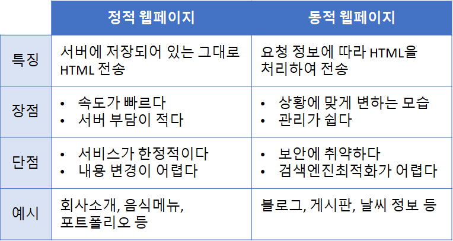
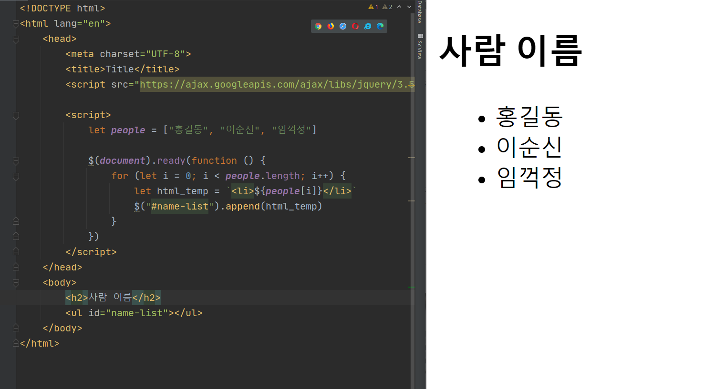
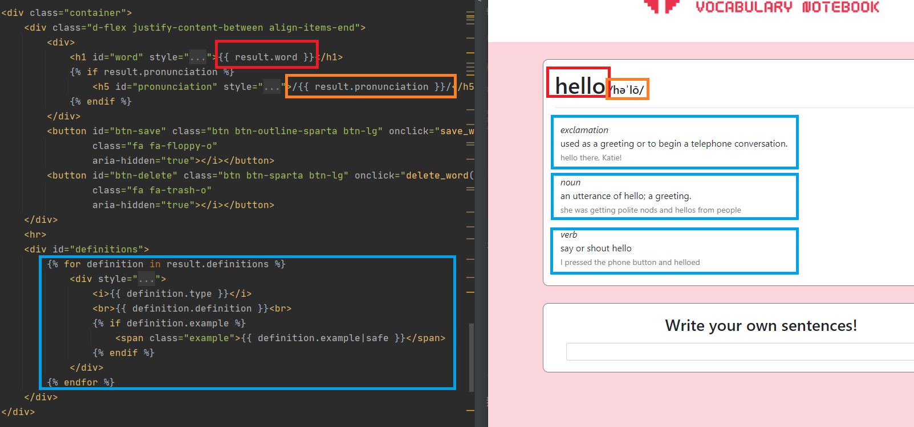
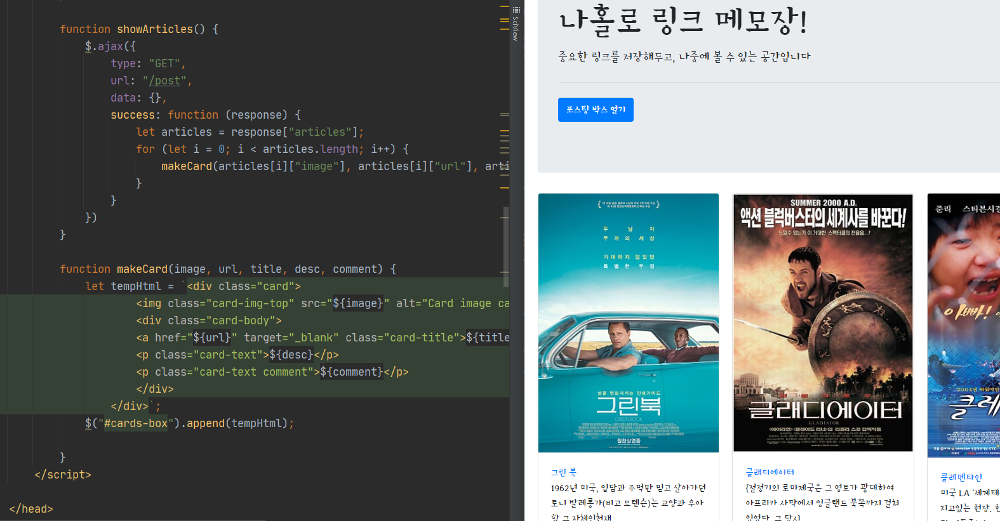

> [[스파르타코딩클럽\] 웹개발 플러스 - 1주차 (notion.so)](https://www.notion.so/1-9d5e4a49113a4cc4990aaddfe17a17e5)
>
> [[스파르타코딩클럽\] 웹개발 플러스 - 2주차 (notion.so)](https://www.notion.so/2-8218e41923f748a590c9ce4645e307bd)
>
> [[스파르타코딩클럽\] 웹개발 플러스 - 3주차 (notion.so)](https://www.notion.so/3-886885172e3343ae93ed43e0eada22a7)
>
> [[스파르타코딩클럽\] 웹개발 플러스 - 4주차 (notion.so)](https://www.notion.so/4-fdcb0566b88e4305bebc8b6817ccedbb)


1. **API**란?
   - 서버가 요청을 받게 위해 뚫어놓은 '창구'라고 했습니다.
   - 요청에는 POST(주로 데이터를 수정할 때), GET(주로 데이터를 가져올 때) 요청 등 여러가지 타입이 있다고 했죠!
2. **HTML, CSS, JS**는 각각 어떤 역할을 하죠?
   - HTML은 뼈대 / CSS는 꾸미기 / JavaScript는 움직이게 하는 것! 기억난다 기억나!🤓
   - CSS로 꾸밀 때에는 이름표를 붙여주고(class="클래스명"), `<style></style>`안에 `.클래스명` 으로 썼었어요. → 이건 곧 다시 해보면서 기억을 상기시켜보죠!
3. **JQuery**는 어떤 친구였죠?
   - JQuery는 JavaScript의 라이브러리로, HTML 조작을 쉽게 하는 친구!
   - 라이브러리는 남이 만들어 놓은 갖다쓰기 좋은 코드! 그렇기에, `임포트` 를 해야했어요.
   - id로 이름표를 붙여주고(id="아이디"), `$('#아이디').val()` 과 같이 input 박스의 값을 가져올 수 있었죠!
4. **Ajax**는요?
   - Ajax는 서버 통신을 위해 쓰이는 친구! 아래 처럼 생겼어요! 생김새만 먼저 보죠!

```jsx
$.ajax({
    type: "GET",
    url: "요청할 URL",
    data: {},
    success: function (response) {
        // 서버가 준 데이터가 response에 담깁니다!
    }
})
```

1. 마지막! **Flask**는 어떤 역할일까요?
   - 서버를 만드는 `프레임워크`라고 했어요. 서버를 처음부터 만드는 것은 너무 어려운 일이에요. 그렇기에 누군가 만들어둔 틀 안에서 코딩하는 거예요. 아래 코드, 기억나죠?

<aside> 💡 아래 코드를 run 하고, `http://localhost:5000/`으로 접속하면, index.html 페이지를 볼 수 있었습니다.</aside>

```python
from flask import Flask, render_template, jsonify, request
app = Flask(__name__)

@app.route('/')
def home():
    return render_template('index.html')

if __name__ == '__main__':
    app.run('0.0.0.0', port=5000, debug=True)
```


## 동적 웹페이지와 템플릿 언어

### 정적 웹페이지 vs 동적 웹페이지




### 동적 웹페이지의 종류

- Client-side rendering (CSR)

  자바스크립트에 데이터를 포함해서 보낸 후, **클라이언트 쪽에서 HTML을 완성**하는 방법

  

- Server-side rendering (SSR)

  서버 쪽에서 템플릿 HTML에 데이터를 끼워넣어 **완성된 형태의 HTML**을 보내주는 방법

  

- 복합적인 방법

  클라이언트 쪽에서 Ajax 요청을 보내서 서버에서 데이터를 받아와 HTML을 완성하는 방법

  


**Jinja2 템플릿 언어**

<aside> 💡 Flask 프레임워크에서 사용하는 템플릿 언어 '템플릿'이 되는 HTML 문서에 데이터가 들어갈 곳을 표시해놓는 역할을 합니다!</aside>

- 파이썬의 `render_template("html페이지", 변수명 = 데이터)`형식에서 변수명을
  HTML문서의 태그 안에 `{{변수명}}`으로 호출 할 수 있음

